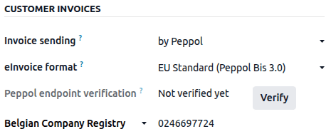

================================================================
Electronic invoicing (:abbr:`EDI (electronic data interchange)`)
================================================================

EDI, or electronic data interchange, is the inter-company communication of business documents, such
as purchase orders and invoices, in a standard format. Sending documents according to an EDI
standard ensures that the machine receiving the message can interpret the information correctly.
Various EDI file formats exist and are available depending on your company's country.

EDI feature enables automating the administration between companies and might also be required by
some governments for fiscal control or to facilitate the administration.

Electronic invoicing of your documents such as customer invoices, credit notes or vendor bills is
one of the application of EDI.

Odoo supports, among others, the following formats.

.. list-table::
   :header-rows: 1

   * - Format Name
     - Applicability
   * - Factur-X (CII)
     - All customers
   * - Peppol BIS Billing 3.0
     - All customers
   * - XRechnung (UBL)
     - All customers
   * - Fattura PA (IT)
     - Italian companies
   * - CFDI (4.0)
     - Mexican companies
   * - Peru UBL 2.1
     - Peruvian companies
   * - SII IVA Llevanza de libros registro (ES)
     - Spanish companies
   * - UBL 2.1 (Columbia)
     - Colombian companies
   * - Egyptian Tax Authority
     - Egyptian companies
   * - E-Invoice (IN)
     - Indian companies
   * - NLCIUS (Netherlands)
     - Dutch companies
   * - EHF 3.0
     - Norwegian companies
   * - SG BIS Billing 3.0
     - Singaporean companies
   * - A-NZ BIS Billing 3.0
     - All customers

.. note::
   - The **Factur-X (CII)** format enables validation checks on the invoice and generates PDF/A-3
     compliant files.
   - Every PDF generated by Odoo includes an integrated **Factur-X** XML file.

.. seealso::
   :doc:`../../fiscal_localizations`

.. _e-invoicing/configuration:

Configuration
=============

By default, the format available in the :ref:`send window <e-invoicing/generation>` depends on your
customer's country.

You can define a specific e-invoicing format for each customer. To do so, go to
:menuselection:`Accounting --> Customers --> Customers`, open the customer form, go to the
:guilabel:`Accounting` tab and select the appropriate format.

National electronic invoicing
-----------------------------

Depending on your company's country (e.g., :doc:`Italy <../../fiscal_localizations/italy>`,
:doc:`Spain <../../fiscal_localizations/spain>`, :doc:`Mexico
<../../fiscal_localizations/mexico>`, etc.), you may be required to issue e-invoicing documents in
a specific format for all your invoices. In this case, you can define a default e-invoicing format
for your sales journal.

To do so, go to :menuselection:`Accounting --> Configuration --> Journals`, open your sales journal,
go to the :guilabel:`Advanced Settings` tab, and enable the formats you need for this journal.

.. _e-invoicing/generation:

E-invoices generation
=====================

From a confirmed invoice, click :guilabel:`Send & Print` to open the send window. Check the
e-invoicing option to generate and attach the e-invoice file.

.. image:: electronic_invoicing/send-window.png
   :alt: The Peppol option is checked and an e-invoicing XML file is attached to the email.

Peppol
======

The `Peppol <https://peppol.org/about/>`_ network ensures the exchange of documents and information
between enterprises and governmental authorities. It is primarily used for electronic invoicing, and
its access points (connectors to the Peppol network) allow enterprises to exchange electronic
documents.

Odoo is an **access point** and an :abbr:`SMP (Service Metadata Publisher)`, enabling electronic
invoicing transactions without the need to send invoices and bills by email or post.

If not done yet, :ref:`install <general/install>` the :guilabel:`Peppol` module (`account_peppol`).

.. important::
   - Peppol registration is **free** and available in Odoo Community
   - You can send **Customer Invoices** and **Credit Notes** and receive **Vendor Bills** and
     **Refunds** via Peppol.
   - You can send in one of the following supported document formats: **BIS Billing 3.0, XRechnung
     CIUS, NLCIUS**.
   - | The following **countries** are eligible for **Peppol registration in Odoo**:
     | Andorra, Albania, Austria, Bosnia and Herzegovina, Belgium, Bulgaria, Switzerland, Cyprus,
       Czech Republic, Germany, Denmark, Estonia, Spain, Finland, France, United Kingdom, Greece,
       Croatia, Hungary, Ireland, Iceland, Italy, Liechtenstein, Lithuania, Luxembourg, Latvia,
       Monaco, Montenegro, North Macedonia, Malta, Netherlands, Norway, Poland, Portugal, Romania,
       Serbia, Sweden, Slovenia, Slovakia, San Marino, Turkey, Holy See (Vatican City State)

Registration
------------

Go to :menuselection:`Accounting --> Configuration --> Settings`. If you do not have the
Peppol module installed, first tick the :guilabel:`Enable PEPPOL` checkbox and then **manually
save**.

.. image:: electronic_invoicing/peppol-install.png
   :alt: Peppol module installation

Fill in the following information:

- :guilabel:`Peppol EAS`. This is the Peppol Electronic Address Scheme and usually depends on your
  company's country. Odoo often prefills this with the most commonly used EAS code in your country.
  For example, the preferred EAS code for most companies in Belgium is 0208.
- :guilabel:`Peppol Endpoint`. This is usually a Company Registry number or a VAT number.
- :guilabel:`Phone Number`, including the country code (e.g., `+32` in Belgium)
- :guilabel:`Primary contact email`

.. seealso::
   - `Peppol EAS - European Commision <https://ec.europa.eu/digital-building-blocks/wikis/display/DIGITAL/Code+lists/>`_
   - `Peppol Endpoint - OpenPeppol eDEC Code Lists <https://docs.peppol.eu/edelivery/codelists/>`_
     (open the "Participant Identifier Schemes" as HTML page)

If you are migrating from another access point, insert the :guilabel:`Migration key` from the
previous provider.

.. image:: electronic_invoicing/peppol-settings.png
   :alt: Configuration for peppol

Finally, click :guilabel:`Validate registration`. If you want to explore or demo Peppol, you can
choose to register in :guilabel:`Demo` mode. Otherwise, select :guilabel:`Live`.

   .. image:: electronic_invoicing/peppol-demo-mode.png
      :alt: Peppol demo mode selection

.. note::
   When testing Peppol, the system parameter `account_peppol.edi.mode` can be changed to `test`.
   Then, a radio button appears with the option to register on the test server.

   .. image:: electronic_invoicing/peppol-system-parameter.png
      :alt: Peppol test mode parameter

   .. image:: electronic_invoicing/peppol-test-mode-settings.png
      :alt: Peppol test mode selection

Now, you can request a verification code to be sent to you by clicking :guilabel:`Verify phone
number`.

.. image:: electronic_invoicing/peppol-registration-verify.png
   :alt: phone validation request verification

A text message containing a code is sent to the phone number provided to finalize the verification
process.

.. image:: electronic_invoicing/phone-registration.png
   :alt: phone validation

Once you enter the code and click :guilabel:`Confirm`, you can see that your registration is pending
activation. From this point onwards, the default journal for receiving Vendor Bills can be set.

.. image:: electronic_invoicing/peppol-registration-pending.png
   :alt: pending application

It should be automatically activated within a day.

.. tip::
   It is also possible to manually trigger the cron that checks the registration status by going to
   :menuselection:`Settings --> Technical --> Scheduled Actions --> PEPPOL\: update participant
   status`.

Your application status should be updated soon after you are registered on the Peppol network.

.. image:: electronic_invoicing/peppol-registration-active.png
   :alt: active application

All invoices and vendor bills can now be sent directly using the Peppol network.

Contact verification
--------------------

Before sending an invoice to a contact using the Peppol network, it is necessary to verify that they
are also registered as a Peppol participant.

To do so, go to :menuselection:`Accounting --> Customers --> Customers` and open the customer's
form. Then go to :menuselection:`Accounting tab --> Electronic Invoicing`, select the correct
format, and make sure their :guilabel:`Peppol EAS code` and the :guilabel:`Endpoint` are filled in.
Then, click :guilabel:`Verify`. If the contact exists on the network, their Peppol endpoint validity
is set to Valid.

.. image:: electronic_invoicing/peppol-contact-verify.png
   :alt: verify contact registration

.. important::
   While Odoo prefills both the EAS code and the Endpoint number based on the information available
   for a contact, it is better to confirm these details directly with the contact.

It is possible to verify the Peppol participant status of several customers at once.
To do so, go to :menuselection:`Accounting --> Customers --> Customers` and switch to the list view.
Select the customers you want to verify and then click :menuselection:`Actions --> Verify Peppol`.

Send invoices
-------------

Once ready to send an invoice via the Peppol network, simply click :guilabel:`Send & Print` on the
invoice form. To queue multiple invoices, select them in the list view and click
:menuselection:`Actions --> Send & Print`; they will be sent in a batch later on. Both
:guilabel:`BIS Billing 3.0` and :guilabel:`Send via PEPPOL` checkboxes need to be ticked.

.. image:: electronic_invoicing/peppol-send-print.png
   :alt: Send peppol invoice

Posted invoices that can be sent via Peppol are marked as :guilabel:`Peppol Ready`.
To display them, use the :guilabel:`Peppol Ready` filter or access the Accounting dashboard and
click :guilabel:`Peppol ready invoices` on the corresponding sales journal.

.. image:: electronic_invoicing/peppol-ready-invoices.png
   :alt: Filter Peppol ready invoices

Once the invoices are sent via Peppol, the status is changed to :guilabel:`Processing`. The
status is changed to `Done` after they have been successfully delivered to the contact's Access
Point.

.. image:: electronic_invoicing/peppol-message-processing.png
   :alt: Peppol message status

.. tip::
   By default, the Peppol status column is hidden on the Invoices list view. You can choose to have
   it displayed by selecting it from the optional columns, accessible from the top right corner of
   the Invoices list view.

A cron runs regularly to check the status of these invoices. It is possible to check the status
before the cron runs by clicking :guilabel:`Fetch Peppol invoice status` in the corresponding
sales journal on the Accounting dashboard.

.. image:: electronic_invoicing/peppol-fetch-message-status.png
   :alt: Fetch invoice Peppol status

Receive vendor bills
--------------------

Once a day, a cron checks whether any new documents have been sent to you via the Peppol network.
These documents are imported, and the corresponding vendor bills are created automatically as
drafts.

.. image:: electronic_invoicing/peppol-receive-bills.png
   :alt: peppol receive bills

If you want to retrieve incoming Peppol documents before the cron runs, you can do so from the
Accounting dashboard on the main Peppol purchase journal that you set up in the settings. Just click
:guilabel:`Fetch from Peppol`.

.. image:: electronic_invoicing/peppol-fetch-bills.png
   :alt: Fetch bills from Peppol
