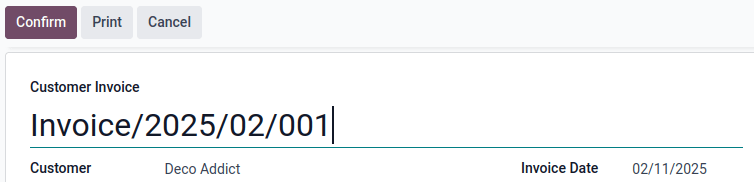
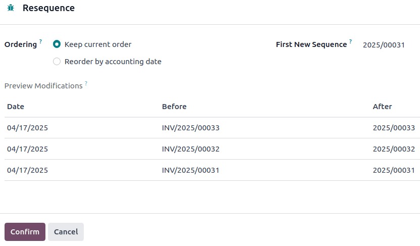

================
Invoice sequence
================

When confirming an invoice, Odoo generates a unique invoice reference number. By default, it uses
the sequence format `INV/year/incrementing-number` (e.g., `INV/2025/00001`), which restarts from
`00001` each year.

However, it is possible to :ref:`change the sequence format <accounting/invoice/resequencing>` and
its periodicity, and to :ref:`mass-resequence invoices <accounting/invoice/mass-resequencing>`.

.. note::
   Changes made to reference numbers are logged in the chatter.

.. _accounting/invoice/resequencing:

Changing the default sequence
=============================

To customize the default sequence, open the last confirmed invoice, click :guilabel:`Reset to
Draft`, and edit the invoice's reference number.

Odoo then explains how the detected format will be applied to all future invoices. For example, if
the current invoice's month is added, the sequence's periodicity will change to every month instead
of every year.

.. image:: sequence/sequence-dialog.png
   :alt: Editing the reference number of an invoice.

.. tip::
   The sequence format can be edited directly when creating the first invoice of a given sequence
   period.

.. _accounting/invoice/mass-resequencing:

Mass-resequencing invoices
==========================

It can be helpful to resequence multiple invoice numbers. For example, when importing invoices from
another invoicing or accounting system and the reference originates from the previous software,
continuity for the current year must be maintained without restarting from the beginning.

.. note::
   This feature is only available to users with administrator or advisor access.

Follow these steps to resequence invoice numbers:

#. Activate the :ref:`developer mode <developer-mode>`.
#. From the :guilabel:`Accounting Dashboard`, open the :guilabel:`Customer Invoices` journal.
#. Select the invoices that need a new sequence.
#. Click the :icon:`fa-cog` :guilabel:`Actions` menu and select :guilabel:`Resequence`.
#. In the :guilabel:`Ordering` field, choose to

   - :guilabel:`Keep current order`: The order of the numbers remains the same.
   - :guilabel:`Reorder by accounting date`: The number is reordered by accounting date.

#. Set the :guilabel:`First New Sequence`.
#. :guilabel:`Preview Modifications` and click :guilabel:`Confirm`.

.. note::
   - To indicate where the sequence change began, the first invoice in the new sequence is
     highlighted in red in the :guilabel:`Customer Invoices` list. This visual marker is permanent
     and purely informational.
   - If there are any irregularities in the new sequence, such as gaps, cancelled, or deleted
     entries within the open period, a :guilabel:`Gaps in the sequence` message appears in the
     :guilabel:`Customer Invoices` journal on the Accounting dashboard. To view more details about
     the related invoice(s), click :guilabel:`Gaps in the sequence`. This visual marker is temporary
     and will disappear once the entry's accounting date is on or after the lock date.

.. tip::
   Resequencing is not possible:

   - When entries are before a lock date.
   - When the sequence leads to a duplicate.
   - When the range is invalid. For example, if the :guilabel:`Invoice Date` doesn't align with the
     date in the new sequence, such as using a 2024 sequence (INV/2024/XXXXX) for an invoice dated
     in 2025.

   In these cases, a :guilabel:`Validation Error` message appears.
