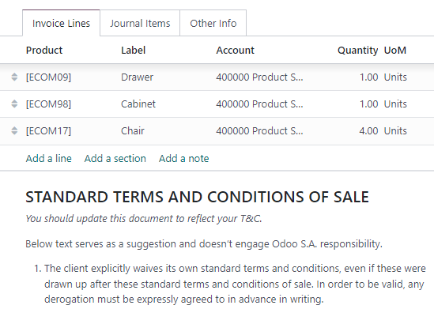
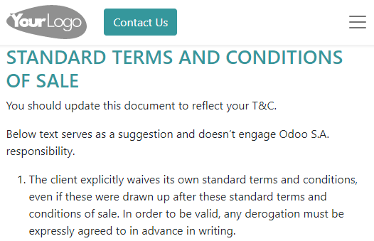

==================================
Default terms and conditions (T&C)
==================================

Specifying terms and conditions is essential to establish important contractual points, such as
return and refunds, warranty, and after-sale services.

You can add default terms and conditions at the bottom of all customer invoices, sales orders, and
quotations, either as text or a link to a web page.

.. seealso::
   `Odoo Tutorial: Terms & Conditions <https://www.odoo.com/slides/slide/terms-conditions-1680>`_

Configuration
=============

Go to :menuselection:`Accounting --> Configuration --> Settings`. Under the :guilabel:`Customer
Invoices`, enable :guilabel:`Default Terms & Conditions`. By default, the :guilabel:`Add a Note`
option is selected, and the terms and conditions are displayed at the bottom of the document. Enter
the terms and conditions in the text box below.

.. tip::
   You can also add a PDF version of your terms and conditions as an attachment when sending the
   document via email. Edit the email templates if you want to include them by default.

Alternatively, to display the terms and conditions on a web page, select the :guilabel:`Add a link
to a Web Page` option and click :guilabel:`Save`. Click :guilabel:`Update Terms`, edit the
content, and click :guilabel:`Save`. The link to that page is then added as a note in your document.

.. note::
   You can edit the layout and content of the page using the :doc:`Website
   </applications/websites/website>` app. If the Website app is activated, the :guilabel:`Edit in
   Website Builder` option then replaces :guilabel:`Update Terms`.

