=========
Argentina
=========

Webinars
========

Below you can find videos with a general description of the localization, and how to configure it.

- `VIDEO WEBINAR OF A COMPLETE DEMO <https://youtu.be/c41-8cVaYAI>`_.
- `ECOMMERCE <https://youtu.be/5gUi2WWfRuI>`_.

Introduction
============

The Argentinean localization has been improved and extended in Odoo v13, in this version the next
modules are available:

- **l10n_ar**: This module add accounting features for the Argentinian localization, which represent
  the minimal configuration needed for a company  to operate in Argentina and under the AFIP
  (Administración Federal de Ingresos Públicos) regulations and guidelines.

- **l10n_ar_reports**: Add VAT Book report which is a legal requirement in Argentine and that holds
  the VAT detail info of sales or purchases recorded on the journal entries. This module includes as
  well the VAT summary report that is used to analyze the invoice
  
- **l10n_ar_edi**: This module includes all technical and functional requirements to generate 
  Electronic Invoice via web service, based on the AFIP regulations. 

Configuration
=============

Install the Argentinean localization modules
--------------------------------------------

For this, go to *Apps* and search for Argentina. Then click *Install* for the first two modules.

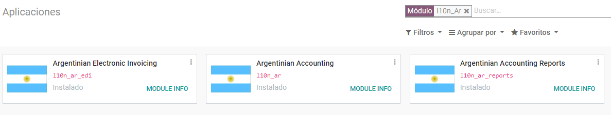

Configure your company
~~~~~~~~~~~~~~~~~~~~~~

Once that the modules are installed, the first step is to set up your company data. Additional to
the basic information, a key field to fill in the AFIP Responsibility Type, that represent the
fiscal obligation and structure of the company:

.. image:: argentina/argentina02.png
   :align: center
   

Chart of Account
~~~~~~~~~~~~~~~~

In Accounting settings there are three available packages of Chart of accounts, which are related to
the AFIP responsibility type of the Company, considering that if the base companies don't require as
many accounts as the companies that gave more complex fiscal requirements:

- Monotributista  (149 accounts).
- IVA Exempto   (159 accounts).
- Responsables Inscriptos  (166 Accounts).

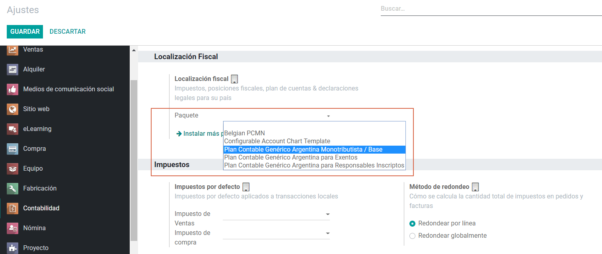

Configure Master data
---------------------

Electronic Invoice Credentials
~~~~~~~~~~~~~~~~~~~~~~~~~~~~~~

Environment
***********

The AFIP infrastructure is replicated in two separate environments, Testing and Production.

Testing is provided so that the Companies can test their developments until they are ready to move 
into the Production environment. As these two environments are completely isolated from each other, 
the digital certificates of one instance are not valid in the other one. 

Go to :menuselection:`Accounting --> Settings --> Argentinian Localization` to select the environment:

.. image:: argentina/argentina_edi_01.png
   :align: center

AFIP Certificates
*****************
The electronic invoice and other afip services work with WebServices (WS) provided by the AFIP. 

In order to enable communication with the AFIP, the first step is to request a Digital Certificate
if you don’t have one already.   

#. Generate certificate Sign Request (Odoo). When this option is selected a file with extension
   ``.csr`` (certificate signing request) is generated to be used the AFIP portal to request the
   certificate.

   .. image:: argentina/argentina_edi_02.png

#. Generate Certificate (AFIP). Access the AFIP portal and follow the instructions described in the
   next document in order to get a certificate. `Get AFIP Certificate
   <http://www.afip.gob.ar/ws/WSAA/wsaa_obtener_certificado_produccion.pdf>`_.
   
#. Upload Certificate and Private Key (Odoo). Once the certificate has been generated, it needs to
   be uploaded in Odoo, using the pencil next in the field “Certificado” and selecting the
   corresponding file.

   .. image:: argentina/argentina_edi_03.png

.. tip::
   In case you need to configure the Homologation Certificate, please refer to the AFIP official 
   documentation: `Homologation Certificate
   <http://www.afip.gob.ar/ws/documentacion/certificados.asp>`_.

Partner
~~~~~~~

Identification Type and VAT
***************************

As part of the Argentinean localization, the document types defined by the AFIP are now available on
the Partner form, this information is essential for most transactions. There are six identification
types available by default:

.. image:: argentina/argentina04.png
   :align: center

.. note::
   The complete list of Identification types defined by the AFIP is included in Odoo but only the
   common ones are active.

AFIP Responsibility Type
************************

In Argentina the document type associated with customers and vendors transactions is defined based
on the AFIP Responsibility type, this field should be defined in the partner form:

.. image:: argentina/argentina05.png
   :align: center

Taxes
~~~~~

As part of the localization module,  the taxes are created automatically with their related
financial account and configuration.

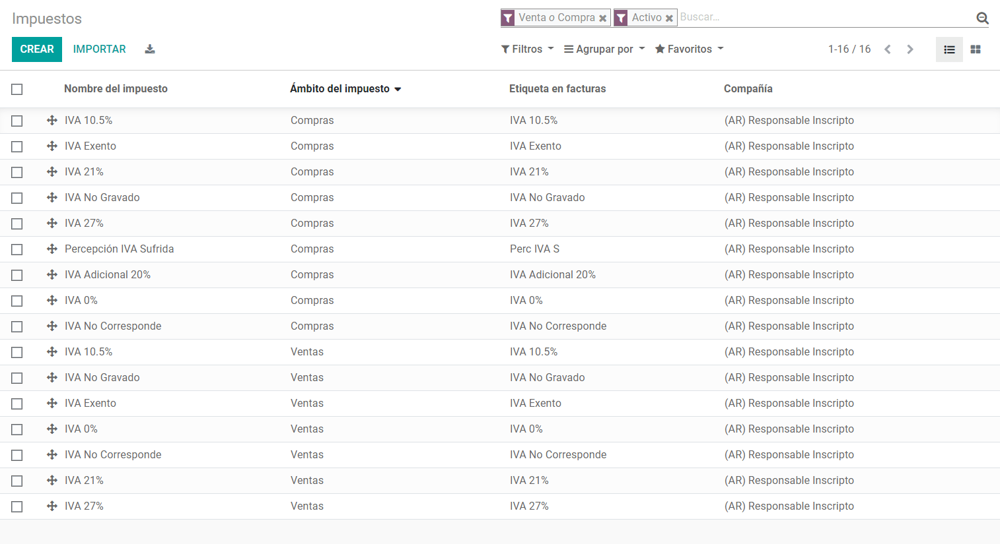

Taxes Types
***********

Argentina has several tax types, the most common ones are:

- VAT. Is the regular VAT and it can have several percentages.
- Perception. Advance payment of a tax that is applied on Invoices.
- Retention. Advance payment of a tax that is applied on payments
- Otros.

Special Taxes
*************

Some argentine taxes are not commonly used  for all companies, these type of taxes are included as
inactive by default, it's important that before creating a new tax you confirm if they are not
already included in the Inactive taxes:

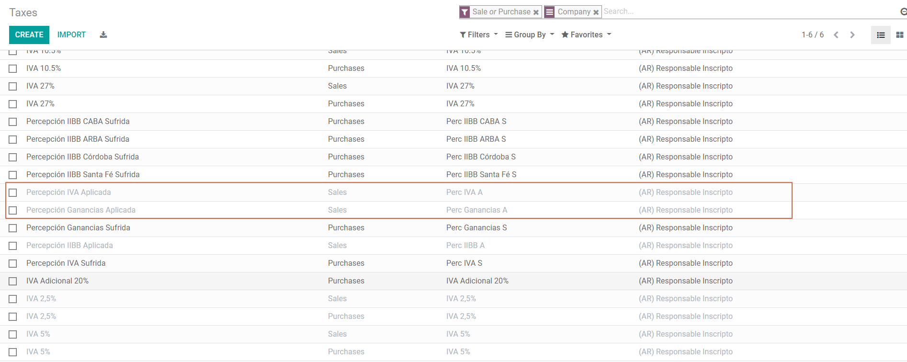

Document Types
~~~~~~~~~~~~~~

In some Latin America countries, including Argentina, some accounting transactions like invoices and
vendor bills are classified by  document types defined by the government fiscal authorities (In
Argentina case: AFIP).

The document type is an essential information that needs to be displayed in the printed reports and
that needs to be easily identified, within the set of invoices as well of account moves.

Each document type can have a unique sequence per journal where it is assigned. As part of the
localization, the Document Type include the country on which the document is applicable and the data
is created automatically when the localization module is installed.

The information required for the document types is included by default so the user doesn't need to
fill anything on this view:

.. image:: argentina/argentina08.png
   :align: center

.. note::
   There are several document types that are inactive by default but can be activated if needed.

Letters
*******

For Argentina, the document types include a letter that helps that indicates the
transaction/operation, example:

- When an invoice is related to a B2B transaction, a document type "A" must be used.
- When an invoice is related to a B2C transaction, a document type "B" must be used.
- When an invoice is related to exportation transaction, a document type "E" must be used.

The documents included in the localization have the proper letter associated, the user doesn't need
to configure anything additional.

.. image:: argentina/argentina09.png
   :align: center

Use on Invoices
***************

The document type on each transaction will be determined by:

- The Journal related to the Invoice, identifying if the journal use documents.
- Condition applied based on the type of Issues and Receiver (ex. Type of fiscal regimen of
  the buyer and type of fiscal regimen of the vendor)

Journals
--------

In the Argentinean localization the Journal can have a different approach depending on its usage and
internal type, to configure you journals go to :menuselection:`Accounting --> Configuration -->
Journals`:

For Sales and Purchase Journals it’s possible to enable the option *Use Documents*, this indicates
the Journal enables a list of document types that can be related to the Invoices and vendor Bills,
for more detail of the invoices, please refer to the section 2.3 Document Types.

If the Sales/Purchase journal are used without the option *Use Documents* it because they won’t be
used to generate fiscal invoices, but mostly for account moves related to internal control process.

AFIP Information (also known as AFIP Point of Sale)
~~~~~~~~~~~~~~~~~~~~~~~~~~~~~~~~~~~~~~~~~~~~~~~~~~~

.. image:: argentina/argentina10.png
   :align: center

**AFIP POS System**: This field is only visible for the Sales journals and defined the type of AFIP
POS that will be used to manage the transactions for which the journal is created. The AFIP POS
defines as well:

#. The sequences of document types related to the Web service.
#. The structure and data of the electronic invoice file.

Web Services
************      
- ``wsfev1: Electronic Invoice.`` This is the most common service, 
  is used to generated invoices for document types A, B, C, M  with no detail per item. 
- ``wsbfev1: Electronic Fiscal Bond.``  For those who invoice capital goods and wish 
  to access the benefit of the Electronic Tax Bonds granted by the Ministry of Economy. For more 
  detail you can refer to the next link: `Fiscal Bond
  <https://www.argentina.gob.ar/acceder-un-bono-por-fabricar-bienes-de-capital>`_.
- ``wsfexv1: Electronic Exportation Invoice.`` Used to generate invoices for international customers
  and transactions that involve exportation process, the document type related is type “E”.

.. image:: argentina/argentina_edi_04.png
   :align: center

**AFIP POS Number**: This is the number configured in the AFIP to identify the operations related to
this AFIP POS.

**AFIP POS Address**: This field is related to commercial address registered for the POS, which is
usually the same address than the Company. For example: has multiple stores (fiscal locations) then
AFIP will require that you have one AFIP POS per location: this location will be printed in the
invoice report.

**Unified Book**: When AFIP POS System is Preimpresa the document types (applicable to the journal)
with the same letter will share the same sequence.  For example:

- Invoice: FA-A 0001-00000002.
- Credit Note: NC-A 0001-00000003.
- Debit Note: ND-A 0001-00000004.

Sequences
~~~~~~~~~
In case that you want to synchronize the next number in the sequence in Odoo based on the next
number in the AFIP POS, the next button that is visible under :ref:`developer mode <developer-mode>`
can be used:

.. image:: argentina/argentina_edi_05.png
   :align: center

.. note::
  When creating the Purchase journals, it's possible to define if they can be related to document 
  types or not.  In case that the option to use documents is selected, there is no need to manually 
  associate the document type sequences as the document number is provided by the vendor.

Usage and testing
=================

Invoice
-------

After the partners and journals are created and configured, when the invoices are created the will
have the next behaviour:

Document type assignation
~~~~~~~~~~~~~~~~~~~~~~~~~

Once the partner is selected the document type will filled automatically, based on the AFIP document
type:

**Invoice for a customer IVA Responsable Inscripto, prefix A**.

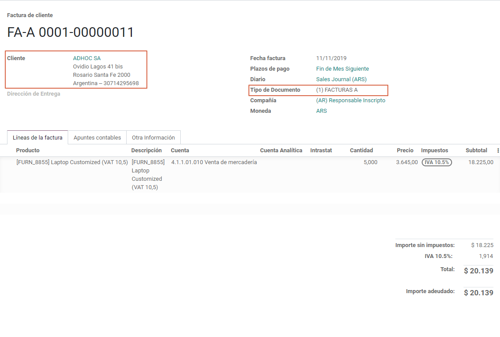

**Invoice for an end customer, prefix B**.

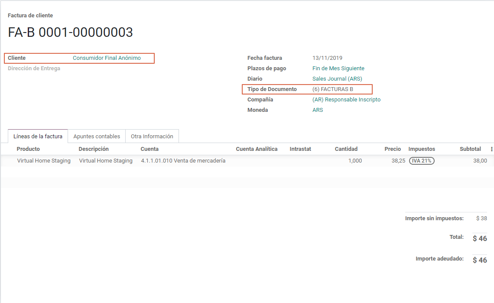

**Exportation Invoice, prefix E**.

.. image:: argentina/argentina13.png
   :align: center

As it is shown in the invoices, all of them use the same journal but the prefix and sequence is
given by the document type.

The most common document type will be defined automatically for the different combinations of AFIP
responsibility type but it can be updated manually by the user.

Electronic Invoice elements
~~~~~~~~~~~~~~~~~~~~~~~~~~~
When using electronic invoice, if all the information is correct the Invoice is posted in the 
standard way, in case that something needs to be addressed (check the section common errors for more 
detail), an error message is raised indicating the issue/proposed solution and the invoice remains 
in draft until the related data is corrected. 

Once the invoice is posted, the information related to the AFIP validation and status is displayed 
in the AFIP Tab, including: 

- AFIP Autorisation:  CAE number.
- Expiration date: Deadline to deliver the invoice to the customers. Normally 10 days after the 
  CAE is generated. 
- Result:

  - Aceptado en AFIP.
  - Aceptado con Observaciones. 
  
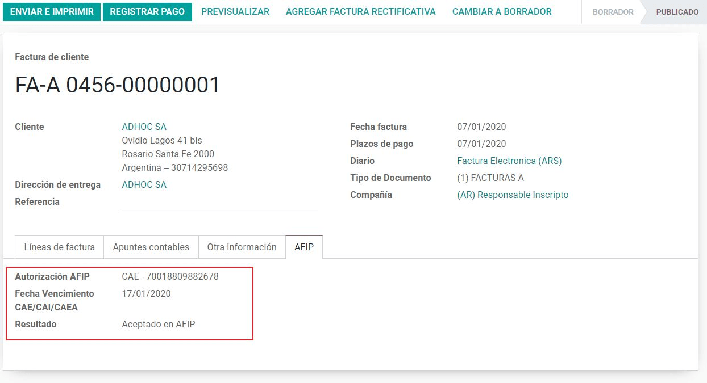

Invoice Taxes
~~~~~~~~~~~~~

Based on the  AFIP Responsibility type,  the VAT tax can have a different behavior on the pdf
report:

**A. Tax excluded:** In this case the taxed amount needs to be clearly identified in the report.
This condition applies when the customer has the following AFIP Responsibility type:

- Responsable Inscripto.

.. image:: argentina/argentina14.png
   :align: center

**B. Tax amount included:** This means that the taxed amount is included as part of the product
price, subtotal and totals. This condition applies when the customer has the following AFIP
Responsibility types:

- IVA Sujeto Exento.
- Consumidor Final.
- Responsable Monotributo.
- IVA liberado.

.. image:: argentina/argentina15.png
   :align: center

Special Use Cases
~~~~~~~~~~~~~~~~~

Invoices for Services
*********************
For electronic invoices that include Services, the AFIP requires to report the  service starting
and ending date, this information can be filled in the tab “Other Info”: 

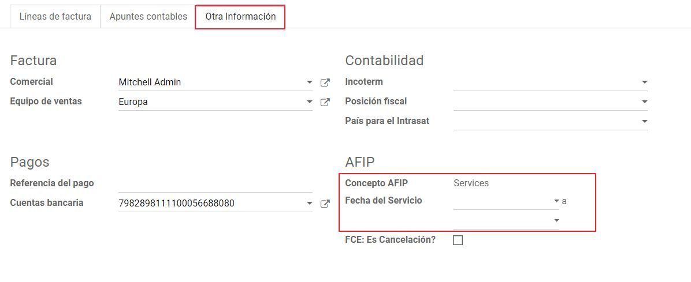

If  the dates are not selected manually before the invoice is validated, the values will be
filled automatically considering the beginning and day of the invoice month:

.. image:: argentina/argentina_edi_07.png
   :align: center

Exportation Invoices
********************
The invoices related to Exportation transactions required a Journal that used the AFIP POS 
System “Expo Voucher - Web Service” so the proper document type be associated:

.. image:: argentina/argentina_edi_08.png
   :align: center

When the customer selected in the Invoice has set the AFIP responsibility type as “Cliente / 
Proveedor del Exterior” or “IVA Liberado – Ley Nº 19.640”, Odoo automatically assigned:

- Journal related to the exportation Web Service.
- Exportation document type .
- Fiscal position: Compras/Ventas al exterior.
- Concepto AFIP:  Products / Definitive export of goods.
- Exempt Taxes. 

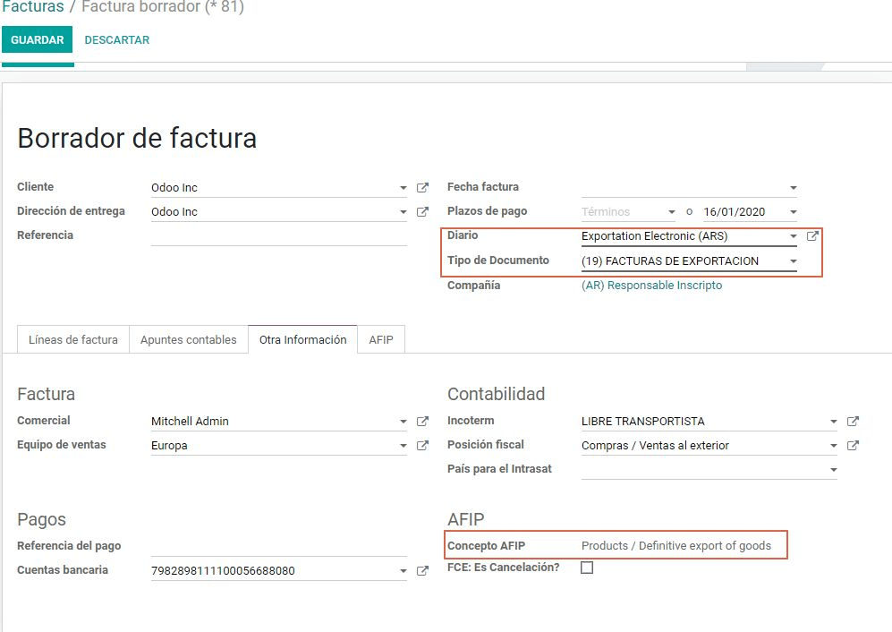

.. note::
   The Exportation Documents required the Incoterm in :menuselection:`Other Info --> Accounting`:
   
.. image:: argentina/argentina_edi_13.png
   :align: center
   
   
Fiscal Bond
***********
The Electronic Fiscal bond is used for those who invoice capital goods and wish to access 
the benefit of the Electronic Tax Bonds granted by the Ministry of Economy.

For these transactions it’s important to have into consideration the next requirements:

- Currency (according to parameter table) and invoice quotation.
- Taxes.
- Zone.
- Detail each item.

  - Code according to the Common Nomenclator of Mercosur (NCM).
  - Complete description.
  - Unit Net Price.
  - Quantity.
  - Unit of measurement.
  - Bonus.
  - VAT rate. 

Electronic Credit Invoice MiPyme (FCE) 
**************************************

**Invoices:** There are several document types classified as Mipyme also known as
Electronic Credit Invoice (FCE in spanish), which is used to impulse the SME, its purpose is 
to develop a mechanism that improves the financing conditions of these companies and allows 
them to increase their productivity, through the early collection of credits and receivables 
issued to their clients and / or vendors. 

For these transactions it’s important to have into consideration the next requirements:

- Specific document types (201, 202, 206, etc).
- The emisor should be eligible by the AFIP to MiPyme transactions. 
- The amount should be bigger than 100,000 ARS. 
- A bank account type CBU must be related to the emisor, otherwise the invoice can’t 
  be validated, having these errors messages for example:  
  
.. image:: argentina/argentina_edi_10.png
   :align: center

**Credit& Debit Notes:** When creating a Credit/Debit note related to a FCE document, it is 
important take the next points into consideration:

- Use the Credit and Debit Note buttons, so the correct reference of the originator 
  document passed to the note. 

.. image:: argentina/argentina_edi_11.png
   :align: center
   
- The document letter should be the same than the originator document (either A or B).
- The same currency as the source document must be used.  When using a secondary currency 
  there is an exchange difference  if the currency rate is different between the emission day 
  and the payment date, it’s possible to create a credit/debit note to decrease/increase the 
  amount to pay in ARS. 

In the workflow we can have two scenarios:

#. The FCE is rejected so the Credit Note should have the field “FCE, is Cancellation?” as True. 
#. The Credit Note, is created with the negative amount to annulate the FCE document, 
   in this case the field “FCE, is Cancellation?” must be empty (false). 

.. image:: argentina/argentina_edi_12.png
   :align: center
   
Invoice printed report
~~~~~~~~~~~~~~~~~~~~~~
The PDF report related to electronic invoices that have been validated by the AFIP includes 
a barcode at the bottom of the format which represent the CAE number, the Expiration Date is 
also displayed as it’s legal requirement: 
   
.. image:: argentina/argentina_edi_14.png
   :align: center

Troubleshooting and Auditing
~~~~~~~~~~~~~~~~~~~~~~~~~~~~
For auditing and troubleshooting purposes you can get the detailed information of an 
invoice number that has been  previously sent to the AFIP,  

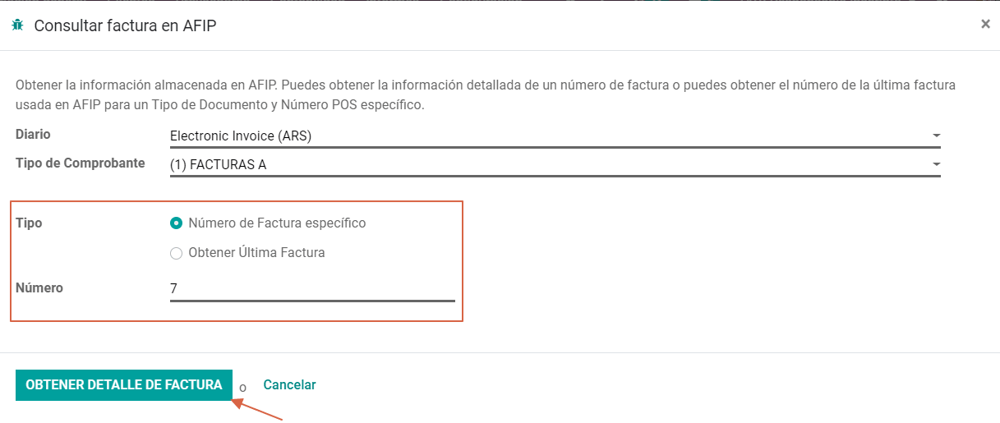
     
.. image:: argentina/argentina_edi_24.png
   :align: center  

You can also get the last number used in AFIP for a specific Document Type and POS Number 
as support for any possible  issues on the sequence synchronization between Odoo and AFIP. 

.. image:: argentina/argentina_edi_22.png
   :align: center

Vendor Bills
------------

Based on the purchase journal selected for the vendor bill, the document type is now a required field. 
This value is auto populated based on the AFIP Responsibility type of Issuer and Customer, but the 
value can be switched if necessary.

.. image:: argentina/argentina16.png
   :align: center

The document number needs to be registered manually and the format is validated automatically, in
case that the format is invalid a user error will be displayed indicating the correct format that is
expected.

.. image:: argentina/argentina17.png
   :align: center

The vendor bill number is structured in the same way that the invoices with the difference 
that the document sequence is input by the user: “Document Prefix - Letter -  Document number".

Validate Vendor Bill number in AFIP
~~~~~~~~~~~~~~~~~~~~~~~~~~~~~~~~~~~
As most companies have internal controls to verify that the vendor bill is related to an AFIP
valid document,  an automatic validation can be set in :menuselection:`Accounting --> Settings --> 
Argentinian Localization --> Validate document in the AFIP`, considering the following levels: 

- **Not available:** The verification is not done (this is the default value).
- **Available:**  The verification  is done, in case the number is not valid 
  it only raises a warning but it allows you to post the vendor bill. 
- **Required:** The verification  is done and it doesn't allow the user to 
  post the vendor bill if the document number is not valid.

.. image:: argentina/argentina_edi_16.png
   :align: center

How to use it in Odoo
*********************
This tool incorporates in the vendor bill a new "Verify on AFIP" button located 
next to the AFIP Authorization code. 

.. image:: argentina/argentina_edi_17.png
   :align: center

In case it’s not a valid AFIP authorization the value “Rejected” will be 
displayed and the details of the validation will be added to the chatter.

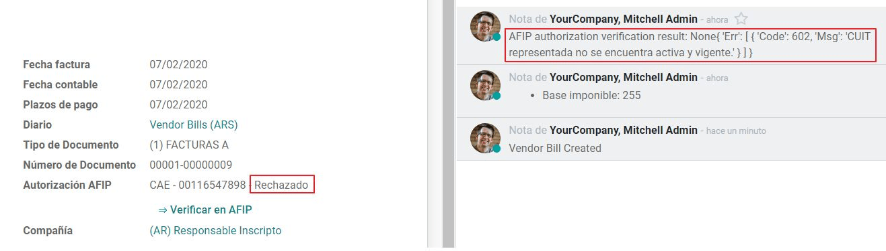

Special Use cases
~~~~~~~~~~~~~~~~~
Untaxed Concepts
****************
There are some transactions that include items that are not part of the VAT base amount, 
this is commonly used in fuel and gasoline invoices. 

The vendor bill will be registered using 1 item for each product that is part of the VAT
base amount and an additional item to register the amount of  the Exempt concept:

.. image:: argentina/argentina_edi_19.png
   :align: center

Perception Taxes
****************
The vendor bill will be registered using 1 item for each product that is part of the 
VAT base amount, the perception tax can be added in any of the product lines, as result 
we will have one tax group for the VAT and one for the perception, the perception default 
value is always 1.00. 

.. image:: argentina/argentina_edi_20.png
   :align: center

You should use the pencil that is the next to the Perception amount to edit it 
and set the correct amount. 

.. image:: argentina/argentina_edi_21.png
   :align: center
   
After this is done the invoice can be validated. 
   
   
Reports
=======

As part of the localization the next Financial reports were added:

.. image:: argentina/argentina18.png
   :align: center

VAT Reports
-----------

Libro de IVA Ventas
~~~~~~~~~~~~~~~~~~~

.. image:: argentina/argentina19.png
   :align: center

Libro de IVA Compras
~~~~~~~~~~~~~~~~~~~~

.. image:: argentina/argentina20.png
   :align: center

Resumen de IVA
~~~~~~~~~~~~~~

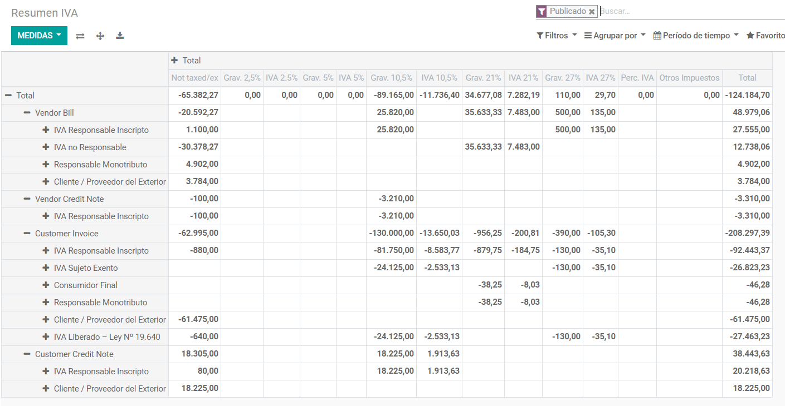

IIBB - Reports
--------------

IIBB - Ventas por Jurisdicción
~~~~~~~~~~~~~~~~~~~~~~~~~~~~~~

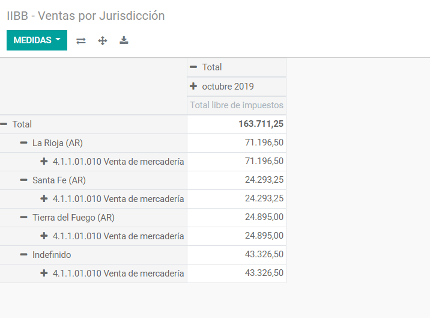

IIBB - Compras  por Jurisdicción
~~~~~~~~~~~~~~~~~~~~~~~~~~~~~~~~

.. image:: argentina/argentina23.png
   :align: center
