=====
Chile
=====

Webinars
========

Below you can find videos with a general description of the localization, and how to configure it.

- `VIDEO WEBINAR OF CHILEAN LOCALIZATION: INTRO AND DEMO <https://youtu.be/BHnByZiyYcM>`_.
- `VIDEO WEBINAR OF DELIVERY GUIDE <https://youtu.be/X7i4PftnEdU>`_.

Introduction
============

The Chilean localization has been improved and extended in Odoo v13. In this version, the next
modules are available:

- **l10n_cl:** Adds accounting features for the Chilean localization, which represent the minimal
  configuration required for a company to operate in Chile and under the SII (Servicio de Impuestos
  Internos) regulations and guidelines.

- **l10n_cl_edi:** Includes all technical and functional requirements to generate and receive
  Electronic Invoice via web service, based on the SII regulations.

- **l10n_cl_reports:** Adds the reports Propuesta F29 y Balance Tributario (8 columnas).

Configuration
=============

Install the Chilean localization modules
----------------------------------------

For this, go to *Apps* and search for Chile. Then click *Install* in the module **Chile
E-invoicing**. This module has a dependency with **Chile - Accounting**. In case this last
one is not installed, Odoo installs it automatically with E-invoicing.

.. image:: chile/Chile01.png
   :align: center
   :alt: Chilean module to install on Odoo.

.. note::
   When you install a database from scratch selecting Chile as country, Odoo will automatically
   install the base module: Chile - Accounting.

Company Settings
----------------

Once the modules are installed, the first step is to set up your company data. Additional
to the basic information, you need to add all the data and elements required for Electronic
Invoice, the easiest way to configure it is in
:menuselection:`Accounting --> Settings --> Chilean Localization`.

.. important::
   All the following configuration and functionality is only available in Odoo if your
   company already passed the `Certification process <https://www.sii.cl/factura_electronica/
   factura_mercado/proceso_certificacion.htm>`_
   in the SII - Sistema de Facturación de Mercado, this certification enables you to
   generate electronic invoices from your ERP and send them automatically to the SII.
   If your company has not passed this certification yet, make sure you communicate this
   to your Account Manager as a special process outside Odoo is required in order to complete
   this certification.

Fiscal Information
~~~~~~~~~~~~~~~~~~

Fill in the fiscal information for your company according to the SII register, follow the
instructions on each section.

.. image:: chile/Chile02.png
   :align: center
   :alt: Chilean company fiscal data.

Electronic Invoice Data
~~~~~~~~~~~~~~~~~~~~~~~

This is part of the main information required to generate electronic Invoice, select your
environment and the legal information, as well as the email address to receive invoices
from your vendors and the alias you use to send invoices to your customers.

.. image:: chile/Chile03.png
   :align: center
   :alt: Chilean edi environment settings.

Configure DTE Incoming email server
***********************************

In order to receive you the claim and acceptance emails from your customers, it is
crucial to define the DTE incoming email server, considering this configuration:

.. image:: chile/Chile03_2.png
   :align: center
   :alt: Incoming email server configuration for Chilean DTE.

.. tip::
   For your Go-live make sure you archive/remove from your inbox all the emails
   related to vendor bills that are not required to be processed in Odoo.

Certificate
~~~~~~~~~~~

In order to generate the electronic invoice signature, a digital certificate with the extension
``pfx`` is required, proceed to this section and load your file and password.

.. image:: chile/Chile03_3.png
   :align: center
   :alt: Digital certificate access.

.. image:: chile/Chile04.png
   :align: center
   :alt: Digital certificate configuration.

A certificate can be shared between several users. If this is the case leave the user field empty,
so all your billing users can use the same one. On the other hand, if you need to restrict the
certificate for a particular user, just define the users in the certificate.

.. note::
   In some cases, depending on the certificate format, it is possible that the field Subject Serial
   Number is not loaded automatically. If this is the case, you can manually edit this field by
   filling it with the Certificate's legal representative RUT.

Financial Reports
~~~~~~~~~~~~~~~~~

The report Propuesta F29 requires two values that need to be defined as part of the company
configuration:

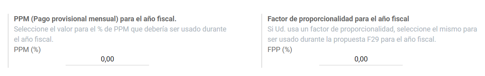

Multicurrency
~~~~~~~~~~~~~

The official currency rate in Chile is provided by the Chilean service `mindicador.cl
<https://mindicador.cl>`_. You can find this service in the currency rate configuration, and you
can set a predefined interval for the rate updates.

.. image:: chile/Chile05_2.png
   :align: center
   :alt: Currency reate service for Chile.

Chart of accounts
~~~~~~~~~~~~~~~~~

The chart of accounts is installed by default as part of the set of data included in
the localization module. The accounts are mapped automatically in:

- Taxes.
- Default Account Payable.
- Default Account Receivable.
- Transfer Accounts.
- Conversion Rate.

Master Data
-----------

Partner
~~~~~~~

Identification Type and VAT
***************************

As part of the Chilean localization, the identification types defined by the SII
are now available on the Partner form. This information is essential for most transactions.

.. image:: chile/Chile06.png
   :align: center
   :alt: Chilean identification types for partners.

TaxpayerType
************

In Chile, the document type associated with customers and vendors transactions is defined
based on the Taxpayer Type. This field should be defined in the partner form, when creating
a customer is important you make sure this value is set:

.. image:: chile/Chile07.png
   :align: center
   :alt: Chilean taxpayer types for partners.

Electronic Invoice Data
***********************

As part of the information that is sent in the electronic Invoice, you need to define the
email that is going to appear as the sender of the electronic invoice to your customer, and
the Industry description.

.. image:: chile/Chile07_2.png
   :align: center
   :alt: Chilean electronic invoice data for partners.

Taxes
~~~~~

As part of the localization module, the taxes are created automatically with their related
financial account and configuration.

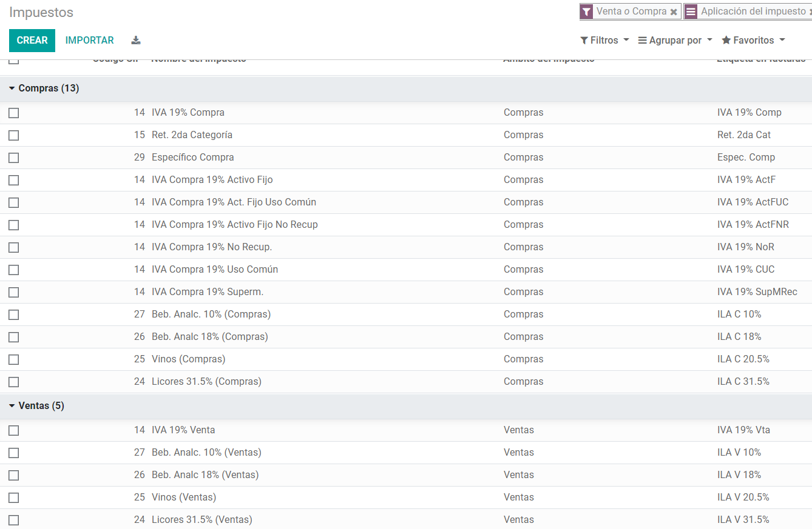

Taxes Types
***********

Chile has several tax types, the most common ones are:

- VAT. Is the regular VAT and it can have several rates.
- ILA (Impuesto a la Ley de Alcholes). Taxes for alcoholic drinks. It has a different rate.

Fiscal Positions
~~~~~~~~~~~~~~~~

Based on the purchase transactions, the VAT can have different affections. This will be done
in Odoo using the default purchase fiscal positions.

Document Types
~~~~~~~~~~~~~~

In some Latin American countries, including Chile, some accounting transactions like invoices and
vendor bills are classified by document types defined by the government fiscal authorities (In
Chile case: SII).

The document type is essential information that needs to be displayed in the printed reports and
that needs to be easily identified within the set of invoices as well of account moves.

Each document type can have a unique sequence per company. As part of the localization,
the Document Type includes the country on which the document is applicable and the data
is created automatically when the localization module is installed.

The information required for the document types is included by default so the user doesn't need to
fill anything on this view:

.. image:: chile/Chile09.png
   :align: center
   :alt: Chilean fiscal document types list.

.. note::
   There are several document types that are inactive by default but can be activated if needed.

Use on Invoices
***************

The document type on each transaction will be determined by:

- The Journal related to the Invoice, identifying if the journal uses documents.
- Condition applied based on the type of Issues and Receiver (ex. Type of fiscal
  regimen of the buyer and type of fiscal regimen of the vendor).

Journals
--------

Usage
~~~~~

Sales
*****

Sales Journals in Odoo usually represent a business unit or location, example:

- Ventas Santiago.
- Ventas Valparaiso.

For the retail stores is common to have one journal per POS:

- Cashier 1.
- Cashier 2.

Purchases
*********

The transactions purchase can be managed with a single journal, but sometimes companies use
more than one in order to handle some accounting transactions that are not related to vendor
bills but can be easily registered using this model, for example:

- Tax Payments to government.
- Employees payments.

Configuration
~~~~~~~~~~~~~

When creating sales journals the next information must be filled in:

**Point of sale type**: If the Sales journal will be used for electronic documents, the option
Online must be selected. Otherwise, if the journal is used for invoices imported from a previous
system or if you are using the SII portal “Facturación MiPyme“ you can use the option Manual.

**Use Documents**: This field is used to define if the journal will use Document Types. It is only
applicable to Purchase and Sales journals that can be related to the different sets of document
types available in Chile. By default, all the sales journals created will use documents.

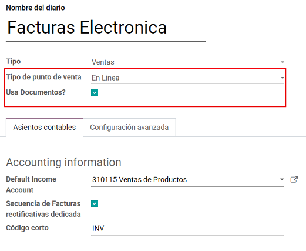

.. important::
   For the Chilean localization, it is important to define the default Debit and Credit accounts
   as they are required for one of the debit notes use cases.

.. _chile/caf-documentation:

CAF
---

A CAF (Folio Authorization Code) is required, for each document type that is issued to your
customers, the CAF is a file the SII provides to the Emisor with the folio/sequence authorized
for the electronic invoice documents.

Your company can make several requests for folios and obtain several CAFs, each one associated
with different ranges of folios. The CAFs are shared within all the journals, this means
that you only need one active CAF per document type and it will be applied on all journals.

Please refer to the `SII documentation <https://palena.sii.cl/dte/mn_timbraje.html>`_ to check the
detail on how to acquire the CAF.

.. important::
   The CAFs required by the SII are different from Production to Test (Certification mode). Make
   sure you have the correct CAF set depending on your environment.

Configuration
~~~~~~~~~~~~~

Once you have the CAF files you need to associate them with a document type in Odoo,
in order to add a CAF, just follow these steps:

1. Access to :menuselection:`Accounting --> Settings --> CAF`
2. Upload the file.
3. Save the CAF.

.. image:: chile/Chile39.png
   :align: center
   :alt: Steps to add a new CAF.

Once loaded, the status changes to *In Use*. At this moment, when a transaction is used
for this document type, the invoice number takes the first folio in the sequence.

.. important::
   In case you have used some folios in your previous system, make sure you set the next valid
   folio when the first transaction is created.

Usage and Testing
=================

Electronic Invoice Workflow
---------------------------

In the Chilean localization the electronic Invoice workflow covers the Emission of Customer
Invoices and the reception of Vendor Bills, in the next diagram we explain how the information
transmitted to the SII and between the customers and Vendors.

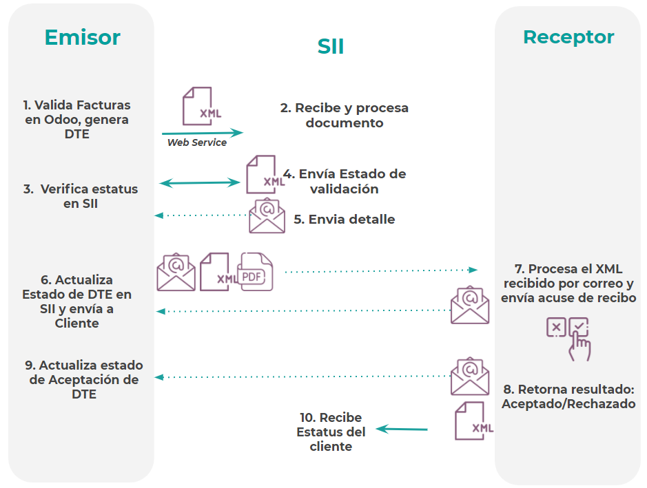

Customer invoice Emission
-------------------------

After the partners and journals are created and configured, the invoices are created in the
standard way, for Chile one of the differentiators is the document type which is selected
automatically based on the Taxpayer.

You can manually change the document type if needed.

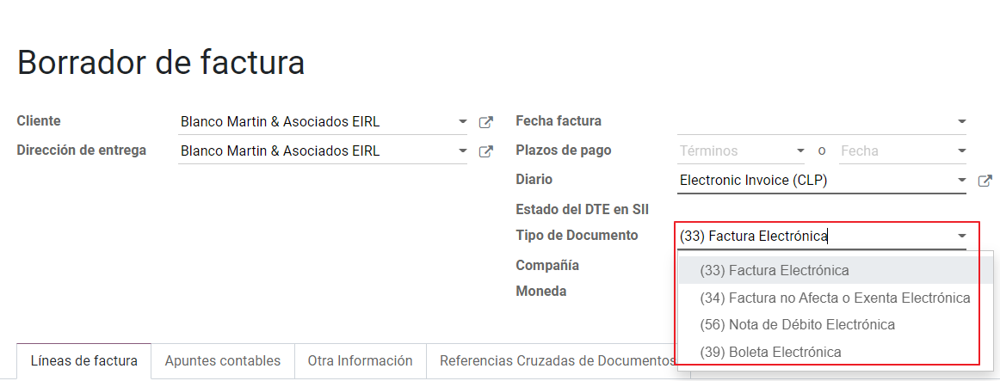

.. important::
   Documents type 33: Electronic Invoice must have at least one item with tax, otherwise the SII
   rejects the document validation.

.. _chile/electronic-invoice-validation:

Validation and DTE Status
~~~~~~~~~~~~~~~~~~~~~~~~~

When all the invoice information is filled, either manually or automatically when it's created
from a sales order, proceed to validate the invoice. After the invoice is posted:

- The DTE File (Electronic Tax Document) is created automatically and added in the chatter.
- The DTE SII status is set as: Pending to be sent.

  .. image:: chile/Chile16.png
     :align: center
     :alt: DTE XML File displayed in chatter.

The DTE Status is updated automatically by Odoo with a scheduled action that runs every day
at night, if you need to get the response from the SII immediately you can do it manually as well.
The DTE status workflow is as follows:

.. image:: chile/Chile17.png
   :align: center
   :alt: Transition of DTE statuses.

1. In the first step the DTE is sent to the SII, you can manually send it using the button: Enviar
   Ahora, a SII Tack number is generated and assigned to the invoice, you can use this number to
   check the details the SII sent back by email. The DTE status is updated to Ask for Status.

2. Once the SII response is received Odoo updates the DTE Status, in case you want to do it
   manually just click on the button: Verify on SII. The result can either be Accepted, Accepted
   With Objection or Rejected.

   .. image:: chile/Chile18.png
      :align: center
      :alt: Identification transaction for invoice and Status update.

   There are several internal status in the SII before you get Acceptance or Rejection, in case you
   click continuously the Button Verify in SII, you will receive in the chatter the detail of
   those intermediate statuses:

   .. image:: chile/Chile18_2.png
      :align: center
      :alt: Descprtion of each DTE status in the chatter.

3. The final response from the SII, can take on of these values:

   **Accepted:** Indicates the invoice information is correct, our document is now fiscally valid
   and it's automatically sent to the customer.

   **Accepted with objections:** Indicates the invoice information is correct but a minor issue was
   identified, nevertheless our document is now fiscally valid and it's automatically sent to the
   customer.

   .. image:: chile/Chile19.png
      :align: center
      :alt: Email track once it is sent to the customer.

   **Rejected:** Indicates the information in the invoice is incorrect and needs to be corrected,
   the detail of the issue is received in the emails you registered in the SII, if it is properly
   configured in Odoo, the details are also retrieved in the chatter once the email server is
   processed.

   If the invoice is Rejected please follow this steps:

   * Change the document to draft.
   * Make the required corrections based on the message received from the SII.
   * Post the invoice again.

   .. image:: chile/Chile20.png
      :align: center
      :alt: Message when an invoice is rejected.

Crossed references
~~~~~~~~~~~~~~~~~~

When the Invoice is created as a result of another fiscal document, the information related to the
originator document must be registered in the Tab Cross Reference, which is commonly used for
credit or debit notes, but in some cases can be used on Customer Invoices as well. In the case of
the credit and debit notes, they are set automatically by Odoo:

.. image:: chile/Chile21.png
   :align: center
   :alt: Invoice tab with origin document number and data.

Invoice PDF Report
~~~~~~~~~~~~~~~~~~

Once the invoice is accepted and validated by the SII and the PDF is printed, it includes the
fiscal elements that indicate that the document is fiscally valid:

.. image:: chile/Chile22.png
   :align: center
   :alt: Barcode and fiscal elements in the invoice report.

.. important::
   If you are hosted in Odoo SH or On-Premise, you should manually install the ``pdf417gen``
   library. Use the following command to install it: ``pip install pdf417gen``.

Commercial Validation
~~~~~~~~~~~~~~~~~~~~~

Once the invoice has been sent to the customer:

1. DTE partner status changes to “Sent”.
2. The customer must send a reception confirmation email.
3. Subsequently, if all the commercial terms and invoice data are correct, they will send the
   Acceptance confirmation, otherwise they send a Claim.
4. The field DTE acceptation status is updated automatically.

.. image:: chile/Chile23.png
   :align: center
   :alt: Message with the commercial acceptance from the customer.

Processed for Claimed invoices
~~~~~~~~~~~~~~~~~~~~~~~~~~~~~~

Once the invoice has been Accepted by the SII **it can not be cancelled in Odoo**. In case you get
a Claim for your customer the correct way to proceed is with a Credit Note to either cancel the
Invoice or correct it. Please refer to the :ref:`chile/credit-notes` section for more details.

.. image:: chile/Chile24.png
   :align: center
   :alt: Invoice Comercial status updated to Claimed.

Common Errors
~~~~~~~~~~~~~

There are multiple reasons behind a rejection from the SII, but these are some of the common errors
you might have and which is the related solution.

- Error: ``RECHAZO- DTE Sin Comuna Origen.``

  *Hint:* Make sure the Company Address is properly filled including the State and City.

- Error en Monto: ``- IVA debe declararse.``

  *Hint:* The invoice lines should include one VAT tax, make sure you add one on each invoice line.

- Error: ``Rut No Autorizado a Firmar.``

  *Hint:* The invoice lines should include one VAT tax, make sure you add one on each invoice line.

- Error: ``Fecha/Número Resolucion Invalido RECHAZO- CAF Vencido : (Firma_DTE[AAAA-MM-DD] -
  CAF[AAAA-MM-DD]) &gt; 6 meses.``

  *Hint:* Try to add a new CAF related to this document as the one you're using is expired.

- Error: ``Element '{http://www.sii.cl/SiiDte%7DRutReceptor': This element is not expected. Expected
  is ( {http://www.sii.cl/SiiDte%7DRutEnvia ).``

  *Hint:* Make sure the field Document Type and VAT are set either in the Customer and in the main
  company.

- GLOSA: ``Usuario sin permiso de envio.``

  *Hint:* This error indicates that most likely, your company has not passed the `Certification
  process <https://www.sii.cl/factura_electronica/factura_mercado/proceso_certificacion.htm>`_ in
  the SII - Sistema de Facturación de Mercado. If this is the case, please contact your Account
  Manager or Customer Support as this certification is not part of the the Odoo services, but we
  can give you some alternatives.

.. _chile/credit-notes:

Credit Notes
------------

When a cancellation or correction is needed over a validated invoice, a credit note must be
generated. It is important to consider that a CAF file is required for the Credit Note,
which is identified as document 64 in the SII.

.. image:: chile/Chile40.png
   :align: center
   :alt: Creation of CAF for Credit notes.

.. tip::
   Refer to the :ref:`CAF section <chile/caf-documentation>` where we described the process to load
   the CAF on each document type.

Use Cases
~~~~~~~~~

Cancel Referenced document
**************************

In case you need to cancel or invalid an Invoice, use the button Add Credit note and select Full
Refund, in this case the SII reference Code is automatically set to: Anula Documento de referencia.

.. image:: chile/Chile26.png
   :align: center
   :alt: Full invoice refund with SII reference code 1.

Corrects Referenced Document Text
*********************************

If a correction in the invoice information is required, for example the Street Name, use the button
Add Credit note,select Partial Refund and select the option “Solo corregir Texto”. In this case
the SII reference Code is automatically set to: Corrige el monto del Documento de Referencia.

.. image:: chile/Chile27.png
   :align: center
   :alt: Partial refund to correct text including the corrected value.

Odoo creates a Credit Note with the corrected text in an invoice and price 0.

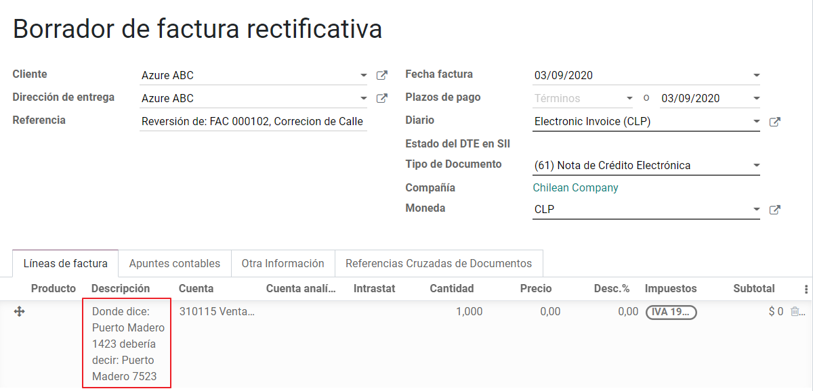

.. important::
   It's important to define the default credit account in the Sales journal as it
   is taken for this use case in specific.

Corrects Referenced Document Amount
***********************************

When a correction on the amounts is required, use the button Add Credit note and select Partial
Refund. In this case the SII reference Code is automatically set to: Corrige el monto del Documento
de Referencia.

.. image:: chile/Chile30.png
   :align: center
   :alt: Credit note for partial refund to correct amounts, using the SII reference code 3.

Debit Notes
-----------

As part of the Chilean localization, besides creating credit notes from an existing document you
can also create debit Notes. For this just use the button “Add Debit Note”. The two main use cases
for debit notes are detailed below.

Use Cases
~~~~~~~~~

Add debt on Invoices
********************

The most common use case for debit notes is to increase the value of an existing invoice, you
need to select option 3 in the field Reference code SII:

.. image:: chile/Chile31.png
   :align: center
   :alt: Debit note for partial refund to crrect amounts, using the SII reference code 3.

In this case Odoo automatically includes the source invoice in the cross reference section:

.. image:: chile/Chile32.png
   :align: center
   :alt: Invoice data on crossed reference section for debit notes.

Cancel Credit Notes
*******************

In Chile the debits notes are used to cancel a validated Credit Note, in this case just
select the button Add debit note and select the first option in the wizard: *1: Anula
Documentos de referencia.*

.. image:: chile/Chile33.png
   :align: center
   :alt: Creating a debit note to cancel a credit note with the SII code reference 1.

Vendor Bills
------------

As part of the Chilean localization, you can configure your Incoming email server as the same you
have register in the SII in order to:

- Automatically receive the vendor bills DTE and create the vendor bill based on this information.
- Automatically Send the reception acknowledgement to your vendor.
- Accept or Claim the document and send this status to your vendor.

Reception
~~~~~~~~~

As soon as the vendor email with the attached DTE is received:
1. The vendor Bill mapping all the information included in the xml.
2. An email is sent to the vendor with the Reception acknowledgement.
3. The DTE status is set as: Acuse de Recibido Enviado

.. image:: chile/Chile34.png
   :align: center
   :alt: Messages recorded in the chatter with the reception notification for the vendor.

Acceptation
~~~~~~~~~~~

If all the commercial information is correct on your vendor bill then you can accept the document
using the :guilabel:`Aceptar Documento` button. Once this is done the DTE Acceptation Status
changes to :guilabel:`Accepted`` and an email of acceptance is sent to the vendor.

.. image:: chile/Chile35.png
   :align: center
   :alt: Acceptance button in vendor bills to inform vendor the document is comercially accepted.

Claim
~~~~~

In case there is a commercial issue or the information is not correct on your vendor bill, you can
Claim the document before validating it, using the button: Claim, once this is done the DTE
Acceptation Status change to: Claim and an email of acceptance is sent to the vendor.

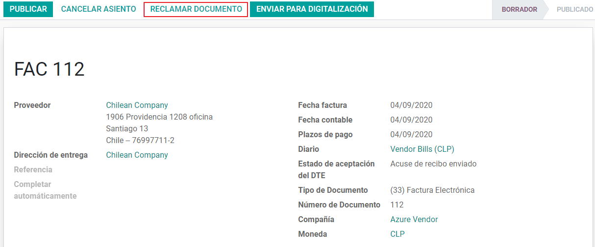

If you claim a vendor bill, the status changes from draft to cancel automatically. Considering this
as best practice, all the Claim documents should be canceled as they won't be valid for your
accounting records.

Delivery Guide
--------------

To install the Delivery Guide module, go to :menuselection:`Apps` and search for :guilabel:`Chile
(l10n_cl)`. Then click :guilabel:`Install` on the module :guilabel:`Chile - E-Invoicing Delivery
Guide`.

.. note::
   *Chile - E-Invoicing Delivery Guide* has a dependency with *Chile - Facturación Electrónica*.
   Odoo will install the dependency automatically when the Delivery Guide module is installed.

The Delivery Guide module includes sending the DTE to SII and the stamp in PDF reports for
deliveries.

.. image:: chile/chile42.png
   :align: center
   :alt: Install Delivery Guide Module

Once all configurations have been made for electronic invoices (e.g., uploading a valid company
certificate, setting up master data, etc.), Delivery Guides need their own CAFs. Please refer to the
:ref:`CAF documentation <chile/caf-documentation>` to check the details on how to acquire the CAFs
for electronic Delivery Guides.

Verify the following important information in the *Price for the Delivery Guide* configuration:

- :guilabel:`From Sales Order`: Delivery Guide takes the product price from the Sales Order and
  shows it on the document.
- :guilabel:`From Product Template`: Odoo takes the price configured in the product template and
  shows it on the document.
- :guilabel:`No show price`: no price is shown in the Delivery Guide.

Electronic delivery guides are used to move stock from one place to another and they can represent
sales, sampling, consignment, internal transfers, and basically any product move.

Delivery Guide from a Sales Process
~~~~~~~~~~~~~~~~~~~~~~~~~~~~~~~~~~~

When a Sales Order is created and confirmed, a Delivery Order is generated. After validating the
Delivery Order, the option to create a Delivery Guide is activated.

.. image:: chile/chile43.png
   :align: center
   :alt: Create Delivery Guide Button

When clicking on :guilabel:`Create Delivery Guide` for the first time, a warning message pops up,
showing the following:

.. image:: chile/chile44.png
   :align: center
   :alt: An example sequence error when creating a Delivery Guide in Odoo

This warning message means the user needs to indicate the next sequence number Odoo has to take to
generate the Delivery Guide, and only only happens the *first time* a Delivery Guide is created in
Odoo. After the first document has been correctly generated, Odoo takes the CAFs next available
number to generate the following Delivery Guide and so on.

After the Delivery Guide is created:

- The DTE file (Electronic Tax Document) is automatically created and added to the chatter.
- The DTE SII status is set as: Pending to be sent.

.. image:: chile/chile45.png
   :align: center
   :alt: DTE Status in SII and creation of DTE/XML

The DTE Status is automatically updated by Odoo with a scheduled action that runs every day at
night. To get a response from the SII immediately, press the :guilabel:`Send now to SII` button.

Once the Delivery Guide is sent, it may then be printed by clicking on the :guilabel:`Print
Delivery Guide` button.

.. image:: chile/chile46.png
   :align: center
   :alt: Printing Delivery Guide PDF

Electronic Receipt
------------------

To install the Electronic Receipt module, go to :menuselection:`Apps` and search for
:guilabel:`Chile (l10n_cl)`. Then click :guilabel:`Install` on the module :guilabel:`Chile -
Electronic Receipt`.

.. note::
   *Chile - Electronic Receipt* has a dependency with *Chile - Facturación Electrónica*. Odoo will
   install the dependency automatically when the E-invoicing Delivery Guide module is installed.

This module contains the electronic receipt and daily sales report, which are automatically sent to
SII.

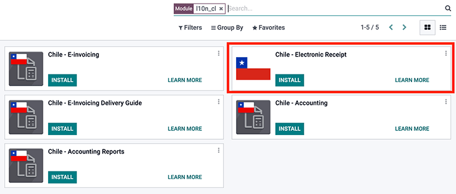

Once all configurations have been made for Electronic Invoices (e.g., uploading a valid company
certificate, setting up master data, etc.), Electronic Receipts need their own CAFs. Please refer
to the :ref:`CAF documentation <chile/caf-documentation>` to check the details on how to acquire the
CAFs for Electronic Receipts.

Electronic Receipts are useful when clients do not need an Electronic Invoice. By default, there is
a partner in the database called *Anonymous Final Consumer* with a generic RUT 66666666-6 and
taxpayer type of *Final Consumer*. This partner can be used for Electronic Receipts or a new record
may be created for the same purpose.

Although Electronic Receipts should be used for final consumers with a generic RUT, it can also be
used for specific partners. After the partners and journals are created and configured, the
Electronic Receipts are created in the standard way as Electronic Invoice, but the type of document
:guilabel:`(39) Electronic Receipt` should be selected, like so:

.. image:: chile/chile48.png
   :align: center
   :alt: Select type of Document: (39) Boleta Electrónica

Validation and DTE Status
~~~~~~~~~~~~~~~~~~~~~~~~~

When all of the Electronic Receipt information is filled, either manually or automatically from a
Sales Order, proceed to validate the receipt. By default, Electronic Invoice is selected as the
Document Type, however in order to validate the receipt correctly, make sure to edit the Document
Type and change to Electronic Receipt.

After the receipt is posted:

- The DTE file (Electronic Tax Document) is created automatically and added to the chatter.
- The DTE SII status is set as: Pending to be sent.

.. image:: chile/chile49.png
   :align: center
   :alt: DTE status in SII and creation of DTE/XML

The DTE Status is automatically updated by Odoo with a scheduled action that runs every day at
night. To get a response from the SII immediately, press the :guilabel:`Send now to SII` button.

Please refer to the :ref:`DTE Workflow <chile/electronic-invoice-validation>` for Electronic
Invoices as the workflow for Electronic Receipt follows the same process.

Daily Sales Report
~~~~~~~~~~~~~~~~~~

Once Electronic Receipts have been created, the system creates a daily sales report containing all
Electronic Receipts per day. This report is electronically stamped and sent to the SII overnight in
XML format. These daily reports can be found in :menuselection:`Reports --> Daily Sales Reports`.

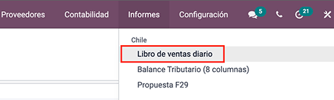

A list of daily reports is displayed with all daily DTE sent to SII.

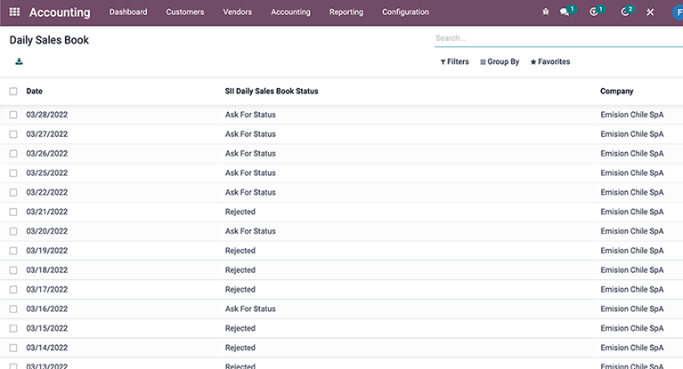

If no Electronic Receipt was made on a particular day, the report is sent but it will not have any
receipts in it. The report will also have an answer from the SII if it was accepted or rejected
(depending on the company's certificate and validated receipts).

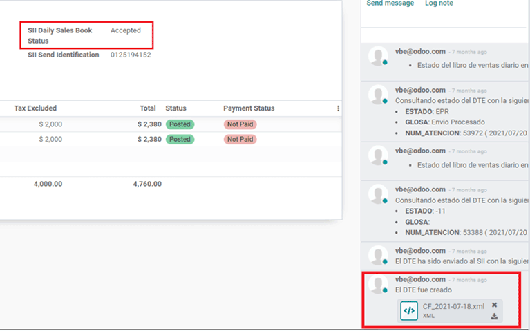

.. important::
   For Chilean localization, note that the feature tax included in the price is *not* supported for
   the Electronic Receipt.

   If a Daily Sales Report has already been created for a specific day in another system, the daily
   report in Odoo will be rejected due to the sequence number used. If that is the case, the user
   has to manually click on :guilabel:`Retry` in order for a new sequence number to be generated
   (this action is automatically done by Odoo). Afterwards, users can manually verify report status
   with SII or wait for Odoo to update status later at night.

Financial Reports
=================

Balance Tributario de 8 Columnas
--------------------------------

This report presents the accounts in detail (with their respective balances), classifying them
according to their origin and determining the level of profit or loss that the business had within
the evaluated period of time, so that a real and complete knowledge of the status of a company.

You can find this report in :menuselection:`Accounting --> Accounting --> Reports`

.. image:: chile/Chile37.png
   :align: center
   :alt: Columns and data displayed in the report Balance Tributario 8 Columnas.

Propuesta F29
-------------

The form F29 is a new system that the SII enabled to taxpayers, and that replaces the Purchase and
Sales Books. This report is integrated by Purchase Register (CR) and the Sales Register (RV).
Its purpose is to support the transactions related to VAT, improving its control and declaration.

This record is supplied by the electronic tax documents (DTE's) that have been received by the
SII.

You can find this report in :menuselection:`Accounting --> Accounting --> Reports`

.. image:: chile/Chile38.png
   :align: center
   :alt: Parameters to required to generate the Report Propuesta F29
