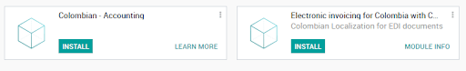
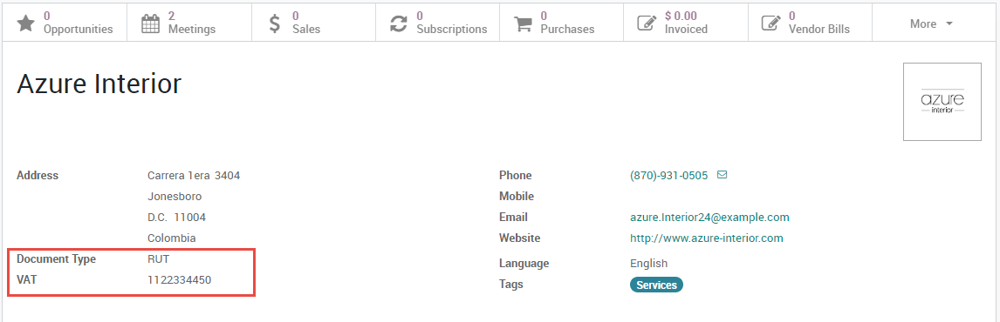
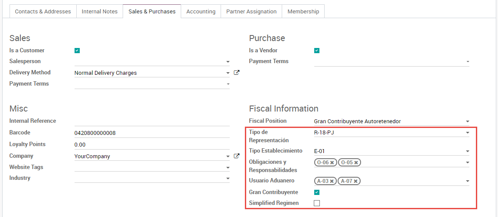
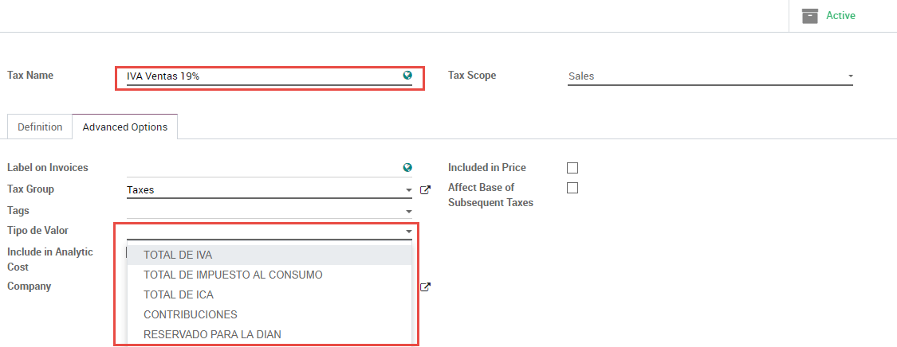
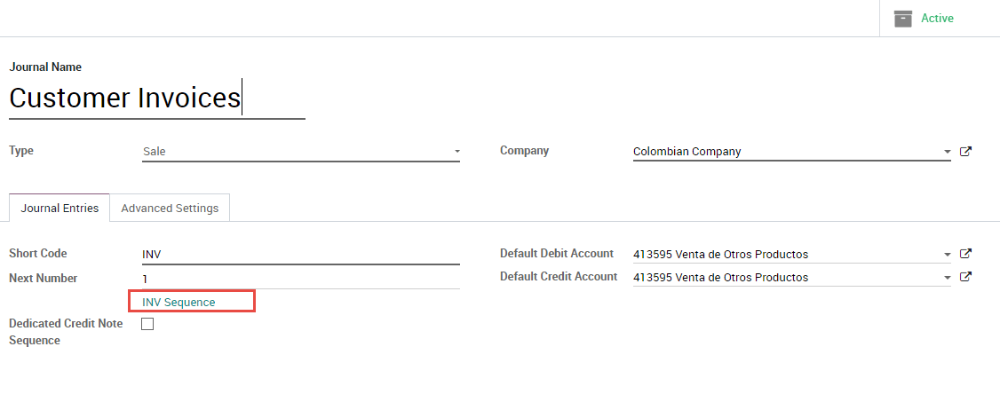
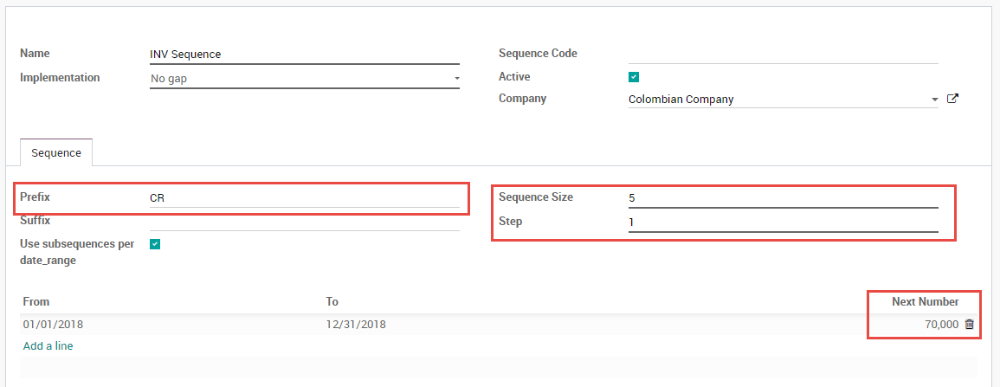

=============
Configuration
=============

Install the Colombian localization modules
==========================================

.. _colombia/e-invoicing:

To :ref:`install <general/install>` the modules, navigate to :menuselection:`Apps`, remove the
:guilabel:`Apps` filter and search for `Colombia`. Then click on :guilabel:`Install` for the first
two modules.

Configure credentials for Carvajal web service
==============================================

Once the modules are installed, the user credentials need to be configured in order to connect with
Carvajal Web Service. First, navigate to :menuselection:`Accounting --> Configuration --> Settings`
and look for the :guilabel:`Colombian Electronic Invoice` section. Then, fill in the required
configuration information provided by Carvajal.

.. image:: colombia/carvajal-credential-config.png
   :align: center
   :alt: Configure credentials for Carvajal web service in Odoo.

Check the :guilabel:`Testing mode` checkbox to connect with the Carvajal testing environment. This
allows users to test the complete workflow and integration with the CEN Financiero portal, which is
accessible here:

`CTS (Carvajal T&S) <https://cenflab.cen.biz/site/>`_.

`CSC (Carvajal Servicios de Comunicación) <https://web-stage.facturacarvajal.com/>`_.

CSC is the default for new databases.

Once Odoo and Carvajal are fully configured and ready for production, the testing environment can
be disabled by unchecking the :guilabel:`Testing mode` checkbox.

Configure report data
=====================

Report data can be defined for the fiscal section and the bank information in the PDF as part of
the configurable information that is sent in the XML.

Navigate to :menuselection:`Accounting --> Configuration --> Settings` and look for the
:guilabel:`Colombian Electronic Invoice` section.

.. image:: colombia/report-config.png
   :align: center
   :alt: Configure the report data in Odoo.

Configure data required in the XML
==================================

Partner
-------

Configure the identification number and fiscal structure.

Identification
~~~~~~~~~~~~~~

As part of the Colombian Localization, the document types defined by the DIAN are now available on
the Partner form. Colombian partners have to have their identification number (:guilabel:`VAT`) and
:guilabel:`Document Type` set:

.. tip::
   When the :guilabel:`Document Type` is `RUT` the identification number needs to be configured in
   Odoo including the verification digit, Odoo will split this number when the data to the third
   party vendor is sent.

Fiscal structure (RUT)
~~~~~~~~~~~~~~~~~~~~~~

The partner's responsibility codes (section 53 in the RUT document) are included as part of the
electronic invoice module given it is part of the information required by the DIAN.

The required fields can be found in :menuselection:`Partner --> Sales & Purchase Tab --> Fiscal
Information`.

Additionally two boolean fields were added in order to specify the fiscal regimen of the partner.

Taxes
-----

If sales transactions include products with taxes, the :guilabel:`Value Type` field in the
:guilabel:`Advanced Options tab` needs to be configured per tax.

Retention tax types (ICA, IVA, Fuente) are also included in the options to configure taxes.
This configuration is used in order to correctly display taxes in the invoice PDF.

Journals
--------

Once the DIAN has assigned the official sequence and prefix for the electronic invoice resolution,
the :guilabel:`Sales journals` related to the invoice documents need to be updated in Odoo. To
access the sequence, first enable :ref:`developer mode <developer-mode>`. Then, navigate to
:menuselection:`Accounting --> Settings --> Configuration Setting --> Journals` and finally, open
the sequence.

Once the sequence is opened, the Prefix and Next Number fields should be configured and
synchronized with the CEN Financiero.

Users
-----

The default template that is used by Odoo on the invoice PDF includes the job position of the
salesperson, so the :guilabel:`Job Position` field should be configured.

.. seealso::
   - :doc:`workflows`
   - :doc:`reports`
