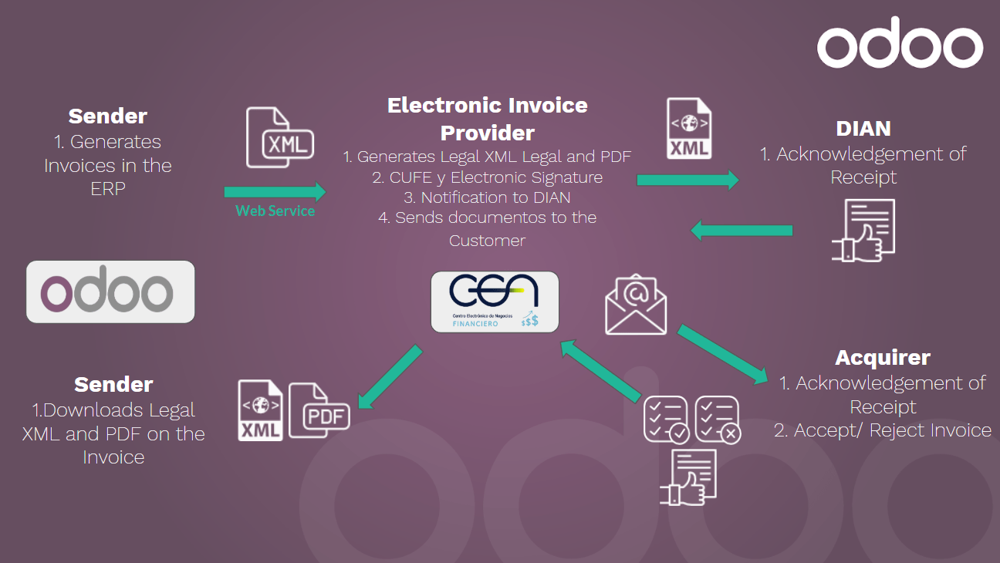
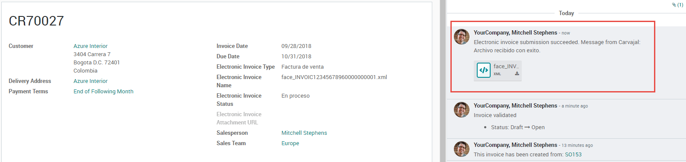
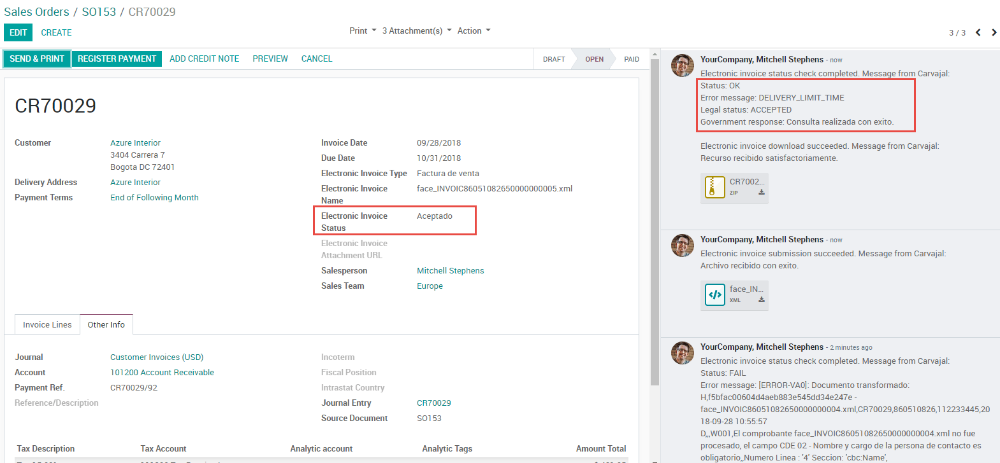

=========
Workflows
=========

Main workflows
==============

Invoice
-------

With all of the master data and credentials configured, it is possible to start testing the
electronic invoice workflow.

Invoice creation
----------------

The functional workflow that takes place before an invoice validation doesn't change. The main
changes that are introduced with the electronic invoice are the next fields.

There are three types of documents:

- **Factura Electronica**: This is the regular type of document and its applicable for Invoices,
  Credit Notes and Debit Notes.
- **Factura de Importación**: This should be selected for importation transactions.
- **Factura de contingencia**: This is an exceptional type that is used as a manual backup if the
  company is not able to use the ERP and if it is necessary to generate the invoice manually when
  this invoice is added to the ERP.

Invoice validation
------------------

After the invoice is validated, an XML file is created and sent automatically to Carvajal. This
file is also displayed in the chatter.

The :guilabel:`Electronic Invoice Name` field is now displayed in the :guilabel:`Other Info` tab
with the name of the XML file. Additionally, the :guilabel:`Electronic Invoice Status` field is
displayed with the with the initial value :guilabel:`In progress`.

Reception of legal XML and PDF
------------------------------

The electronic invoice vendor receives the XML file and proceeds to validate the structure and the
information in it. In the :guilabel:`Action` dropdown, select the :guilabel:`Check Carvajal Status`
button. If everything is correct the :guilabel:`Electronic Invoice Status` field value changes to
:guilabel:`Validated`. Then, proceed to generate a Legal XML which includes a digital signature and
a unique code (CUFE), a PDF invoice that includes a QR code and the CUFE is also generated.

After this:

- A ZIP containing the legal XML and the PDF is downloaded and displayed in the invoice chatter:

  .. image:: colombia/zip-invoice-chatter.png
     :align: center
     :alt: ZIP file displayed in the invoice chatter in Odoo.

  .. image:: colombia/zip-file-contents.png
     :align: center
     :alt:  XML and PDF contained in invoice ZIP file.

- The Electronic Invoice status changes to "Accepted."

Common errors
-------------

During the XML validation the most common errors are usually related to missing master data. In
such cases, error messages are shown in the chatter after updating the electronic invoice status.

.. image:: colombia/xml-validation-errors.png
   :align: center
   :alt: XML validation errors shown in the invoice chatter in Odoo.

After the master data is corrected, it's possible to reprocess the XML with the new data and send
the updated version, using the following button in the Action dropdown.

Additional use cases
--------------------

The process for credit and debit notes is exactly the same as the invoice, the functional workflow
remains the same as well.

Advanced workflows
==================

.. seealso::
   - :doc:`reports`
   - :doc:`configuration`
