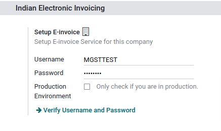
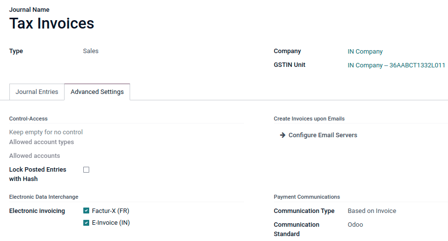
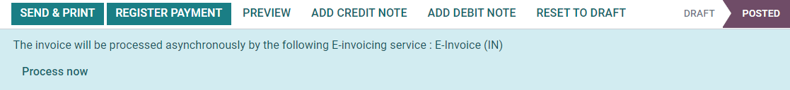
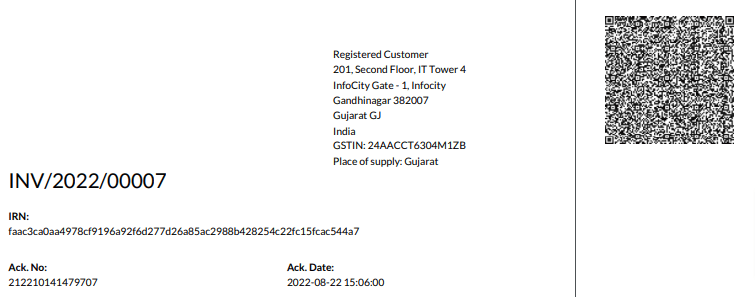

=====
India
=====

.. _india/installation:

Installation
============

:ref:`Install <general/install>` the following modules to get all the features of the Indian
localization:

.. list-table::
   :header-rows: 1

   * - Name
     - Technical name
     - Description
   * - :guilabel:`Indian - Accounting`
     - `l10n_in`
     - Default :doc:`fiscal localization package <../overview/fiscal_localization_packages>`
   * - :guilabel:`Indian E-invoice Integration`
     - `l10n_in_edi`
     - :ref:`Indian e-invoicing integration <india/e-invoicing>`

.. _india/e-invoicing:

Indian e-invoicing
==================

Odoo is compliant with the **Indian Good and Services Tax (GST) e-Invoice system** requirements.

.. important::
   Indian e-invoicing is available from Odoo 15.0. If needed, :doc:`upgrade
   </administration/upgrade>` your database.

.. _india/e-invoicing-api:

Registration on your NIC e-Invoice web portal
---------------------------------------------

You must register on the **NIC e-Invoice** web portal to get your **API credentials**. You need
these credentials to :ref:`configure your Odoo Accounting app <india/e-invoicing-configuration>`.

#. Login to the NIC e-Invoice web portal on - https://einvoice1.gst.gov.in/ by clicking on
   :guilabel:`Login` and entering your :guilabel:`Username` and :guilabel:`Password`.

   .. note::
      If you have already registered on the NIC Eway Bill Production portal, then you can use the
      same login credentials here.

   .. image:: india/e-invoice-system-login.png
      :align: center
      :alt: Register Odoo ERP system on e-invoice web portal

#. From your dashboard, go to :menuselection:`API Registration --> User Credentials --> Create API
   User`.

   .. image:: india/e-invoice-create-api-user.png
      :align: center
      :alt: Click on User Credentials and Create API User

#. After that, you receive an :abbr:`OTP (one-time password)` code to your registered mobile number.
#. Enter the OTP code and click on :guilabel:`Verify OTP`.

   .. image:: india/trigger-otp.png
      :align: center
      :alt: Trigger an OTP to your registerd phone number

#. Select :guilabel:`Through GSP` in the first field, select :guilabel:`Tera Software Limited`
   as your GSP, and type in a :guilabel:`Username` and :guilabel:`Password` for your API.

   .. image:: india/submit-api-registration-details.png
      :align: center
      :alt: Submit API specific Username and Password

#. Click on :guilabel:`Submit`.

.. _india/e-invoicing-configuration:

Configuration on Odoo
---------------------

To set up the e-invoice service, go to :menuselection:`Accounting --> Configuration --> Settings -->
Indian Electronic Invoicing`, and enter the :guilabel:`Username` and :guilabel:`Password`.

.. _india/e-invoicing-journals:

Journals
~~~~~~~~

Your default *sales* journal should be already configured correctly. You can check it or configure
other journals by going to :menuselection:`Accounting --> Configuration --> Journals`. Then, open
your *sales* journal, and in the :guilabel:`Advanced Settings` tab, under :guilabel:`Electronic Data
Interchange`, check :guilabel:`E-Invoice (IN)` and :guilabel:`Save`.

.. _india/e-invoicing-workflow:

Workflow
--------

To start invoicing from Odoo, an invoice must be created using the standard invoicing flow, that is,
either from a sales order or the invoice menu in the Accounting application.

.. _india/invoice-validation:

Invoice validation
~~~~~~~~~~~~~~~~~~

Once the invoice is validated, a confirmation message is displayed at the top.

Odoo automatically uploads the JSON-signed file to the government portal after a while. If you want
to process the invoice immediately, you can click on :guilabel:`Process Now`.

         the following E-invoicing service : E-Invoice (IN)"

.. note::
   - You can find the JSON-signed file in the attached files, in the chatter.
   - You can check the status of EDI with web-service under the :guilabel:`EDI Document` tab or the
     :guilabel:`Electronic invoicing` field.

.. _india/invoice-pdf-report:

Invoice PDF Report
~~~~~~~~~~~~~~~~~~

Once the invoice is submitted and validated, you can print the invoice PDF report. The report
includes the :abbr:`IRN (Invoice Reference Number)`, acknowledgment number and date, and QR code.
They certify that the invoice is a valid fiscal document.

.. _india/edi-cancellation:

EDI Cancellation
~~~~~~~~~~~~~~~~

If you want to cancel an e-invoice, go to the :guilabel:`Other info` tab of the invoice and fill out
the :guilabel:`Cancel reason` and :guilabel:`Cancel remarks` fields. Then, click on
:guilabel:`Request EDI cancellation`. The status of the :guilabel:`Electronic invoicing` field
changes to :guilabel:`To Cancel`.

.. image:: india/e-invoice-cancellation.png
   :align: center
   :alt: cancel reason and remarks

.. note::
   If you want to abort the cancellation before processing the invoice, then click on
   :guilabel:`Call Off EDI Cancellation`.

Once you request to cancel the e-invoice, Odoo automatically submits the JSON Signed file to the
government portal. If you want to process the invoice immediately, you can process it by clicking on
:guilabel:`Process Now`.

.. _india/verify-e-invoice:

Verify the e-invoice from the GST
~~~~~~~~~~~~~~~~~~~~~~~~~~~~~~~~~

After submitting an e-invoice, you can also verify the signed invoice from the GST e-Invoice system
website.

#. Download the JSON file from the attached files.
#. Open the e-invoice portal: https://einvoice1.gst.gov.in/ and go to :menuselection:`Search -->
   Verify Signed Invoice`.
#. Select the JSON file and submit it.

   .. image:: india/verify-invoice.png
      :align: center
      :alt: select the JSON file for verify invoice

#. You can check the verified signed e-invoice here.

   .. image:: india/signed-invoice.png
      :align: center
      :alt: verified e-invoice
