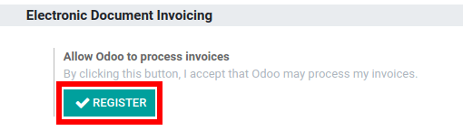
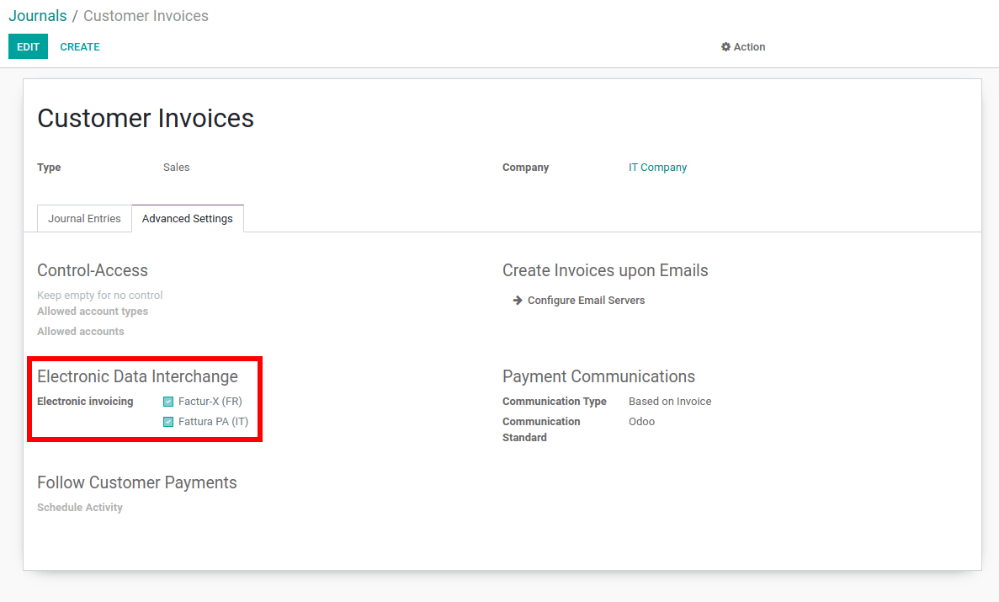
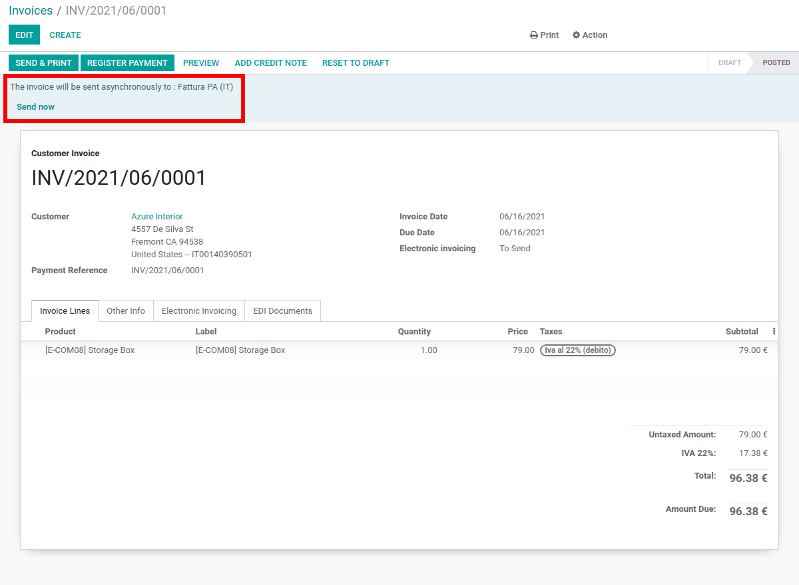
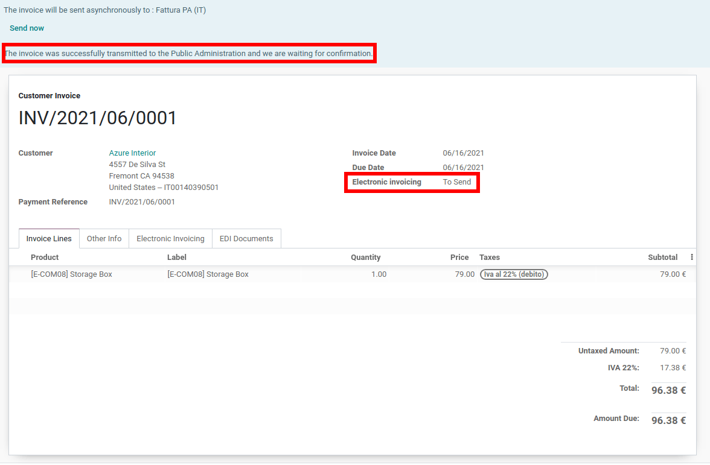

=====
Italy
=====

Allow the user to generate the EDI document for Italian invoicing.

This module allows the creation of the EDI documents and the communication with the SDICoop web
service of FatturaPA to send or receive invoices and notifications.

.. warning::
   Once this module is installed, it's no longer possible to send invoices via :ref:`PEC mails
   <italy/pec>`.

SDICoop
=======

Configuration
-------------

Setup the Codice Destinatario on FatturaPA
~~~~~~~~~~~~~~~~~~~~~~~~~~~~~~~~~~~~~~~~~~

To receive invoices and notifications from third parties, you need to inform the FatturaPA service
that Odoo is the allowed party to process files for you. To do so, you must setup Odoo's *Codice
Destinatario* on the FatturaPA portal. The *Codice Destinatario* is ``K95IV18``.

#. Go to https://ivaservizi.agenziaentrate.gov.it/portale/ and authenticate.
#. Go to section :menuselection:`Fatture e Corrispettivi`.
#. Set the user as Legal Party for the VAT number you wish to configure the electronic adress.
#. In :menuselection:`Servizi Disponibili --> Fatturazione Elettronica --> Registrazione
   dell’indirizzo telematico dove ricevere tutte le fatture elettroniche`, input Odoo's Codice
   Destinatario (**K95IV18**), then confirm.

Give Odoo permission to process files
~~~~~~~~~~~~~~~~~~~~~~~~~~~~~~~~~~~~~

Since the files are transmitted through Odoo's server before being sent to SDICoop or received by
your database, you need to authorize Odoo to process your files from your database.

To do this, go to :menuselection:`Accounting --> Settings --> Electronic Invoicing` and click on
*Register*.

.. Note::
   All your files are encrypted upon reception in such a way that only you are able to decrypt them.

Enable FatturaPA on the Sales journal
~~~~~~~~~~~~~~~~~~~~~~~~~~~~~~~~~~~~~

Open your sales journal. Under the *Advanced Settings* tab, in the **Electronic invoicing** field,
check *FatturaPA* and *Save*.

Issue invoices
--------------

Send an invoice the way you would do it normally. The EDI process proceeds automatically.

You can check the current status of your customer invoice under the **Electronic invoicing** field.

Receive invoices
~~~~~~~~~~~~~~~~

This process is ran automatically once a day.
