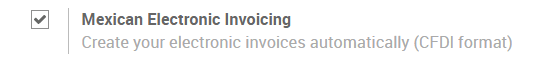
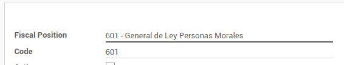
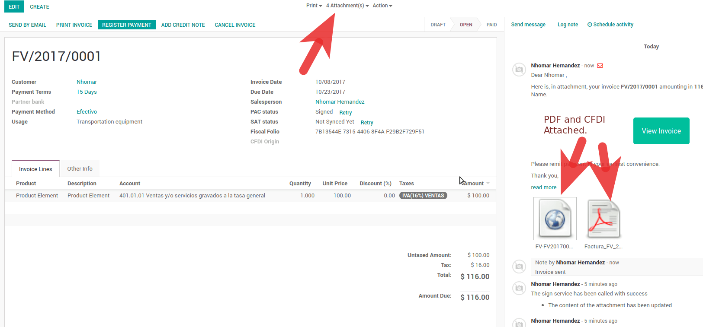
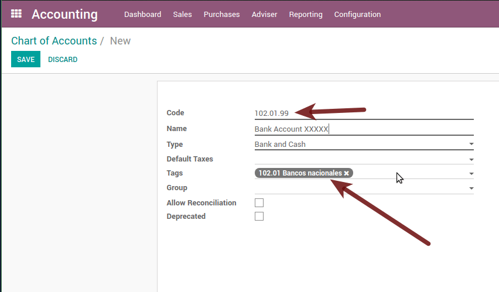
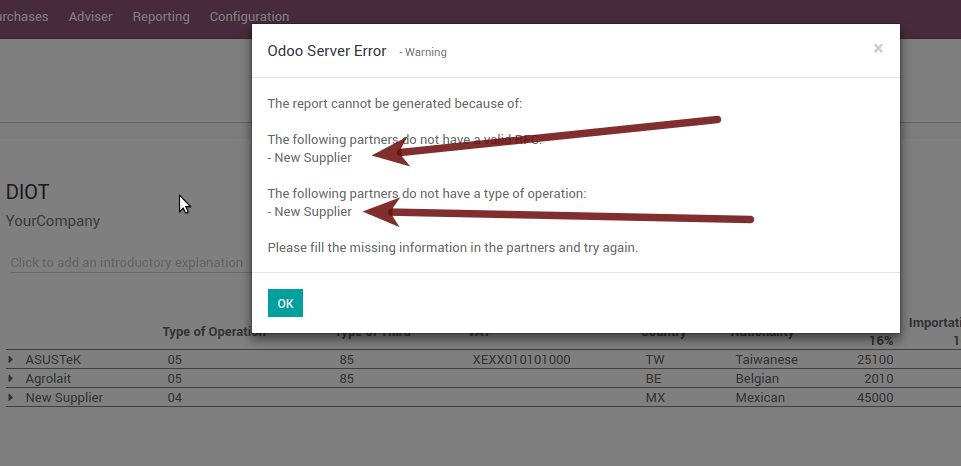
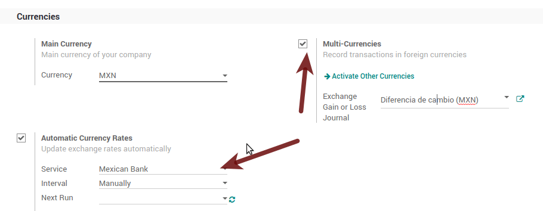

======
Mexico
======

.. note::
   This documentation is written assuming that you follow and know the official
   documentation regarding Invoicing, Sales and Accounting and that you have
   experience working with odoo on such areas, we are not intended to put
   here procedures that are already explained on those documents, just the
   information necessary to allow you use odoo in a Company with the country
   "Mexico" set.

Introduction
============

The mexican localization is a group of 3 modules:

1. **l10n_mx:** All basic data to manage the accounting, taxes and the
   chart of account, this proposed chart of account installed is a intended
   copy of the list of group codes offered by the `SAT`_.
2. **l10n_mx_edi**: All regarding to electronic transactions, CFDI 3.2 and 3.3,
   payment complement, invoice addendum.
3. **l10n_mx_reports**: All mandatory electronic reports for electronic
   accounting are here (Accounting app required).

With the Mexican localization in Odoo you will be able not just to comply
with the required features by law in México but to use it as your
accounting and invoicing system due to all the set of normal requirements for
this market, becoming your Odoo in the perfect solution to administer your
company in Mexico.

Configuration
=============

.. tip::
   After the configuration we will give you the process to test everything,
   try to follow step by step in order to allow you to avoid expend time on
   fix debugging problems. In any step you can recall the step and try again.

Install the Mexican Accounting Localization
-------------------------------------------

For this, go in Apps and search for Mexico. Then click on *Install*.

.. image:: media/mexico01.png
   :align: center

.. tip::
   When creating a database from www.odoo.com, if you choose Mexico
   as country when creating your account, the mexican localization will be
   automatically installed.

Electronic Invoices (CDFI 3.2 and 3.3 format)
---------------------------------------------

To enable this requirement in Mexico go to configuration in accounting Go in
:menuselection:`Accounting --> Settings` and enable the option on the image
with this you will be able to generate the signed invoice (CFDI 3.2 and 3.3)
and generate the payment complement signed as well (3.3 only) all fully
integrate with the normal invoicing flow in Odoo.

.. _mx-legal-info:

Set your legal information in the company
-----------------------------------------

First, make sure that your company is configured with the correct data.
Go in :menuselection:`Settings --> Users --> Companies`
and enter a valid address and VAT for
your company. Don’t forget to define a mexican fiscal position on your
company’s contact.

.. tip::
   If you want use the Mexican localization on test mode, you can put any known
   address inside Mexico with all fields for the company address and
   set the vat to **EKU9003173C9**.

.. image:: media/mexico03.png
   :align: center

.. warning::
   From a legal point of view, a Mexican company must use the local currency (MXN).
   Therefore, Odoo does not provide features to manage an alternative configuration.
   If you want to manage another currency, let MXN be the default currency and use
   price list instead.

Set the proper "Fiscal Position" on the partner that represent the company
--------------------------------------------------------------------------

Go In the same form where you are editing the company save the record in
order to set this form as a readonly and on readonly view click on the partner
link, then edit it and set in the *Invoicing* tab the proper Fiscal Information
(for the **Test Environment** this must be *601 - General de Ley Personas
Morales*, just search it as a normal Odoo field if you can't see the option).

Enabling CFDI Version 3.3
-------------------------

.. warning::
   This steps are only necessary when you will enable the CFDI 3.3 (only available
   for V11.0 and above) if you do not have Version 11.0 or above on your
   SaaS instance please ask for an upgrade by submitting a ticket to support in
   https://www.odoo.com/help.

Activate the :ref:`developer mode <developer-mode>`.

Go and look the following technical parameter, on
:menuselection:`Settings --> Technical --> Parameters --> System Parameters`
and set the parameter called *l10n_mx_edi_cfdi_version* to 3.3 (Create it if
the entry with this name does not exist).

.. warning::
   The CFDI 3.2 will be legally possible until November 30th 2017 enable the
   3.3 version will be a mandatory step to comply with the new `SAT resolution`_
   in any new database created since v11.0 released CFDI 3.3 is the default
   behavior.

Important considerations when you enable the CFDI 3.3
~~~~~~~~~~~~~~~~~~~~~~~~~~~~~~~~~~~~~~~~~~~~~~~~~~~~~

Your tax which represent the VAT 16% and 0% must have the "Factor Type" field
set to "Tasa".

.. image:: media/mx_faq_05.png
   :align: center

You must go to the Fiscal Position configuration and set the proper code (it is
the first 3 numbers in the name) for example for the test one you should set
601, it will look like the image.

All products must have for CFDI 3.3 the "SAT code" and the field "Reference"
properly set, you can export them and re import them to do it faster.

Configure the PAC in order to sign properly the invoices
--------------------------------------------------------

To configure the EDI with the **PACs**, you can go in
:menuselection:`Accounting --> Settings --> Electronic Invoicing (MX)`.
You can choose a PAC within the **List of supported PACs** on the *PAC field*
and then enter your PAC username and PAC password.

.. warning::
   Remember you must sign up in the refereed PAC before hand, that process
   can be done with the PAC itself on this case we will have two
   (2) availables `Finkok`_ and `Solución Factible`_.

   You must process your **Private Key (CSD)** with the SAT institution before
   follow this steps, if you do not have such information please try all the
   "Steps for Test" and come back to this process when you finish the process
   proposed for the SAT in order to set this information for your production
   environment with real transactions.

.. image:: media/mexico04.png
   :align: center

.. tip::
   If you ticked the box *MX PAC test environment* there is no need
   to enter a PAC username or password.

.. image:: media/mexico05.png
   :align: center

.. tip::
   Here is a SAT certificate you can use if you want to use the *Test
   Environment* for the Mexican Accounting Localization.

   - :download:`Certificate <files/certificate.cer>`
   - :download:`Certificate Key <files/certificate.key>`
   - **Password:** ``12345678a``

Configure the tag in sales taxes
-----------------------------------

This tag is used to set the tax type code, transferred or withhold, applicable
to the concept in the CFDI.
So, if the tax is a sale tax the "Tag" field should be "IVA", "ISR" or "IEPS".

.. image:: media/mexico33.png
   :align: center

Note that the default taxes already has a tag assigned, but when you create a
new tax you should choose a tag.

Usage and testing
=================

Invoicing
---------

To use the mexican invoicing you just need to do a normal invoice following
the normal Odoo's behaviour.

Once you validate your first invoice a correctly signed invoice should look
like this:

.. image:: media/mexico07.png
   :align: center

You can generate the PDF just clicking on the Print button on the invoice or
sending it by email following the normal process on odoo to send your invoice
by email.

.. image:: media/mexico08.png
   :align: center

Once you send the electronic invoice by email this is the way it should looks
like.

Cancelling invoices
-------------------

The cancellation process is completely linked to the normal cancellation in Odoo.

If the invoice is not paid.

- Go to to the customer invoice journal where the invoice belong to.

  .. image:: media/mexico28.png

  .. image:: media/mexico29.png

- Check the "Allow cancelling entries" field.

  .. image:: media/mexico29.png

- Go back to your invoice and click on the button "Cancel Invoice".

  .. image:: media/mexico30.png

- For security reasons it is recommendable return the check on the to allow
  cancelling to false again, then go to the journal and un check such field.

**Legal considerations**

- A cancelled invoice will automatically cancelled on the SAT.
- If you retry to use the same invoice after cancelled, you will have as much
  cancelled CFDI as you tried, then all those xml are important to maintain a
  good control of the cancellation reasons.
- You must unlink all related payment done to an invoice on odoo before
  cancel such document, this payments must be cancelled to following the same
  approach but setting the "Allow Cancel Entries" in the payment itself.

Payments (Just available for CFDI 3.3)
--------------------------------------

To generate the payment complement you only need to follow the normal payment
process in Odoo, this considerations to understand the behavior are important.

#. To generate payment complement the payment term in the invoice must be
   PPD, because It is the expected behavior legally required for
   "Cash payment".

   **1.1. How can I generate an invoice with payment term `PUE`?**

   `According to the SAT documentation`_ a payment is classified as ``PUE`` if
   it was agreed that the invoice would be fully paid before the 1st of the
   next calendar month (the month after the one in the CFDI date); any other
   condition will generate a ``PPD`` invoice.

   **1.2. How is this done in Odoo?**

   The appropriate CFDI payment term (PPD or PUE) is determined by the dates
   and the ``Payment Terms`` that are selected in the invoice.

   - If an invoice is generated without ``Payment Term`` the attribute
     ``MetodoPago`` will always be ``PUE``.

   - If this is the first week of the month and an invoice is generated
     with ``Payment Term`` ``15 Net Days`` the calculated ``Due Date`` will
     be before the 1st of the next month, which will result in the
     attribute ``MetodoPago`` being ``PUE``.

   - If this is not the first week of the month and an invoice is generated 
     with ``Payment Term`` ``30 Net Days``, the ``Due Date`` will be later higher 
     than the 1st day of the next month and the ``MetodoPago`` will be ``PPD``.

   - If the ``Payment Term`` are defined with 2 or more lines (for example
     ``30% Advance`` and ``End of Following Month``), this is an installments
     term, and the attribute ``MetodoPago`` will always be ``PPD``.

#. To test a normal signed payment just create an invoice with the payment term
   ``30% Advance, End of Following Month`` and register a payment to it.
#. You must print the payment in order to retrieve the PDF properly.
#. Regarding "Payments in Advance" you must create a proper invoice with
   the advance payment itself as a product line setting the proper SAT code
   following the procedure in the official documentation `given by the SAT`_
   in the section **Apéndice 2 Procedimiento para la emisión de los CFDI en el
   caso de anticipos recibidos**.
#. Related to topic 4, creating a Customer Payment without a proper invoice
   is not allowed.

Electronic Accounting
---------------------

Accounting for Mexico in Odoo is composed of 3 reports:

#. Electronic Chart of Accounts (Called and displayed as COA).
#. Electronic Trial Balance.
#. DIOT report.

1. and 2. are considered electronic accounting, and DIOT is a report only available in the context
of accounting.

You can find all of those reports in :menuselection:`Accounting --> Reporting --> Mexico`

Electronic Chart of Accounts (Called and displayed as COA).
~~~~~~~~~~~~~~~~~~~~~~~~~~~~~~~~~~~~~~~~~~~~~~~~~~~~~~~~~~~

Electronic invoicing has never been so easy, just go to :menuselection:`Accounting -> Reports ->
Mexico -> COA` and click the button **Export for SAT (XML)**.

.. image:: media/mx_ce_02.png
   :align: center
   :alt: COA for SAT

How to add new accounts ?
~~~~~~~~~~~~~~~~~~~~~~~~~

If you add an account with the NNN.YY.ZZ encoding convention where NNN.YY is a SAT encoding group,
your account will be set up automatically.

Example to add an Account for a new Bank account go to :menuselection:`Accounting --> Settings -->
Chart of Account` and then create a new account in the «Create» button and try to create an
account with the number 102.01.99 once you change to establish the name you will see an
automatically configured label, the configured labels are the ones chosen to be used in the COA
in XML.

What is the meaning of the tags?
~~~~~~~~~~~~~~~~~~~~~~~~~~~~~~~~

To know all the possible labels, you can read `Annex 24
<http://www.sat.gob.mx/fichas_tematicas/buzon_tributario/Documents/Anexo24_05012015.pdf>`_
on the SAT website in the section called **Código agrupador de cuentas del SAT**.

.. tip::
   When you install the l10n_mx module and your chart of accounts depends on it (this happens
   automatically when you install the configuration of Mexico as a country in your database), it
   will have the most common labels by default. If the tag you need is not created, you can create
   it.

Trial Balance
-------------

Exactly like the COA but with the credit and debit of the initial balance, once you have
correctly configured your COA, you can go to :menuselection:`Reports --> Trial Balance` this is
automatically generated and can be exported to XML using the button on the top **Export for SAT
(XML)** with the previous selection of the period you want to export.

All normal analysis and listed functions are available here as well as any normal Odoo Report.

DIOT Report (Requires Accounting App)
~~~~~~~~~~~~~~~~~~~~~~~~~~~~~~~~~~~~~

What is DIOT and the importance of presenting it SAT
****************************************************

When it comes to procedures with the SAT Administration Service, we know that we should not
neglect what we present.

The DIOT is the Informative Declaration of Operations with Third Parties (DIOT), which is an
additional obligation with VAT, where we must give the status of our operations to third parties,
or what is considered the same, with our suppliers.

This applies to both individuals and Personas Morales, so if we have VAT to present to the SAT
and also deal with suppliers it is necessary to send the DIOT.

When to file the DIOT and in what format ?
******************************************

It is easy to present the DIOT, since, like all formats, you can obtain it on the SAT page, it is
the electronic form A-29 that you can find on the SAT website.

Every month if you have operations with third parties, it is necessary to present the DIOT, as we
do with VAT, so if in January we have deals with suppliers, by February we must present the
information relevant to said data.

Where is DIOT presented?
************************

You can present DIOT in different ways, it is up to you which one you will choose and which one
will be more comfortable for you since you will present it every month or every time you have
dealings with suppliers.

The A-29 form is electronic so you can present it on the SAT page, but this after having made up
to 500 registrations.

Once these 500 records have been entered in the SAT, you must submit them to the Local Taxpayer
Services Administration (ALSC) with correspondence to your tax address, these records can be
submitted on a digital storage medium such as a CD or USB, which a Once validated, they will
return you, so do not doubt that you will still have these discs and of course, your CD or USB.

One more thing to know: batch loading?
**************************************

When reviewing the official SAT documents in DIOT, you will find the Batch load, and of course
the first thing we think is what is that ?, and according to the SAT site it is:

The "batch load" is the conversion of databases from records of transactions with suppliers made
by taxpayers in text files (.txt). These files have the necessary structure for their application
and import into the Informative Declaration of Operations with third parties system, avoiding
direct capture and consequently, optimizing the time invested in their integration for the
presentation in time and form to the SAT.

You can use it to present the DIOT, since it is allowed, which will facilitate this operation, so
that it does not exist to avoid being in line with the SAT in regards to the Informative
Declaration of Operations with Third Parties.

.. seealso::
   `official information
   <http://www.sat.gob.mx/fichas_tematicas/declaraciones_informativas/Paginas/declaracion_informativa_terceros.aspx>`_

How to generate this report in Odoo?
************************************

#. Go to :menuselection:`Accounting --> Reports --> Mexico --> Transactions with third partied
   (DIOT)`.

   .. image:: media/mx_ce_05.png
      :align: center
      :alt: DIOT report

#. A report view is displayed, select the last month to report the immediately preceding month or
   leave the current month if it suits you.

   .. image:: media/mx_ce_06.png
      :align: center
      :alt: DIOT filter

#. Click on *Export (XLSX)* or *Print (TXT)*

.. image:: media/mx_ce_07.png
      :align: center
      :alt: Print DIOT

#. Save the downloaded file in a safe place, go to the SAT website and follow the necessary steps
   to declare it.

Important considerations about your supplier and invoice data for DIOT
~~~~~~~~~~~~~~~~~~~~~~~~~~~~~~~~~~~~~~~~~~~~~~~~~~~~~~~~~~~~~~~~~~~~~~

- All suppliers must have the fields configured in the accounting tab called "DIOT Information",
  the L10N MX Nationality field is completed by simply selecting the appropriate country in the
  address, not You need to do nothing else there, but the l10n MX type of operation must be
  configured in all your providers.

- There are 3 VAT options for this report, 16%, 0% and exempt, one invoice line in Odoo is
  considered exempt if there is no tax on it, the other 2 taxes are already configured correctly.
- Remember that to pay an invoice that represents a prepayment, you must first request the invoice
  and then pay it and properly reconcile the payment following the standard Odoo procedure.
- You do not need to fill in all your partner data to try to generate the supplier invoice, you
  can correct this information when you generate the report.
- Remember that this report only shows vendor invoices that were actually paid.

If some of these considerations are not taken into account, a message like this will appear when
you generate the DIOT in TXT with all the partners you need to verify this particular report,
this is the reason why we recommend to use this report not only for exporting your legal
information. obligation, but generate it before the end of the month and use it as your auditory
process to see that all your partners are configured correctly.

Closing Fiscal Period in Odoo
-----------------------------

Before proceeding to the close of the fiscal year, there are some steps that you should normally
take to ensure that your accounting is correct, updated and accurate:

- Make sure that you have fully reconciled your bank account (s) through the end of the year and
  confirm that the closing book balances match the balances on your bank statements.
- Verify that all customer invoices have been entered and approved.
- Confirm that you have entered and approved all vendor bills.
- Validate all expenses, ensuring their accuracy.
- Check that all payments received have been entered and recorded exactly.

Year-end checklist
~~~~~~~~~~~~~~~~~~

- Run a **Tax Report**, and verify that your tax information is correct.
- Reconcile all accounts on your **Balance Sheet**

  - Compare your bank balances in Odoo against the current bank balances on your statements. Use
    the report **Bank Reconciliation** to help you with this.
  - Reconcile all cash and bank account transactions by running your **Old Accounts Receivable**
    and **Old Accounts Payable** reports
  - Audit your accounts, making sure you fully understand the transactions that affect them and the
    nature of the transactions, making sure to include loans and fixed assets.

- Run the optional function **Payments Matching**, under the *More* drop-down on the Journal
  options from the Accounting dashboard, validating any Vendor Bill and Customer Invoices with its
  payments. This step is optional, however it can assist the year-end process if all pending
  payments and invoices are reconciled, and it can lead to finding errors or mistakes in the
  system.
- Your accountant will probably like to check your items in the balance sheet and do some Journal
  Entries for:

  - Manual year-end adjustments, using the **Journal Audit** report (For example, the **Current
    Earnings for the Year** and **Retained Earnings reports**).
  - **Work in Progress**.
  - **Depreciation Journals**.
  - **Loans**.
  - **Tax Adjustments**.

If your accountant is on the year-end audit, they will want to have copies of the balance sheet
items (such as loans, bank accounts, prepayments, sales tax reports, etc ...) to compare against.
your balances in Odoo.

During this process, it is a good practice setting the **Closing Date for Non-Advisers** to the
last day of the preceding financial year, which is set under the accounting settings. In this
way, the accountant can trust that no one else is changing the previous year's transactions while
auditing the books.

.. image:: media/mx_cc_01.png
   :align: center
   :alt: Fiscal year

Accounting Closing Process
~~~~~~~~~~~~~~~~~~~~~~~~~~

In Odoo there is no need to make a specific year-end entry to close the reporting income accounts
. The result of the exercise is automatically calculated in the account type (Current Year
Earnings) and the difference between Income - Expenses will be accumulated to calculate it.

The reports are created in real-time, which means that the **Income Report** corresponds directly
to the closing date of the year that you specify in Odoo. In addition, at any time that you
generate the **Income Report**, the start date will correspond to the start date of the **Fiscal
Year** and the account balances will all be 0.

As of December 31, the Balance Sheet shows the earnings of the Current Year that do not have been
recognized (Account type Total Current Year Unallocated Earnings in MX account 305.01.01
['current year earnings' type])

.. image:: media/mx_cc_02.png
   :align: center
   :alt: Balance sheet closing

The accountant should create a Journal Entry to recognize the result of the year in Accumulated
Earnings from previous years on the account "previous years results" account (304.01.01 in
Mexico) - that is an equity account.

The simplified accounting entry would look like this:

.. image:: media/mx_cc_03.png
   :align: center
   :alt: Closing journal entry

Once the accountant has created the journal entry to locate the **Current Earnings for the Year**,
they must set the **Closing Date** to the last day of the fiscal year. Making sure that before
doing this, whether or not the current gain of the year in the **Balance Sheet** is properly
reporting a balance 0.

Extra Recommended features
==========================

Contacts App (Free)
-------------------

If you want to properly manage your customers, suppliers and addresses, this module, even if it
is not a technical need, it is highly recommended to install it.

Multi-currency (Requires Accounting application)
------------------------------------------------

In Mexico, almost all companies send and receive payments in different currencies. If you want to
do this you can enable the use of multi-currency. You should also enable synchronization with the
**Mexican Bank Service**, as this would allow you to automatically have the exchange rate from the
SAT without having to manually create this information every day in Odoo.

Go to settings and enable the multi-currency feature.

Enabling Explicit errors on the CFDI using the XSD local validator (CFDI 3.3)
-----------------------------------------------------------------------------

Frequently you want receive explicit errors from the fields incorrectly set
on the xml, those errors are better informed to the user if the check is
enable, to enable the Check with xsd feature follow the next steps (with the
:ref:`developer mode <developer-mode>` enabled).

- Go to :menuselection:`Settings --> Technical --> Actions --> Server Actions`
- Look for the Action called "Download XSD files to CFDI"
- Click on button "Create Contextual Action"
- Go to the company form :menuselection:`Settings --> Users&Companies --> Companies`
- Open any company you have.
- Click on "Action" and then on "Download XSD file to CFDI".

.. image:: media/mx-xsd-cfdi.png
   :align: center
   :alt: Download XSD files to CFDI from the Companies list view on Odoo

Now you can make an invoice with any error (for example a product without
code which is pretty common) and an explicit error will be shown instead a
generic one with no explanation.

.. note::
   If you see an error like this:

   | ``The cfdi generated is not valid``
   | ``attribute decl. 'TipoRelacion', attribute 'type': The QName value
      '{http://www.sat.gob.mx/sitio_internet/cfd/catalogos}c_TipoRelacion' does
      not resolve to a(n) simple type definition., line 36``

   This can be caused by a database backup restored in another server,
   or when the XSD files are not correctly downloaded. Follow the same steps
   as above but:

   - Go to the company in which the error occurs.
   - Click on *Action* and then on *Download XSD file to CFDI*.

Common problems and errors
==========================

- **Error messages** (Only applicable on CFDI 3.3):

  - ``9:0:ERROR:SCHEMASV:SCHEMAV_CVC_MINLENGTH_VALID: Element
    '{http://www.sat.gob.mx/cfd/3}Concepto', attribute 'NoIdentificacion':
    [facet 'minLength'] The value '' has a length of '0'; this underruns
    the allowed minimum length of '1'.``

  - ``9:0:ERROR:SCHEMASV:SCHEMAV_CVC_PATTERN_VALID: Element
    '{http://www.sat.gob.mx/cfd/3}Concepto', attribute 'NoIdentificacion':
    [facet 'pattern'] The value '' is not accepted by the pattern '[^|]{1,100}'.``

  **Solution**:
  You forgot to set the proper "Reference" field in the product,
  please go to the product form and set your internal reference properly.

- **Error messages**:

  - ``6:0:ERROR:SCHEMASV:SCHEMAV_CVC_COMPLEX_TYPE_4: Element
    '{http://www.sat.gob.mx/cfd/3}RegimenFiscal': The attribute 'Regimen' is required but missing.``

  - ``5:0:ERROR:SCHEMASV:SCHEMAV_CVC_COMPLEX_TYPE_4: Element
    '{http://www.sat.gob.mx/cfd/3}Emisor': The attribute 'RegimenFiscal' is required but missing.``

  **Solution**:
  You forgot to set the proper "Fiscal Position" on the partner of the company. Go to customers,
  remove the customer filter and look for the partner called as your company and set the proper
  fiscal position which is the kind of business your company does related to SAT list of possible
  values, another option can be that you forgot to follow the considerations about fiscal
  positions.

  You need to go to Fiscal Position settings and set the proper code (it is the first 3 numbers
  of the name), for example, for the test, you need to set 601, it will look like the picture.

  .. image:: media/mx_faq_01.png
     :align: center
     :alt: Fiscal position error

  .. tip::
     For testing purposes this value must be set to ``601 - General de Ley
     Personas Morales`` which is the one required for the VAT demo.

- **Error message**:

  - ``2:0:ERROR:SCHEMASV:SCHEMAV_CVC_ENUMERATION_VALID: Element
    '{http://www.sat.gob.mx/cfd/3}Comprobante', attribute 'FormaPago':
    [facet 'enumeration'] The value '' is not an element of the set
    {'01', '02', '03', '04', '05', '06', '08', '12', '13', '14', '15', '17',
    '23', '24', '25', '26', '27', '28', '29', '30', '99'}``

  **Solution**:
  The payment method is required on your invoice.

.. image:: media/mx_faq_02.png
     :align: center
     :alt: Payment method error

- **Error messages**:

  - ``2:0:ERROR:SCHEMASV:SCHEMAV_CVC_ENUMERATION_VALID: Element
    '{http://www.sat.gob.mx/cfd/3}Comprobante', attribute 'LugarExpedicion':
    [facet 'enumeration'] The value '' is not an element of the set {'00``
  - ``2:0:ERROR:SCHEMASV:SCHEMAV_CVC_DATATYPE_VALID_1_2_1: Element
    '{http://www.sat.gob.mx/cfd/3}Comprobante', attribute 'LugarExpedicion':
    '' is not a valid value of the atomic type '{http://www.sat.gob.mx/sitio_internet/cfd/catalogos}c_CodigoPostal'.``
  - ``5:0:ERROR:SCHEMASV:SCHEMAV_CVC_COMPLEX_TYPE_4: Element
    '{http://www.sat.gob.mx/cfd/3}Emisor': The attribute 'Rfc' is required but missing.``

  **Solution**:
  You must configure your company address correctly, this is a mandatory group of fields, you can
  go to your company configuration in :menuselection:`Settings --> Users & Companies --> Companies`
  and fill complete all the mandatory fields for your address by following the steps in this
  section: :ref:`mx-legal-info`.

- **Error message**:

  - ``2:0:ERROR:SCHEMASV:SCHEMAV_CVC_DATATYPE_VALID_1_2_1: Element
    '{http://www.sat.gob.mx/cfd/3}Comprobante', attribute 'LugarExpedicion':
    '' is not a valid value of the atomic type
    '{http://www.sat.gob.mx/sitio_internet/cfd/catalogos}c_CodigoPostal'.``

  **Solution**:
  The postal code of your company address is not valid for Mexico, please correct it.

.. image:: media/mx_faq_03.png
     :align: center
     :alt: ZIP code error

- **Error messages**:

  - ``18:0:ERROR:SCHEMASV:SCHEMAV_CVC_COMPLEX_TYPE_4: Element
    '{http://www.sat.gob.mx/cfd/3}Traslado': The attribute 'TipoFactor' is
    required but missing.``
  - ``34:0:ERROR:SCHEMASV:SCHEMAV_CVC_COMPLEX_TYPE_4: Element
    '{http://www.sat.gob.mx/cfd/3}Traslado': The attribute 'TipoFactor' is
    required but missing.", '')``

  **Solution**:
  Set the Mexican name for the 0% and 16% tax in your system and use it on the invoice. Your tax,
  which represents 16% VAT and 0%, must have the **Factor Type** field set to *Tasa*.

  .. image:: media/mx_faq_04.png
     :align: center
     :alt: Factor type error

  .. image:: media/mx_faq_05.png
     :align: center
     :alt: Rate error

- **Error messages**:

  - | ``CCE159``
    | ``The XXXX attribute must be registered if the key of cce11: ComercioExterior:
      TipoOperacion registered is '1' or '2'.``

  **Solution**: It is necessary to specify the Incoterm.

- **Error messages**:

  - | ``CCE209``
    | ``The attribute cce11: Foreign Trade: Goods: Goods: Customs Unit must have the value
      specified in the catalog catCFDI: c_FraccionArancelaria column 'UMT' when the attribute
      cce11: Foreign Trade: Goods: Me``

  **Solution**: The Tariff Fraction must have the code of the unit of measure 01, corresponding
  to Kilograms.

Glossary
========

- :abbr:`CFDI (Comprobante Fiscal Digital por Internet)`: Online Digital Tax Receipt
- :abbr:`CSD (Certificado de Sello Digital)`: Digital Seal Certificate
- :abbr:`PAC (Proveedores Autorizados de Certificación)`: Authorized Certification Provider
- Stamp: Digital signature of the electronic invoice
- Addenda: Complement of information that can be attached to an Internet Digital Tax Receipt
  (CFDI) normally required by certain companies in Mexico such as Walmart, Tiendas Sorianas, etc.
- :abbr:`UUID (Universally Unique Identifier)`: It is the acronym in English of the Universally
  Unique Identifier. The UUID is the equivalent of Folio Fiscal, it is composed of 32 hexadecimal
  digits, shown in 5 groups separated by hyphens.
- LCO: List of Obliged Taxpayers (LCO) is a list issued by the SAT that accounts for all the
  taxpayers whom it authorizes the issuance of invoices and payroll receipts. This means that, to
  be able to electronically bill your clients, you must be in this database.

.. _SAT: http://www.sat.gob.mx/fichas_tematicas/buzon_tributario/Documents/Anexo24_05012015.pdf
.. _Finkok: https://www.finkok.com/contacto.html
.. _`Solución Factible`: https://solucionfactible.com/sf/v3/timbrado.jsp
.. _`SAT resolution`: http://sat.gob.mx/informacion_fiscal/factura_electronica/Paginas/Anexo_20_version3.3.aspx
.. _`According to the SAT documentation`: https://www.sat.gob.mx/cs/Satellite?blobcol=urldata&blobkey=id&blobtable=MungoBlobs&blobwhere=1461173400586&ssbinary=true
.. _`given by the SAT`: http://sat.gob.mx/informacion_fiscal/factura_electronica/Documents/GuiaAnexo20DPA.pdf
