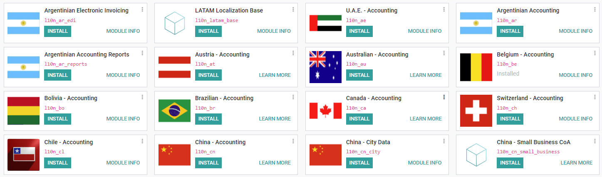

===========================
List of supported countries
===========================

Odoo Accounting can be used in many countries out of the box by installing the appropriate module.
Here is a list of all :doc:`Fiscal Localization Packages <fiscal_localization_packages>` that are
available on Odoo.

Fiscal Localization Packages available
======================================

- Algeria - Accounting
- Argentina

  - Argentinian Accounting
  - Argentinian Accounting Reports
  - Argentinian Electronic Invoicing

- Australian - Accounting
- Austria - Accounting
- Belgium - Accounting
- Bolivia - Accounting
- Brazilian - Accounting
- Canada - Accounting
- Chile - Accounting
- China

  - China - Accounting
  - China - City Data
  - China - Small Business CoA
  - China - Standard CoA

- Colombia

  - Colombian - Accounting
  - Colombian - Point of Sale

- Costa Rica - Accounting
- Croatia - Accounting (RRIF 2012)
- Denmark

  - Denmark - Accounting
  - Denmark - Accounting Reports

- Dominican Republic - Accounting
- Ecuador - Accounting
- Ethiopia - Accounting
- EU Mini One Stop Shop (MOSS)
- Finnish Localization
- France - Accounting
- Generic - Accounting
- Germany

  - Germany - Accounting
  - Germany SKR03 - Accounting
  - Germany SKR04 - Accounting

- Greece - Accounting
- Guatemala - Accounting
- Honduras - Accounting
- Hong Kong - Accounting
- Hungarian - Accounting
- India

  - Indian - Accounting
  - Indian - Point of Sale

- Indonesian - Accounting
- Ireland - Accounting
- Israel - Accounting
- Italy

  - Italy - Accounting
  - Italy - E-invoicing

- Japan - Accounting
- LATAM

  - LATAM Localization Base
  - LATAM Document

- Lithuania

  - Lithuania - Accounting
  - LT - Accounting Reports

- Luxembourg - Accounting
- Maroc - Accounting
- Mexico - Accounting
- Mongolia

  - Mongolia - Accounting
  - Mongolia - Accounting Reports

- Multi Language Chart of Accounts
- Netherlands

  - Netherlands - Accounting
  - Netherlands - Intrastat Declaration

- New Zealand - Accounting
- Norway - Accounting
- OHADA - Accounting
- Panama - Accounting
- Peru

  - Peruvian Accounting
  - Peruvian Accounting Reports
  - Peruvian Electronic Invoicing

- Poland - Accounting
- Portugal - Accounting
- Romania - Accounting
- Saudi Arabia - Accounting
- Singapore - Accounting
- Slovenian - Accounting
- South Africa - Accounting
- Spain - Accounting (PGCE 2008)
- Sweden

  - Sweden - Structured Communication OCR
  - Swedish - Accounting

- Switzerland - Accounting
- Thailand - Accounting
- Turkey - Accounting
- U.A.E. - Accounting
- UK - Accounting
- Ukraine - Accounting
- United States - Accounting
- Uruguay - Chart of Accounts
- Venezuela - Accounting
- Vietnam - Accounting

.. seealso::
   - :doc:`fiscal_localization_packages`