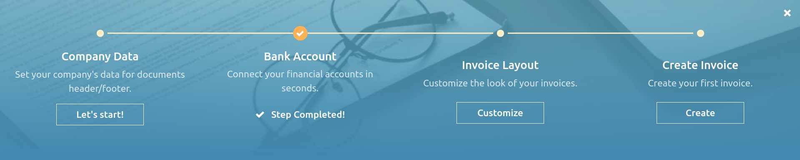

:show-content:

===========
Get started
===========

When you first open your Odoo Accounting app, the :guilabel:`Accounting Dashboard` welcomes you with
a step-by-step onboarding banner, a wizard that helps you get started. This onboarding banner is
displayed until you choose to close it.

The settings visible in the onboarding banner can still be modified later by going to
:menuselection:`Accounting --> Configuration --> Settings`.

.. note::
   Odoo Accounting automatically installs the appropriate **Fiscal Localization Package** for your
   company, according to the country selected at the creation of the database. This way, the right
   accounts, reports, and taxes are ready-to-go. :ref:`Click here <fiscal_localizations/packages>`
   for more information about Fiscal Localization Packages.

Accounting onboarding banner
============================

The step-by-step Accounting onboarding banner is composed of four steps:

#. :ref:`accounting-setup-periods`
#. :ref:`accounting-setup-bank`
#. :ref:`accounting-setup-taxes`
#. :ref:`accounting-setup-chart`

.. _accounting-setup-periods:

Accounting Periods
------------------

Define the **Fiscal Years**’ opening and closing dates, which are used to generate reports
automatically, and set your **Tax Return Periodicity**, along with a reminder to never miss a tax
return deadline.

By default, the opening date is set on the 1st of January and the closing date on the 31st of
December, as this is the most common use.

.. note::
   You can also change these settings by going to :menuselection:`Accounting --> Configuration -->
   Settings --> Fiscal Periods` and updating the values.

.. _accounting-setup-bank:

Bank Account
------------

Connect your bank account to your database and have your bank statements synced automatically. To do
so, find your bank in the list, click :guilabel:`Connect`, and follow the instructions on-screen.

.. note::
   :doc:`Click here <bank/bank_synchronization>` for more information about this feature.

If your Bank Institution can’t be synchronized automatically, or if you prefer not to sync it with
your database, you can also configure your bank account manually by typing its name, clicking
:guilabel:`Create your Bank Account`, and filling out the form.

- :guilabel:`Name`: the bank account's name, as displayed in Odoo.
- :guilabel:`Account Number`: your bank account number (IBAN in Europe).
- :guilabel:`Bank`: click :guilabel:`Create and edit` to configure the bank's details. Add the
  bank institution's :guilabel:`Name` and its :guilabel:`Identifier Code` (BIC or SWIFT).
- :guilabel:`Code`: this code is your Journal's :guilabel:`Short Code`, as displayed in Odoo.
  By default, Odoo creates a new Journal with this short code.
- :guilabel:`Journal`: This field is displayed if you have an existing bank journal that is not
  linked yet to a bank account. If so, then select the :guilabel:`Journal` you want to use to record
  the financial transactions linked to this bank account or create a new one by clicking
  :guilabel:`Create and Edit`.

.. note::
   - You can add as many bank accounts as needed with this tool by going to
     :menuselection:`Accounting --> Configuration --> Add a Bank Account`.
   - :doc:`Click here <bank>` for more information about Bank Accounts.

.. _accounting-setup-taxes:

Taxes
-----

This menu allows you to create new taxes, (de)activate, or modify existing taxes. Depending on the
:doc:`localization package <../fiscal_localizations>` installed on your database, taxes required for
your country are already configured.

.. note::
   :doc:`Click here <taxes>` for more information about taxes.

.. _accounting-setup-chart:

Chart of Accounts
-----------------

With this menu, you can add accounts to your **Chart of Accounts** and indicate their initial
opening balances.

Basic settings are displayed on this page to help you review your Chart of Accounts. To access all
the settings of an account, click on the :guilabel:`Setup` button at the end of the line.

.. image:: get_started/setup_chart_of_accounts.png
   :alt: Setup of the Chart of Accounts and their opening balances in Odoo Accounting

.. note::
   :doc:`Click here <get_started/chart_of_accounts>` for more information on how to configure your
   Chart of Accounts.

Invoicing onboarding banner
===========================

There is another step-by-step onboarding banner that helps you take advantage of your Odoo Invoicing
and Accounting apps. The Invoicing onboarding banner is the one that welcomes you if you use the
Invoicing app rather than the Accounting app.

If you have Odoo Accounting installed on your database, you can reach it by going to
:menuselection:`Accounting --> Customers --> Invoices`.

The Invoicing onboarding banner is composed of four main steps:

#. :ref:`invoicing-setup-company`
#. :ref:`invoicing-setup-bank`
#. :ref:`invoicing-setup-layout`
#. :ref:`invoicing-setup-invoice`

.. _invoicing-setup-company:

Company Data
------------

This form allows you to add your company’s details, such as the name, address, logo, website, phone
number, email address, and Tax ID or VAT number. These details are then displayed on your
documents, such as invoices.

.. image:: get_started/setup_company.png
   :alt: Add your company's details in Odoo Accounting and Odoo Invoicing

.. note::
   You can also change the company's details by going to :menuselection:`Settings --> General
   Settings`, scrolling down to the :guilabel:`Companies` section, and :guilabel:`Update Info`.

.. _invoicing-setup-bank:

Bank Account
------------

Use this button to create and link a bank account in Odoo. To add additional bank accounts, go to
:guilabel:`Invoicing --> Configuration --> Add a Bank Account` and :ref:`configure the fields
<bank_accounts/create>`.

.. tip::
   :doc:`Synchronize <bank/bank_synchronization>` your bank account(s) with your Odoo database to
   automatically update your bank transactions.

.. _invoicing-setup-layout:

Invoice Layout
--------------

Use this button to customize the :ref:`default invoice layout <studio/pdf-reports/default-layout>`.

.. note::
   You can also change the invoice layout by going to :menuselection:`Settings --> General
   Settings`, scrolling down to the :guilabel:`Companies` section, and clicking :guilabel:`Configure
   Document Layout`.

.. _invoicing-setup-invoice:

Invoice Creation
----------------

This button takes you to the invoice creation view, where you can create your first invoice.

.. tip::
   Add your **bank account number** and a link to your **General Terms & Condition** in the footer.
   This way, your contacts can find the full content of your GT&C online without having to print
   them on the invoices you issue.

.. seealso::
   * :doc:`bank`
   * :doc:`get_started/chart_of_accounts`
   * :doc:`bank/bank_synchronization`
   * :doc:`../fiscal_localizations`
   * `Odoo Tutorials: Accounting and Invoicing - Getting started [video]
     <https://www.odoo.com/slides/slide/getting-started-1692>`_

.. toctree::
   :titlesonly:

   get_started/cheat_sheet
   get_started/chart_of_accounts
   get_started/multi_currency
   get_started/avg_price_valuation
   get_started/tax_units
