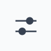
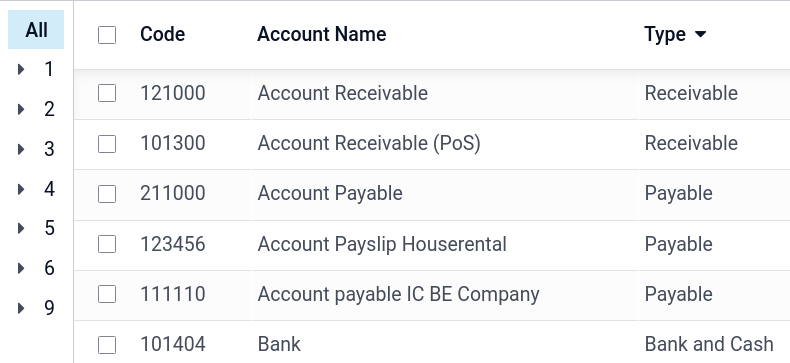
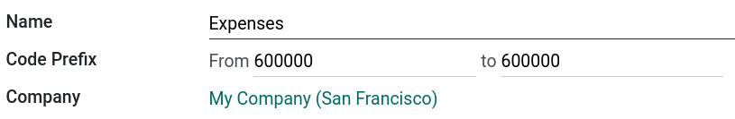
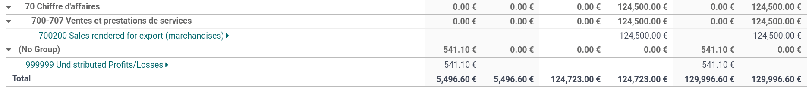

=================
Chart of accounts
=================

The **chart of accounts (COA)** is the list of all the accounts used to record financial
transactions in the general ledger of an organization. The chart of accounts can be found under
:menuselection:`Accounting --> Configuration --> Chart of Accounts`.

When browsing your chart of accounts, you can sort the accounts by :guilabel:`Code`,
:guilabel:`Account Name`, or :guilabel:`Type`, but other options are available in the drop-down menu

.. _chart-of-account/create:

Configuration of an account
===========================

The country you select during the creation of your database (or additional company in your database)
determines which :doc:`fiscal localization package <../../fiscal_localizations>` is installed by
default. This package includes a standard chart of accounts already configured according to the
country's regulations. You can use it directly or set it according to your company's needs.

To create a new account, go to :menuselection:`Accounting --> Configuration --> Chart of Accounts`,
click :guilabel:`Create`, and fill in (at the minimum) the required fields
(:guilabel:`Code, Account Name, Type`).

.. warning::
   It is not possible to modify the **fiscal localization** of a company once a journal entry has
   been posted.

Code and name
-------------

Each account is identified by its :guilabel:`Code` and :guilabel:`Name`, which also indicate the
account's purpose.

.. _chart-of-account/type:

Type
----

Correctly configuring the **account type** is critical as it serves multiple purposes:

- Information on the account's purpose and behavior
- Generate country-specific legal and financial reports
- Set the rules to close a fiscal year
- Generate opening entries

To configure an account type, open the :guilabel:`Type` field's drop-down selector and select the
corresponding type from the following list:

+---------------+-------------+-------------------------+-----------------------------------------------------------------------------------------------------------------+
| Report        | Category    | Account Types           | Description                                                                                                     |
+===============+=============+=========================+=================================================================================================================+
| Balance Sheet | Assets      | Receivable              | Money owed to the company by customers for goods or services delivered                                          |
|               |             +-------------------------+-----------------------------------------------------------------------------------------------------------------+
|               |             | Bank and Cash           | Funds held in company bank accounts or on hand as cash                                                          |
|               |             +-------------------------+-----------------------------------------------------------------------------------------------------------------+
|               |             | Current Assets          | Short-term assets expected to be converted into cash within a year                                              |
|               |             +-------------------------+-----------------------------------------------------------------------------------------------------------------+
|               |             | Non-current Assets      | Long-term assets not expected to be converted to cash within a year                                             |
|               |             +-------------------------+-----------------------------------------------------------------------------------------------------------------+
|               |             | Prepayments             | Payments made in advance for goods or services to be received in the future                                     |
|               |             +-------------------------+-----------------------------------------------------------------------------------------------------------------+
|               |             | Fixed Assets            | Tangible long-term assets like buildings, machinery, and vehicles used in operation and subject to depreciation |
|               +-------------+-------------------------+-----------------------------------------------------------------------------------------------------------------+
|               | Liabilities | Payable                 | Money the company owes to suppliers or vendors                                                                  |
|               |             +-------------------------+-----------------------------------------------------------------------------------------------------------------+
|               |             | Credit Card             | Balances and transactions associated with company credit card usage                                             |
|               |             +-------------------------+-----------------------------------------------------------------------------------------------------------------+
|               |             | Current Liabilities     | Obligations due within one year, such as short-term loans or accrued expenses                                   |
|               |             +-------------------------+-----------------------------------------------------------------------------------------------------------------+
|               |             | Non-current Liabilities | Long-term debts and financial obligations due beyond one year                                                   |
|               +-------------+-------------------------+-----------------------------------------------------------------------------------------------------------------+
|               | Equity      | Equity                  | The owner's residual interest in the company after liabilities are deducted from assets                         |
|               |             +-------------------------+-----------------------------------------------------------------------------------------------------------------+
|               |             | Current Year Earnings   | The company's net profit or loss accumulated in the current fiscal year                                         |
+---------------+-------------+-------------------------+-----------------------------------------------------------------------------------------------------------------+
| Profit & Loss | Income      | Income                  | Revenue generated from the company's primary business activities                                                |
|               |             +-------------------------+-----------------------------------------------------------------------------------------------------------------+
|               |             | Other Income            | Revenue from secondary or non-operational sources, like interest or asset sales                                 |
|               +-------------+-------------------------+-----------------------------------------------------------------------------------------------------------------+
|               | Expense     | Expense                 | Costs incurred during operations to generate revenue                                                            |
|               |             +-------------------------+-----------------------------------------------------------------------------------------------------------------+
|               |             | Depreciation            | The allocation of the cost of tangible assets over their useful life                                            |
|               |             +-------------------------+-----------------------------------------------------------------------------------------------------------------+
|               |             | Cost of Revenue         | Direct costs attributable to the production or delivery of goods and services                                   |
+---------------+-------------+-------------------------+-----------------------------------------------------------------------------------------------------------------+
| Other         | Other       | Off-Balance Sheet       | Transactions not displayed on the balance sheet or profit and loss report                                       |
+---------------+-------------+-------------------------+-----------------------------------------------------------------------------------------------------------------+

Assets
~~~~~~

Some **account types** can **automate** the creation of :ref:`asset <assets-automation>` entries.
To **automate** entries, click :guilabel:`View` on an account line and go to the
:guilabel:`Automation` tab.

You have three choices for the :guilabel:`Automation` tab:

#. :guilabel:`No`: this is the default value. Nothing happens.
#. :guilabel:`Create in draft`: whenever a transaction is posted on the account, a draft entry is
   created but not validated. You must first fill out the corresponding form.
#. :guilabel:`Create and validate`: you must also select a :guilabel:`Deferred Expense Model`.
   Whenever a transaction is posted on the account, an entry is created and immediately validated.

Default taxes
-------------

In the :guilabel:`View` menu of an account, select a **default tax** to be applied when this
account is chosen for a product sale or purchase.

.. _chart-of-account/tags:

Tags
----

Some accounting reports require **tags** to be set on the relevant accounts. To add a tag, under
:guilabel:`View`, click the :guilabel:`Tags` field and select an existing tag or :guilabel:`Create`
a new one.

Account groups
--------------

**Account groups** are useful to list multiple accounts as *sub-accounts* of a bigger account and
thus consolidate reports such as the **Trial Balance**. By default, groups are handled automatically
based on the code of the group. For example, a new account `131200` is going to be part of the group
`131000`. You can attribute a specific group to an account in the :guilabel:`Group` field under
:guilabel:`View`.

Create account groups manually
~~~~~~~~~~~~~~~~~~~~~~~~~~~~~~

.. note::
   Regular users should not need to create account groups manually. The following section is only
   intended for rare and advanced use cases.

To create a new account group, activate :ref:`developer mode <developer-mode>` and head to
:menuselection:`Accounting --> Configuration --> Account Groups`. Here, create a new group and enter
the :guilabel:`name, code prefix, and company` to which that group account should be available. Note
that you must enter the same code prefix in both :guilabel:`From` and :guilabel:`to` fields.

To display your **Trial Balance** report with your account groups, go to
:menuselection:`Accounting --> Reporting --> Trial Balance`, then open the :guilabel:`Options` menu
and select :guilabel:`Hierarchy and Subtotals`.

Allow reconciliation
--------------------

To keep the reconciliation process simple, when reconciling a bank, cash, or credit card transaction
with an existing journal item, only journal items that debit or credit accounts with the
:guilabel:`Allow reconciliation` option enabled are displayed as possible matches.

To enable this option on an account, tick the :guilabel:`Allow Reconciliation` checkbox in the
account's settings, and :guilabel:`Save`; or enable the button from the chart of accounts view.

.. _coa_shared_accounts:

Shared Accounts
---------------

The **Shared Accounts** feature allows the creation of a single account for a specific purpose and
sharing it between multiple companies. It is especially useful for multi-company environments where
a similar account might be used across different companies.

Deprecated
----------

It is not possible to delete an account once a transaction has been recorded on it. You can make
them unusable by using the **Deprecated** feature: check the :guilabel:`Deprecated` box in the
account's settings, and :guilabel:`Save`.

.. seealso::
   * :doc:`cheat_sheet`
   * :doc:`../vendor_bills/assets`
   * :doc:`../vendor_bills/deferred_expenses`
   * :doc:`../customer_invoices/deferred_revenues`
   * :doc:`../../fiscal_localizations`
   * `Odoo Tutorials: Chart of accounts <https://www.odoo.com/slides/slide/chart-of-accounts-6834>`_
   * `Odoo Tutorials: Update your chart of accounts
     <https://www.odoo.com/slides/slide/update-your-chart-of-accounts-6391>`_
