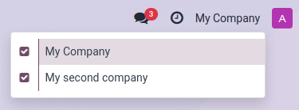
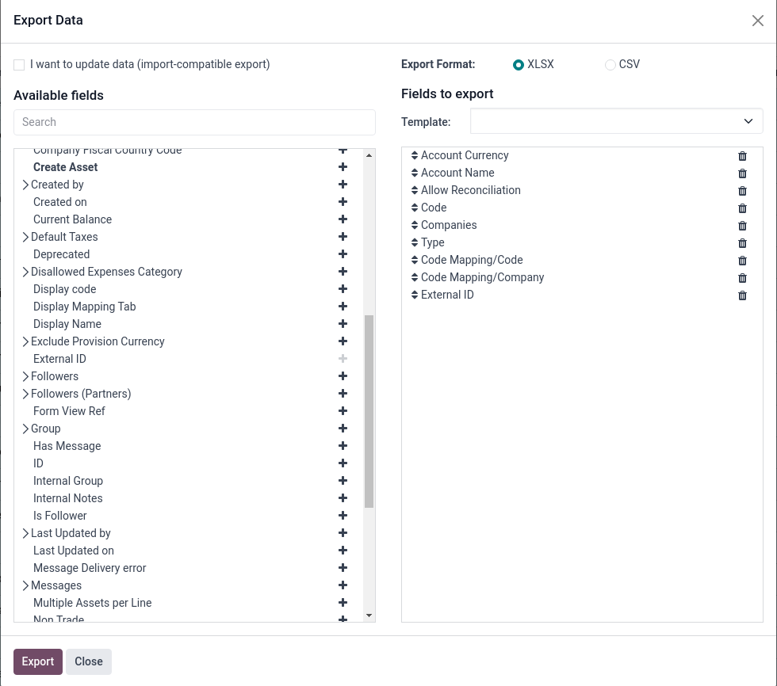
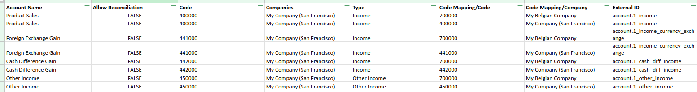
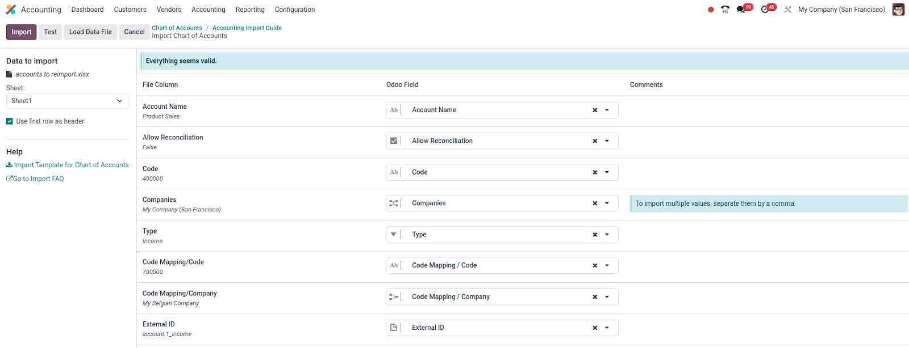

=============
Consolidation
=============

Imagine you have **several separate companies**, each with its own books. Consolidation lets you
combine their financial data into **a single unified view** giving you a "fair image" of the entire
group's financial health.

In essence, consolidation in Odoo helps you gain a clear, comprehensive view of your group's
financial performance by combining data from multiple companies.

.. _consolidation_in_odoo:

How it Works in Odoo
====================

.. _consolidation_tools:

Consolidation Tools
-------------------

**Several tools** combined together will contribute to the construction of your financial
consolidation:

.. _consolidation_account_mapping:

#. **Account Mapping:** You can map similar accounts from different companies together. This
   allows Odoo to combine them correctly in your consolidated reports. Just go to the mapping of an
   account via :menuselection:`Accounting --> Configuration --> Chart of Accounts --> Select an
   account --> Mapping`.

   .. image:: consolidation/multi_company_mapping.png
      :alt: Mapping different codes to different companies.

   .. note:: There's also a possibility to :ref:`import the mapping
      <consolidation_import_account_mapping>` or merge existing account using the
      :ref:`merging tool <consolidation_merge_tool>` if needed. Those tools can make the mapping
      process a lot easier.

   .. _consolidation_multi_ledgers:

#. **Multi-Ledgers:** Ledgers are fundamental to the process of consolidation. They can be found in
   the :menuselection:`Accounting --> Configuration --> Multi-Ledgers` and can either be:

   - *Regular Ledgers:* Each company in the consolidation scope has its own standard accounting
     ledger where all the regular day-to-day transactions are recorded. It excludes the company's
     consolidation adjustment journals.

   - *Multi-Ledger for Consolidation:* The company doing the actual consolidation also has a
     special multi-ledger. This one includes all the other companies' consolidation adjustments
     journals (the ones excluded from their own ledgers). This lets you see the total impact of all
     the adjustments.

   .. image:: consolidation/multi_ledger_misc.png
      :alt: Miscellaneous journal exclusion via multi-ledgers.

   .. _consolidation_company_selector:

#. **Multi-Company Selector:** To see the consolidated view, you'll use the multi-company selector.
   Select the consolidating company as your current company, and then make the other companies
   visible in the selector. This allows you to see all the journal items from the consolidating
   company's perspective.

   .. image:: consolidation/multi_company_selector.png
      :alt: Selecting the main company and activating others.

   .. _consolidation_horizontal_groups:

#. **Horizontal Groups:** Odoo's reporting tools let you combine those multi-ledgers and use
   horizontal groups to see the consolidated Balance Sheet or P&L. You can even see how much each
   company contributes to the overall consolidated figures. Hereunder is a simple example using
   an horizontal group on the Company field. They can be added in :menuselection:`Accounting -->
   Configuration --> Accounting Reports --> Select a report --> Options --> Horizontal Groups`.

   .. image:: consolidation/horizontal_groups.png
      :alt: Using horizontal groups to see each company's contribution.

   .. important::
      When you open financial reports, they usually default to a statutory view, meaning they use
      the company's regular ledger (including its consolidation adjustment). To see the full
      consolidation picture, you need to **make sure to select the multi-ledger** that includes all
      the consolidation adjustments.

   .. _consolidation_currency_translation:

#. **Cumulative Translation Adjustments:** When consolidating companies with different currencies,
   Odoo handles the translation.

   - *Equity accounts:* Use the historical exchange rate.

   - *Profit & Loss (P&L) accounts:* Use the average exchange rate.

   - *Balance sheet accounts (excluding equity):* Use the closing exchange rate.

   .. important::
      The rates used are the ones from the running company.

.. _consolidation_companies_vs_branches:

Consolidating Companies vs. Branch Management
---------------------------------------------

Consolidating companies involves **legally separate entities** whereas branches are
**subdivisions** of a single legal entity which often share the head office's resources (journals,
taxes, accounts, fiscal positions) and are not consolidated in the same way.

.. _consolidation_merge_tool:

Account Merging
===============

You can merge accounts to reduce the number of accounts and standardize them across companies. This
is optional; consolidation works without it.

Steps
-----

To use the merge tool, select all the companies with an account that needs to be merged in the
company selector in the top right corner of the screen.

Then, go to :menuselection:`Accounting --> Configuration --> Chart of Accounts` and select the
accounts to merge. Click the :icon:`fa-cog` :guilabel:`Actions` menu and select :guilabel:`Merge
accounts`.

In the :guilabel:`Merge accounts` window, enable the :guilabel:`Group by name?` option if needed and
click :guilabel:`Merge`.

The selected accounts are then merged into a single shared account, accessible by all the chosen
companies, just as if the account had been directly created to be shared.

.. _consolidation_unmerge_tool:

Account Unmerging
=================

You can also unmerge accounts if ever needed.

.. warning::

   Note that unmerging accounts **does not unmerge the chatters** of the accounts. Once merged, the
   chatters are permanently merged.

Steps
-----

To unmerge accounts, select a company with a shared account in the top right corner of the screen.
Then, go to :menuselection:`Accounting --> Configuration --> Chart of Accounts` and select the
account to unmerge. Click the :icon:`fa-cog` :guilabel:`Actions` menu and select
:guilabel:`Unmerge accounts`.

An :guilabel:`Odoo Warning` confirmation pop-up window will appear, listing how the accounts will
be split.

.. image:: consolidation/shared_accounts_unmerge_tool_confirmation_wizard.png
   :alt: Confirmation wizard for the Unmerge Tool of the shared accounts feature.

A new account linked to each company will be created for the previously shared account.

.. _consolidation_import_account_mapping:

Import a Mapping
================

In order to **import an account mapping**, you can go to your chart of accounts in list view with
multiple companies selected.

First, export the fields you need using the :icon:`fa-cog` :guilabel:`Actions` button. For this
particular use case, you’ll need to add the **Code mapping/Code**, **Code Mapping/Company** and
**External ID fields**. No other field is required.

Second, rework it briefly in a spreadsheet. For example, here, a few income accounts in "My Company
San Francisco" that will correspond to a single account in "My Belgian Company".

Third, reimport this file (xlsx or csv format) into Odoo via the :guilabel:`Import` button.

Finally, jump on any of the accounts you just reimported, and observe the codes now taking into
account your mapping company per company.
