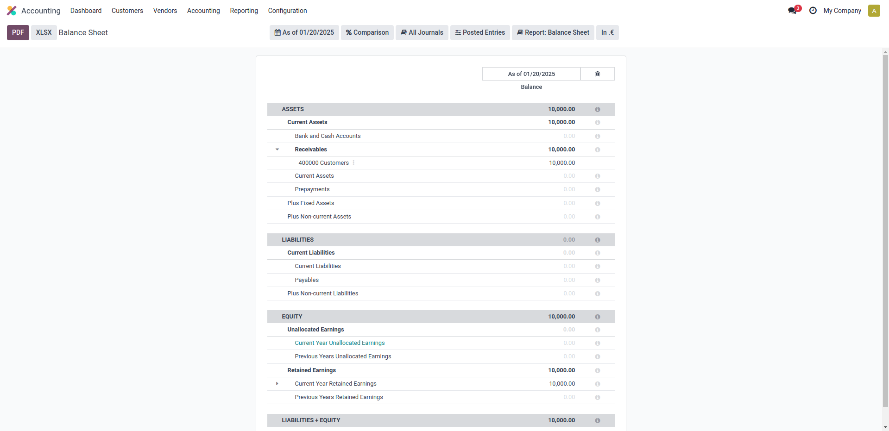
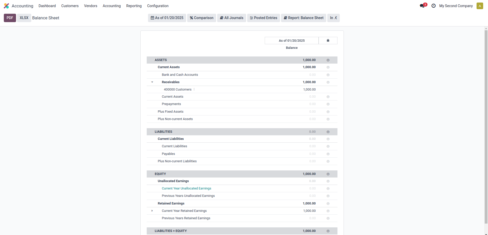
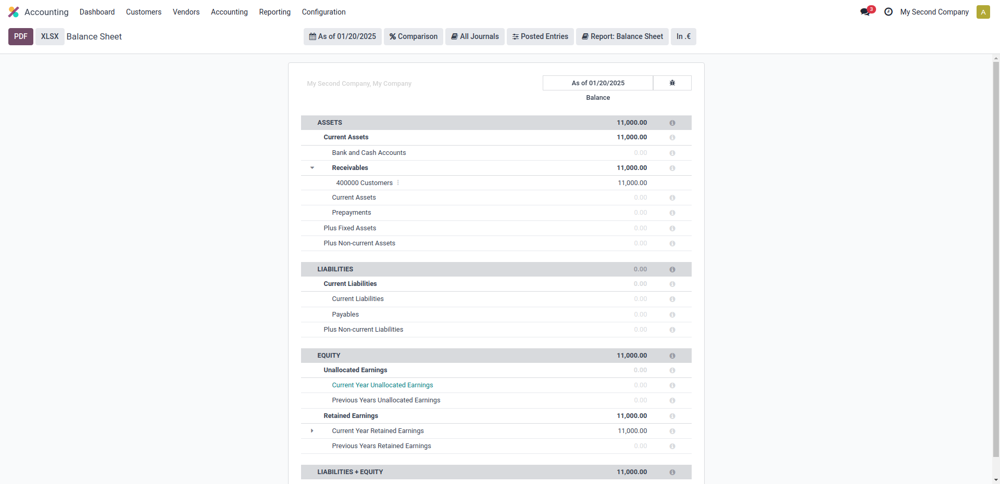
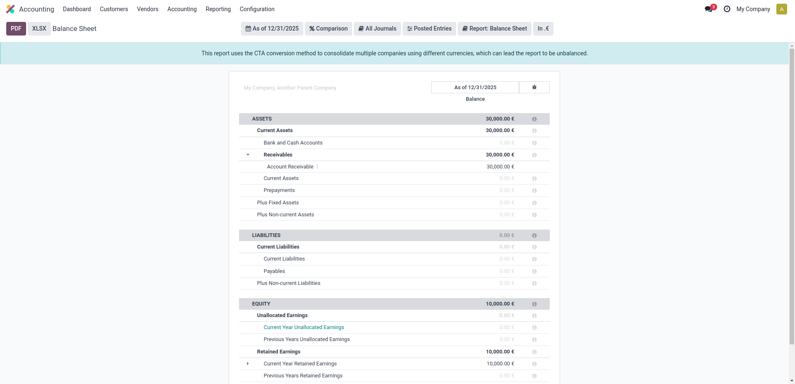
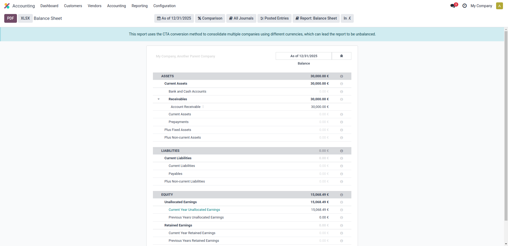
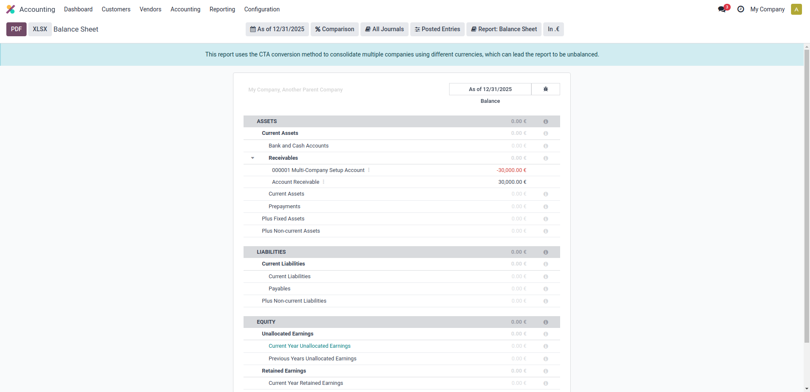

=============
Consolidation
=============

Using the :doc:`Shared Accounts <shared_accounts>` feature, you can consolidate the financial data
of your multi-company but also multi-currency environments.

Regardless of whether you have a multi-currency-environment or not, the consolidation is
automatically done in the :ref:`reports <reporting>` of the accounting application. This allows you
to have a single report and only have to select which companies you want to check the data of with
the company selector in the top right corner of the screen.

For :ref:`multi-currency setups <multi_currency>`, the system uses the :abbr:`CTA (Cumulative
Translation Adjustment)` system to translate all amounts into the selected company's currency by
default.

.. _reporting:

Reporting
---------

Consolidation in the reports
~~~~~~~~~~~~~~~~~~~~~~~~~~~~

In the reports, consolidation is done by summing up the values of the accounts that are shared
between the companies. This allows you to have a **global view** of the financial situation of your
whole group.

Examples
~~~~~~~~

The setup of the following screenshots is a parent company having one invoice for an amount of
10.000€ and a child company having one invoice for an amount of 1.000€. The account used for the
invoices is a shared account between the two companies.

This first screenshot shows the accounting report of the parent company which has a balance of
10.000€.

This second screenshot shows the accounting report of the child company which has a balance of
1.000€.

This third screenshot shows when you select both companies in the company selector and head into
the report. The balance is now 11.000€ which is the sum of the two invoices in the account.

.. _multi_currency:

Multi-currency conversions
--------------------------

:abbr:`CTA (Cumulative Translation Adjustment)`
~~~~~~~~~~~~~~~~~~~~~~~~~~~~~~~~~~~~~~~~~~~~~~~

In the case of multi-currency environments, CTA is used to use a single currency for all the
amounts in the report, the one from the **selected company**. CTA has three different methods
of calculation which are chosen following the **type of account** used in the transaction
which's currency has to be changed.

#. For **Equity** accounts **except the retained earnings**, the CTA is calculated with the historical
    rate which is the rate at the time of the transaction.
#. For **Income**, **Expense** and **retained earnings** accounts, the CTA is calculated with the
    average rate per day for the reported period.
#. For other accounts like **Assets** and **Liabilities** accounts, the CTA is calculated
    with the closing rate which is the last rate applied at the period's closing date.

The use of this system may result in non balanced reports. This is due to the fact that the CTA
can use a different rate for the payable and the receivable of a transaction which can lead to a
difference in the total amount of the report. This is normal and to be taken into account.

.. note::
    It is possible to disable CTA in the options of a report under the label :guilabel:`Currency
    Translation`. If you don't want to use CTA, you can select the option :guilabel:`Use the most
    recent rate at the date of the report` instead of :guilabel:`Use CTA`.

Examples
~~~~~~~~

The setup for the following screenshot is a parent company configured to use EUR as its currency.
A second company configured to use USD as its currency and it has a single invoice for 10.000$ set
in a shared account. That invoice was confirmed on the 1st of January 2025 when the **USD/EUR**
rate was 1.0. The report is generated on the 31st of December 2025 when the rate is now 3.0.
In between those two dates, a rate of 2.0 was applied on the 1st of July 2025. The company selected
is the one using euros meaning all amounts in the report are translated to euros.

This first screenshot shows how the CTA would calculate the amount of the invoice in dollars when
translated to euros if the shared account was an **Equity** account. The CTA would use the rate at
the time of the transaction which was 1.0. This means that the equity would be 10.000€ for an
invoice of 10.000$ sent on the 1st of January 2025.

This second screenshot shows how the CTA would calculate the amount of the invoice in dollars when
translated to euros if the shared account was an **Income** account. The CTA would average the rate
per day for the period which means that 181 days were at a rate of 1.0 USD/EUR, 183 days were at a
rate of 2.0 and 1 day was at a rate of 3.0. Therefore the average per day would be of about 1.5068
resulting in an equity of about 15.068€ for an invoice of 10.000$ sent on the 1st of January 2025.

This third screenshot shows how the CTA would calculate the amount of the invoice in dollars when
translated to euros if the shared account was an **Asset** account. The CTA would use the rate at
the time of the closing date which was 3.0. This means that the amount would be of 30.000€ for an
invoice of 10.000$ sent on the 1st of January 2025 resulting in a null balance for the report.

