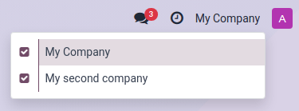

=============
Consolidation
=============

Consolidation allows combining financial data from **multiple separate companies**, each with its
own books, into a unified view, providing a "fair image" of the entire group's financial health.

It helps create a clear, comprehensive view of the group's financial performance by combining data
from multiple companies.

.. _consolidation_in_odoo:

How it Works in Odoo
====================

.. _consolidation_tools:

Consolidation Tools
-------------------

**Several tools** combined together will contribute to the construction of the financial
consolidation:

.. _consolidation_account_mapping:

#. **Account Mapping:** Similar accounts from different companies can be mapped together. This
   allows Odoo to combine them correctly in consolidated reports. To map accounts, go to
   :menuselection:`Accounting --> Configuration --> Chart of Accounts`.  Click :guilabel:`View`
   on the account line. In the :guilabel:`Mapping` tab, enter a code in the corresponding company
   :guilabel:`Code` column to map the account.

   .. image:: consolidation/multi_company_mapping.png
      :alt: Mapping different codes to different companies.

   .. note:: :ref:`Import mapping <consolidation_import_account_mapping>` or merge existing
      accounts using the :ref:`merging tool <consolidation_merge_tool>` can simplify the process.

   .. _consolidation_multi_ledgers:

#. **Multi-Ledgers:** Ledgers are fundamental to the process of consolidation. They are either:

   - *Regular Ledgers:* Each company in the consolidation scope has its own standard accounting
     ledger where all the regular day-to-day transactions are recorded. It excludes the company's
     consolidation adjustment journals.

   - *Multi-Ledger for Consolidation:* The company doing the actual consolidation also has a
     special multi-ledger. This one includes all the other companies' consolidation adjustments
     journals (the ones excluded from their own ledgers). This allows for viewing the total impact
     of all the adjustments.

   To create a new ledger, go to :menuselection:`Accounting --> Configuration --> Multi-Ledgers`
   and hit the :guilabel:`New` button. Enter a name, pick the company the ledger is linked to and
   most importantly, determine which journals are to be excluded from the ledger.

   .. _consolidation_company_selector:

#. **Multi-Company Selector:** The consolidated view can be accessed using the multi-company
      selector. Selecting the consolidating company as the current company and making the other
      companies visible in the selector, all the journal items are displayed from the consolidating
      company's perspective.

   .. image:: consolidation/multi_company_selector.png
      :alt: Selecting the main company and activating others.

   .. _consolidation_horizontal_groups:

#. **Horizontal Groups:** Odoo's reporting tools allow for combining multi-ledgers and using
      horizontal groups to view the consolidated Balance Sheet or P&L. They also show how much each
      company contributes to the overall consolidated figures.

      Follow these steps to create an :guilabel:`Horizontal Group`:

      - Activate the :ref:`developer mode <developer-mode>`.
      - Go to :menuselection:`Accounting --> Configuration --> Horizontal Groups` and click
        :guilabel:`New`.
      - Add a :guilabel:`Group Name` and select the :guilabel:`Reports` where the horizontal group
        can be used.
      - In the :guilabel:`Field` column, click :guilabel:`Add a line`.
      - In the :guilabel:`Create rules` window, add a :guilabel:`Field` and create a new
        :guilabel:`Domain` rule if needed. Then, click :guilabel:`Save & Close`.

   .. image:: consolidation/horizontal_groups.png
      :alt: Using horizontal groups to see each company's contribution.

   .. important::
      When opened, financial reports usually default to a statutory view, using the company's
      regular ledger (including its consolidation adjustment). To see the full consolidation picture,
      **make sure to select the multi-ledger** that includes all the consolidation adjustments.

   .. _consolidation_currency_translation:

#. **Cumulative Translation Adjustments:** When consolidating companies with different currencies,
   Odoo handles the translation.

   - *Equity accounts:* Use the historical exchange rate.

   - *Profit & Loss (P&L) accounts:* Use the average exchange rate.

   - *Balance sheet accounts (excluding equity):* Use the closing exchange rate.

   .. important::
      The rates used are those of the company currently selected.

.. _consolidation_companies_vs_branches:

Consolidating Companies vs. Branch Management
---------------------------------------------

Consolidating companies involves **legally separate entities** whereas branches are
**subdivisions** of a single legal entity which often share the head office's resources (journals,
taxes, accounts, fiscal positions) and are not consolidated in the same way.

.. _consolidation_merge_tool:

Account Merging
===============

Accounts can be merged to reduce the number of accounts and standardize them across companies. This
is optional; consolidation works without it.

To use the merge tool, select all the companies with an account that needs to be merged in the
company selector in the top right corner of the screen.

Then, go to :menuselection:`Accounting --> Configuration --> Chart of Accounts` and select the
accounts to merge. Click the :icon:`fa-cog` :guilabel:`Actions` menu and select :guilabel:`Merge
accounts`.

In the :guilabel:`Merge accounts` window, enable the :guilabel:`Group by name?` option if needed and
click :guilabel:`Merge`.

The selected accounts are then merged into a single shared account, accessible by all the chosen
companies, just as if the account had been directly created to be shared.

.. _consolidation_unmerge_tool:

Account Unmerging
=================

Accounts can also be unmerged if needed.

.. warning::

   Note that unmerging accounts **will not unmerge the chatters** of the accounts. Once merged, the
   changes' histories are permanently merged.

To unmerge accounts, select a company with a shared account in the company selector at the top
right corner of the screen. Then, go to :menuselection:`Accounting --> Configuration --> Chart of
Accounts` and select the account to unmerge. Click the :icon:`fa-cog` :guilabel:`Actions` menu and
select :guilabel:`Unmerge accounts`.

An :guilabel:`Odoo Warning` confirmation pop-up window will appear, listing how the accounts will
be split.

.. image:: consolidation/shared_accounts_unmerge_tool_confirmation_wizard.png
   :alt: Confirmation wizard for the Unmerge Tool of the shared accounts feature.

Click :guilabel:`Unmerge`. A new account linked to each company will be created for the previously
shared account.

.. _consolidation_import_account_mapping:

Import a Mapping
================

To **import an account mapping**, select all the related companies in the company selector at the
top right corner of the screen and go to :menuselection:`Accounting --> Configuration --> Chart of
Accounts`.

First, to choose the fields to export, select the accounts, click the :icon:`fa-cog`
:guilabel:`Actions` button and select :guilabel:`Export`. Then, in the :guilabel:`Export data`
window, add the :guilabel:`Code mapping/Code`, :guilabel:`Code Mapping/Company` and
:guilabel:`External ID` fields using the :icon:`fa-plus` icon and click :guilabel:`Export`. No other
field is required.

Second, rework it in a spreadsheet adding the desired code for each company on desired accounts.

Third, to reimport the file (xlsx or csv format) in Odoo, click :guilabel:`Import` and, in the
:guilabel:`Import Chart of Accounts` section, click :guilabel:`Import CoA`. In the
:guilabel:`Accounting Import Guide`, drop or click :guilabel:`Upload Data File` to import the file.
Then, click :guilabel:`Import`.

Finally, the codes now take into account the mapping company per company.
