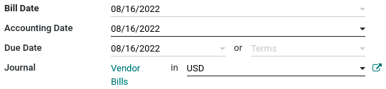
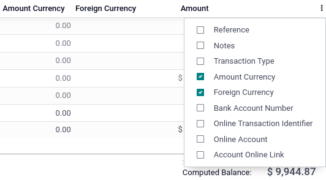

=====================
Multi-currency system
=====================

Odoo allows you to issue invoices, receive bills, and record transactions in currencies other than
the main currency configured for your company. You can also set up bank accounts in other currencies
and run reports on your foreign currency activities.

.. seealso::
   - :doc:`../bank/foreign_currency`

.. _multi-currency/config:

Configuration
=============

.. _multi-currency/config-main-currency:

Main currency
-------------

The **main currency** is defined by default according to the company's country. You can change it by
going to :menuselection:`Accounting --> Configuration --> Settings --> Currencies` and changing the
currency in the :guilabel:`Main Currency` setting.

.. _multi-currency/config-enable:

Enable foreign currencies
-------------------------

Go to :menuselection:`Accounting --> Configuration --> Currencies`, and enable the currencies you
wish to use by toggling the :guilabel:`Active` button.

.. image:: multi_currency/enable-foreign-currencies.png
   :align: center
   :alt: Enable the currencies you wish to use.

.. _multi-currency/config-rates:

Currency rates
--------------

Manual update
~~~~~~~~~~~~~

To manually create and set a currency rate, go to :menuselection:`Accounting --> Configuration -->
Currencies`, click on the currency you wish to change the rate of, and under the :guilabel:`Rates`
tab, click :guilabel:`Add a line` to create a new rate.

.. image:: multi_currency/manual-rate-update.png
  :align: center
  :alt: Create or modify the currency rate.

Automatic update
~~~~~~~~~~~~~~~~

When you activate a second currency for the first time, :guilabel:`Automatic Currency Rates` appears
under :menuselection:`Accounting Dashboard --> Configuration --> Settings --> Currencies`. By
default, you have to click on the **Update now** button (:guilabel:`🗘`) to update the rates.

Odoo can update the rates at regular intervals. To do so, change the :guilabel:`Interval` from
:guilabel:`Manually` to :guilabel:`Daily`, :guilabel:`Weekly`, or :guilabel:`Monthly`. You can also
select the web service from which you want to retrieve the latest currency rates by clicking on the
:guilabel:`Service` field.

.. _multi-currency/config-exch-diff:

Exchange difference entries
---------------------------

Odoo automatically records exchange differences entries on dedicated accounts, in a dedicated
journal.

You can define which journal and accounts to use to **post exchange difference entries** by
going to :menuselection:`Accounting --> Configuration --> Settings --> Default Accounts` and editing
the :guilabel:`Journal`, :guilabel:`Gain Account`, and :guilabel:`Loss Account`.

.. example::
   If you receive a payment for a customer invoice one month after it was issued, the exchange rate
   has likely changed since. Therefore, this fluctuation implies some profit or loss due to the
   exchange difference, which Odoo automatically records in the default **Exchange Difference**
   journal.

.. _multi-currency/config-coa:

Chart of accounts
-----------------

Each account can have a set currency. By doing so, all moves relevant to the account are forced to
have that account's currency.

To do so, go to :menuselection:`Accounting --> Configuration --> Charts of Accounts` and select a
currency in the field :guilabel:`Account Currency`. If left empty, all active currencies are handled
instead of just one.

.. _multi-currency/config-journals:

Journals
--------

If a currency is set on a **journal**, that journal only handles transactions in that currency.

To do so, go to :menuselection:`Accounting --> Configuration --> Journals`, open the journal you
want to edit, and select a currency in the field :guilabel:`Currency`.

.. image:: multi_currency/journal-currency.png
   :align: center
   :alt: Select the currency for the journal to handle.

.. _multi-currency/mca:

Multi-currency accounting
=========================

.. _multi-currency/mca-documents:

Invoices, bills, and other documents
------------------------------------

For all documents, you can select the currency and journal to use for the transaction on the
document itself.

.. _multi-currency/mca-payment:

Payment registration
--------------------

To register a payment in a currency other than your company's main currency, click on the
:guilabel:`Register Payment` payment button of your document and, in the pop-up window, select a
**currency** in the :guilabel:`Amount` field.

.. image:: multi_currency/register-payment.png
  :align: center
  :alt: Select the currency and journal to use before registering the payment.

.. _multi-currency/mca-statements:

Bank transactions
-----------------

When creating or importing bank transactions, the amount is in the company's main currency. To input
a **foreign currency**, select a currency in the :guilabel:`Foreign Currency`. Once selected, enter
the :guilabel:`Amount` in your main currency for it to automatically get converted in the foreign
currency in the :guilabel:`Amount in Currency field`.

When reconciling, Odoo displays both the foreign currency amount and the equivalent amount in your
company's main currency.

.. _multi-currency/mca-exch-entries:

Exchange rate journal entries
-----------------------------

To see **exchange difference journal entries**, go to :menuselection:`Accounting Dashboard -->
Accounting --> Journals: Miscellaneous`.

.. image:: multi_currency/exchange-journal-currency.png
   :align: center
   :alt: Exchange rate journal entry.
