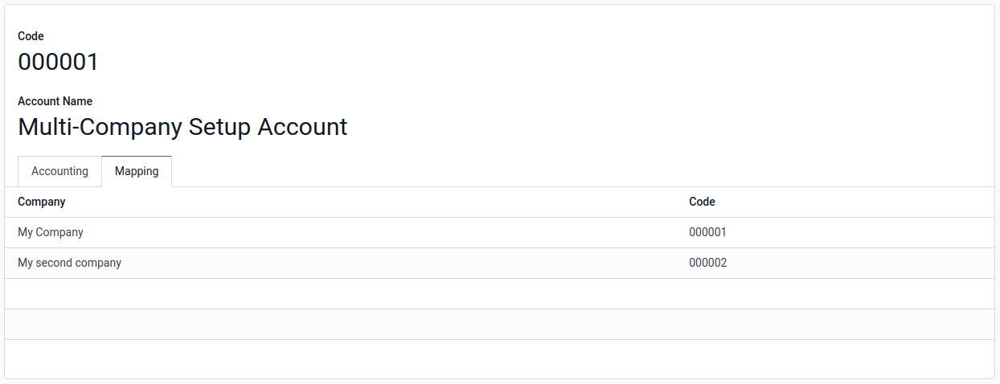
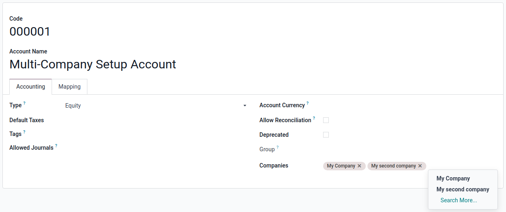
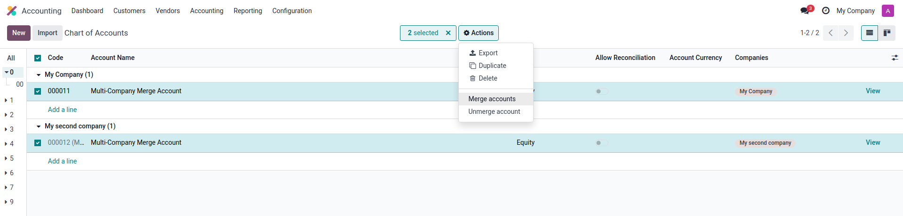
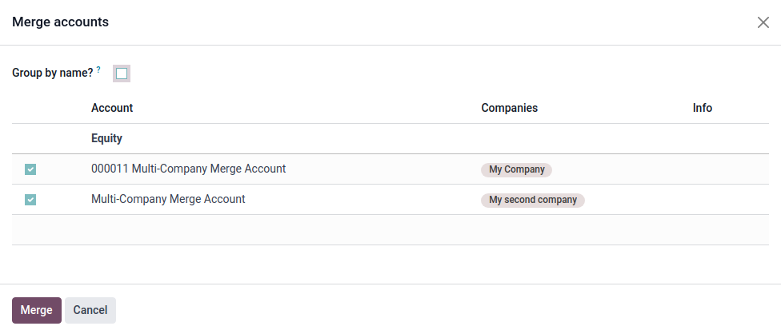
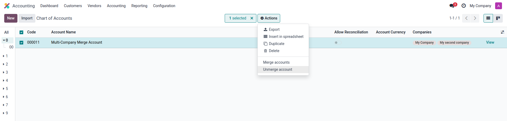
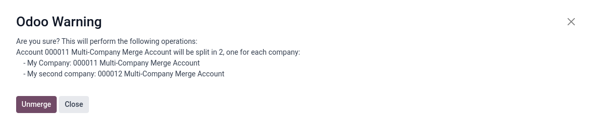
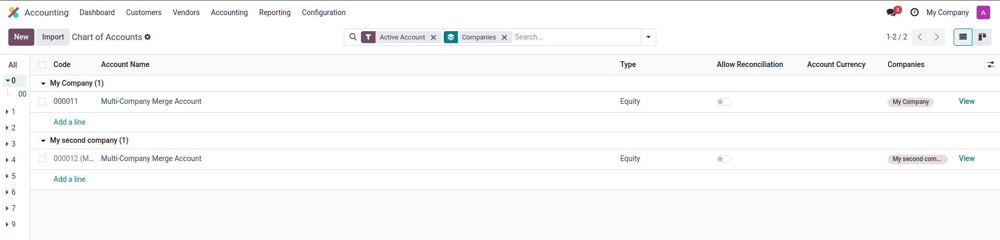

===============
Shared Accounts
===============

In Odoo, it is possible to share accounts between multiple companies. This feature is particularly
useful for businesses that operate under a **multi-company structure** and might benefit from a
**unified chart of accounts**.

In order to setup said feature, two ways are available: Either the :ref:`basic setup
<setting_up_shared_accounts>` or using the :ref:`merge tool <merge_tool>`.

In the same way the feature is accompanied by a merging tool that helps already established
multi-company environments use the the new shared accounts feature, an :ref:`unmerge tool
<unmerge_tool>` is also available for if you ever want to stop using the feature.

The feature can also be used to do :doc:`consolidation` of the financial data of
your multi-company environment. This allows you to have a **global view** of the financial situation
of your whole group when you have child companies under a parent one.

.. _shared_accounts_benefits:

Benefits of Shared Accounts
===========================

1. Lighter load of accounts to handle
-------------------------------------

The main benefit of the shared accounts feature is to **reduce the amount of accounts** that have
to be handled by the main accountant of a multi-company environment.

.. example::
   Environments that have two companies using the generic chart of accounts of the same country
   used to have each accounts of that chart twice. With the shared accounts feature, it is possible
   to have a single version of each of those accounts.

2. Simplified and Cleaner Reporting
-----------------------------------

When auditing reports, the shared accounts feature grants a **lighter version of the reports**
while **keeping all the data visible and accessible**. This makes it easier to understand and
manage the accounts.

.. example::
   Auditing amounts in the balance sheet report of a company using a shared account with one of its
   child companies and grouping by account used to show two groups for the two accounts that share
   the same purpose. Now they are shown in the same group and are differentiable using the company
   they are used in.

3. Macro and Micro Management
-----------------------------

For the main companies as much as the last child company of a branch, using the shared accounts
feature allows accountants to **handle the accounts at the level they need to**. This means that a
main accountant can manage the accounts of all the child companies knowing exactly which one is
meant for what even though it could have a totally different code in each company. For the child
companies' accountants, it means they can manage the accounts of their company without ever having
to consider the impact it could have on the other companies using the same account.

.. example::
   Even though the account is shared and is the same record in the database for all companies, its
   code in any company can be modified without affecting the other companies granting more
   flexibility in the management of the accounts.

.. _setting_up_shared_accounts:

Setting Up Shared Accounts
==========================

Enable Multi-Company
--------------------

To enable account sharing, you first need to enable the multi-company feature in Odoo. This can be
done by simply making sure you have multiple companies setup in your Odoo database.

Configure Shared Accounts
-------------------------

Once multi-company is enabled, you can configure shared accounts by going to an account you wish to
share between companies. Head into the :guilabel:`Mapping` tab and enter the code you want for the
account for each desired company.

From now on, your account will be taken into account for :doc:`consolidation` but is still not
usable in the invoices of the companies you configured a code for. To add that possibility,you
can head back to the :guilabel:`Accounting` tab and add your second company to the list of
companies this account is available for.

.. _merge_tool:

Merge Tool
==========

Use cases
---------

The merging tool is there to simplify the process of creating shared accounts. This tool is
particularly useful when you have an **already setup multi-company environment** in which you were
using separate accounts that you now want to merge.

Steps
-----

To use the merge tool, you need to select all the companies that have an account you want to merge
in the company selector in the top right corner of the screen.

.. image:: shared_accounts/shared_accounts_merge_tool_select_companies.png
   :alt: Selecting all companies that have accounts to be merged.

You can then select all the account that are to be merged, click the :guilabel:`Actions` button,
and select the :guilabel:`Merge accounts` option in the drop-down.

You will then enter a confirmation wizard where you can confirm the operation. Once all is set,
you can click the :guilabel:`Merge` button to complete the process.

In the end, the selected accounts will be merged into a single shared account that is available for
all the selected companies in the same way it would have been if the account had only been created
on a single company and then configured to be shared like in the :ref:`basic setup
<setting_up_shared_accounts>`.

.. _unmerge_tool:

Unmerge Tool
============

Use cases
---------

At the opposite end of the spectrum, the unmerge tool is there to simplify the process of stopping
to share specific accounts. This tool finds its use when you have shared accounts that you want to
**dissociate from certain companies** without losing the data that they contain.

Steps
-----

Using any of the companies that have a shared account, it is possible to select it and unmerge it
using the :guilabel:`Unmerge account` option in the :guilabel:`Actions` menu.

This will open a confirmation window listing all the accounts that will be created.

In the end, each of the companies that had a code configured on the shared account will have a new
account linked to no other company.

