========
Colombia
========

Introduction
~~~~~~~~~~~~

Electronic invoicing for Colombia is available from Odoo 12 and
requires the next modules:

#. **l11n_co**: All the basic data to manage the accounting module,
   contains the default setup for: chart of accounts, taxes,
   retentions, identification document types
#. **l10n_co_edi**: This module includes all the extra fields that are
   required for the Integration with Carvajal T&S and generate the
   electronic invoice, based on the DIAN legal requirements.

Workflow
~~~~~~~~

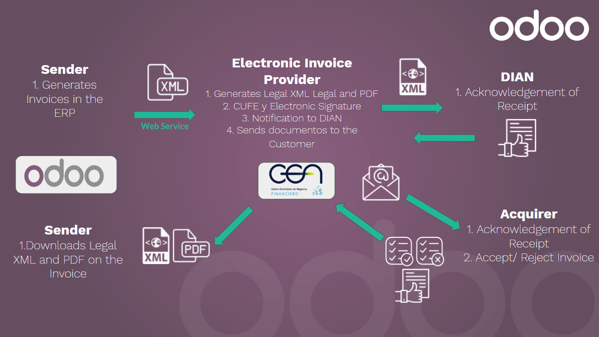

Configuration
~~~~~~~~~~~~~

1. Install the Colombian localization modules
---------------------------------------------

For this, go in Apps and search for Colombia. Then click Install for
the first two modules.

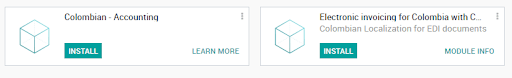

2. Configure credentials for Carvajal T&S web service
-----------------------------------------------------

Once that the modules are installed, in order to be able to connect
with Carvajal T&S Web Service, it's necessary to configure the user
and credentials, this information will be provided by Carvajal T&S.

Go to :menuselection:`Accounting --> Configuration --> Settings` and
look for the *Colombian Electronic Invoice* section.

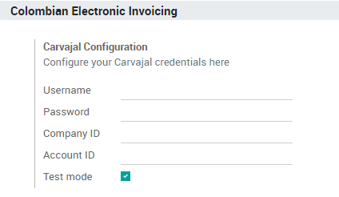

Using the Testing mode it is possible to connect with a Carvajal T&S
testing environment. This allows users to test the complete workflow
and integration with the CEN Financiero portal, which is accessible
here: https://cenfinancierolab.cen.biz

Once that Odoo and Carvajal T&S is fully configured and ready for
production the testing environment can be disabled.

3. Configure your report data
-----------------------------

As part of the configurable information that is sent in the XML, you
can define the data for the fiscal section and the bank information in
the PDF.

Go to :menuselection:`Accounting --> Configuration --> Settings` and
look for the *Colombian Electronic Invoice* section.

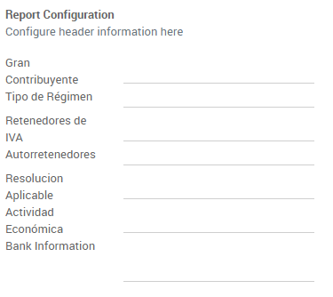

4. Configure data required in the XML
-------------------------------------

4.1 Partner
+++++++++++

4.1.1 Identification
^^^^^^^^^^^^^^^^^^^^

As part of the Colombian Localization, the document types defined by
the DIAN are now available on the Partner form. Colombian partners
have to have their identification number and document type set:

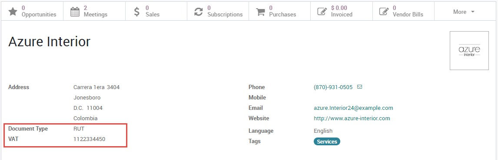

.. tip:: When the document type is RUT the identification number needs
   to be configured in Odoo including the verification digit, Odoo
   will split this number when the data to the third party vendor is
   sent.

4.1.2 Fiscal structure (RUT)
^^^^^^^^^^^^^^^^^^^^^^^^^^^^

The partner's responsibility codes (section 53 in the RUT document)
are included as part of the electronic invoice module given that is
part of the information required by the DIAN .

These fields can be found in :menuselection:`Partner --> Sales &
Purchase Tab --> Fiscal Information`

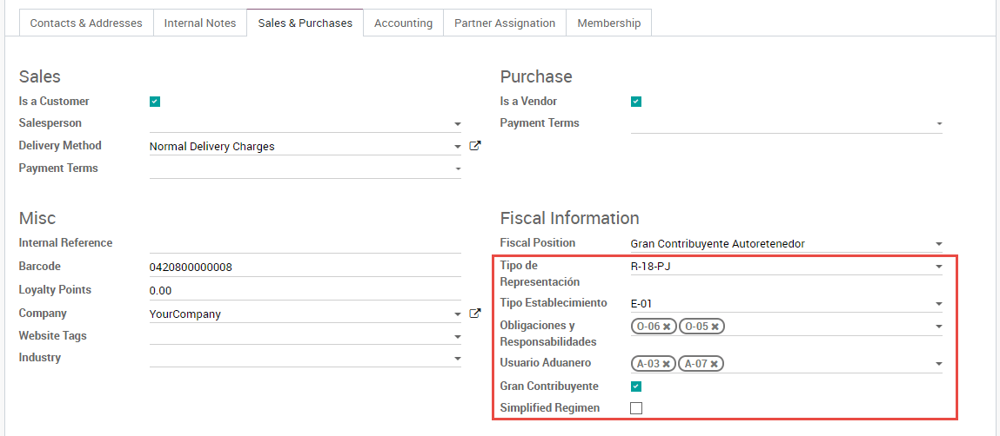

Additionally two booleans fields were added in order to specify the
fiscal regimen of the partner.

4.2 Taxes
+++++++++

If your sales transactions include products with taxes, it's important
to consider that an extra field *Value Type* needs to be configured
per tax. This option is located in the Advanced Options tab.

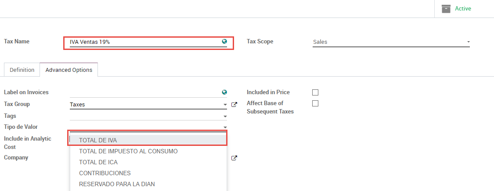

Retention tax types (ICA, IVA, Fuente) are also included in the
options to configure your taxes. This configuration is used in order
to correctly display taxes in the invoice PDF.

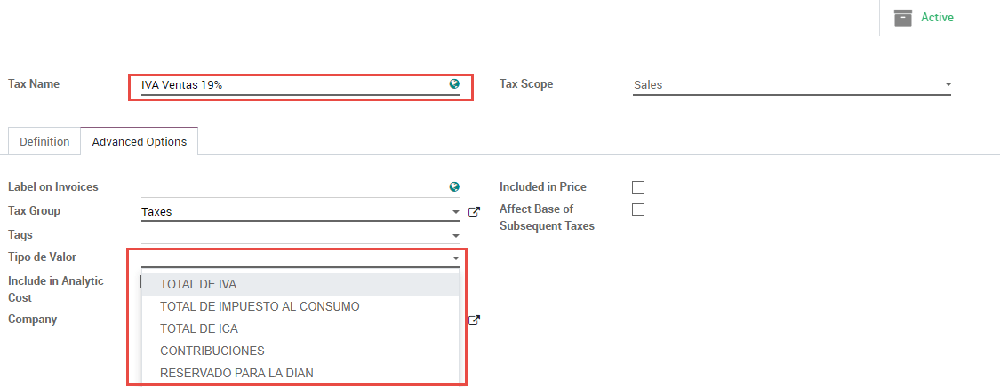

4.3 Journals
++++++++++++

Once the DIAN has assigned the official sequence and prefix for the
electronic invoice resolution, the Sales journals related to your
invoice documents need to be updated in Odoo.  The sequence can be
accessed using developer mode: :menuselection:`Accounting --> Settings
--> Configuration Setting --> Journals`.

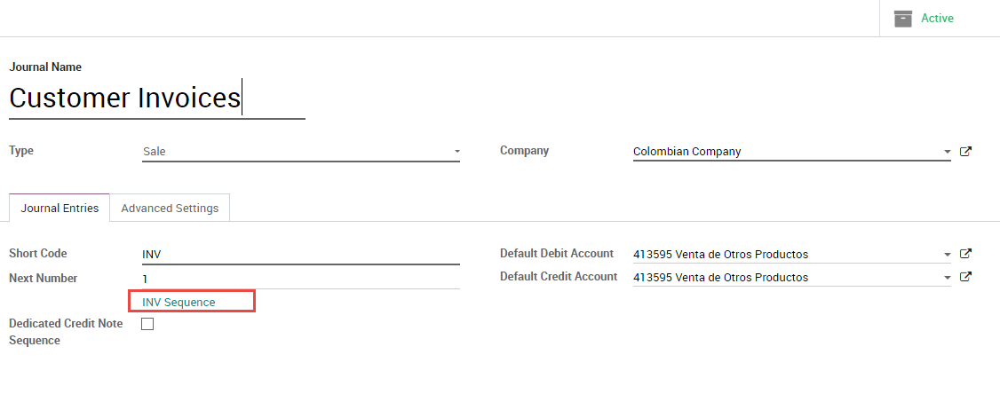

Once that the sequence is opened, the Prefix and Next Number fields
should be configured and synchronized with the CEN Financiero.

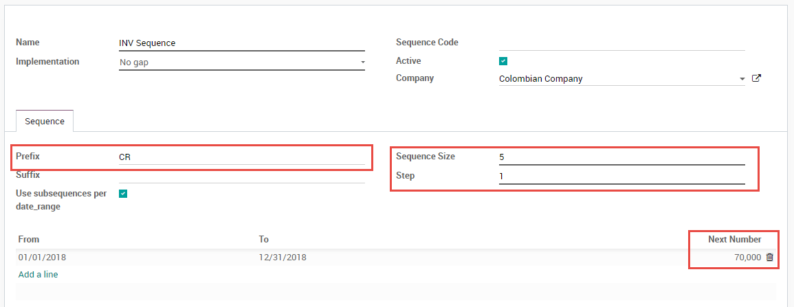

4.4 Users
+++++++++

The default template that is used by Odoo on the invoice PDF includes
the job position of the salesperson, so these fields should be
configured:

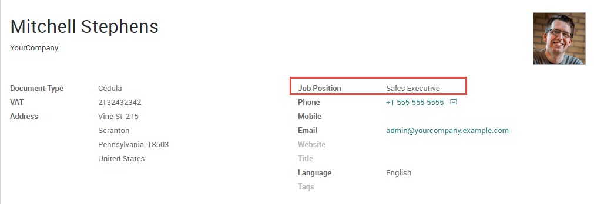

Usage and testing
~~~~~~~~~~~~~~~~~

1. Invoice
----------

When all your master data and credentials has been configured, it's
possible to start testing the electronic invoice workflow.

1.1 Invoice creation
++++++++++++++++++++

The functional workflow that takes place before an invoice validation
doesn't change. The main changes that are introduced with the
electronic invoice are the next fields:

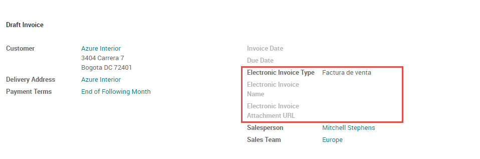

There are three types of documents:

- **Factura Electronica**: This is the regular type of document and
  its applicable for Invoices, Credit Notes and Debit Notes.
- **Factura de Importación**: This should be selected for importation
  transactions.
- **Factura de contingencia**: This is an exceptional type that is
  used as a manual backup in case that the company is not able to use
  the ERP and it's necessary to generate the invoice manually, when
  this invoice is added to the ERP, this invoice type should be
  selected.

1.2 Invoice validation
++++++++++++++++++++++

After the invoice is validated an XML file is created and sent
automatically to Carvajal, this file is displayed in the chatter.

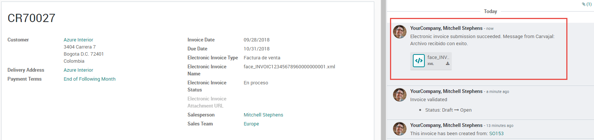

An extra field is now displayed in "Other Info" tab with the name of
the XML file. Additionally there is a second extra field that is
displayed with the Electronic Invoice status, with the initial value
"In progress":

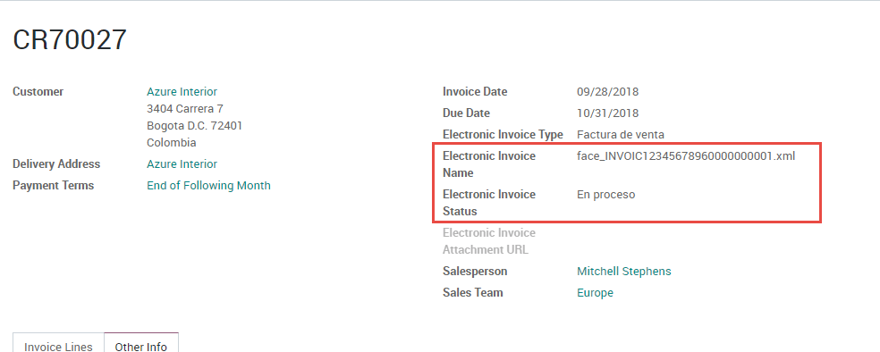

1.3 Reception of legal XML and PDF
++++++++++++++++++++++++++++++++++

The electronic invoice vendor receives the XML file and proceeds to
validate the structure and the information in it, if everything is
correct the invoice status changes to "Validated" after using the
"Check Carvajal Status" button in the Action dropdown. They then
proceed to generate a Legal XML which includes a digital signature and
a unique code (CUFE), a PDF invoice that includes a QR code and the
CUFE is also generated.

After this:

- A ZIP containing the legal XML and the PDF is downloaded and
  displayed in the invoice chatter:

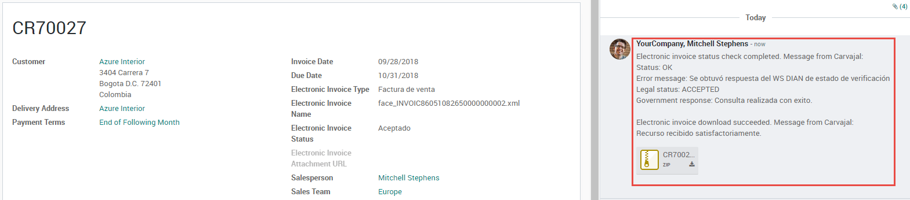

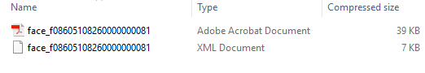

- The Electronic Invoice status changes to "Accepted"

1.4 Common errors
+++++++++++++++++

During the XML validation the most common errors are usually related
to missing master data. In such cases, error messages are shown in the
chatter after updating the electronic invoice status.

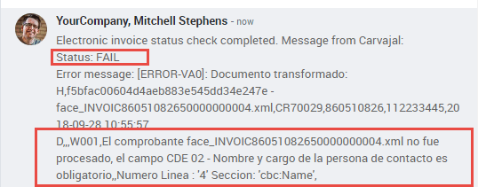

After the master data is corrected, it's possible to reprocess the XML
with the new data and send the updated version, using the following
button:

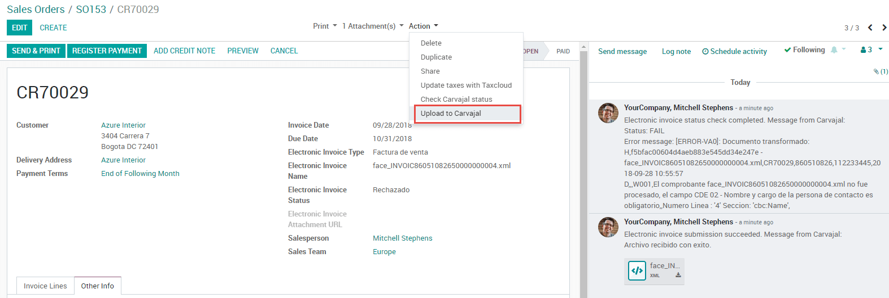

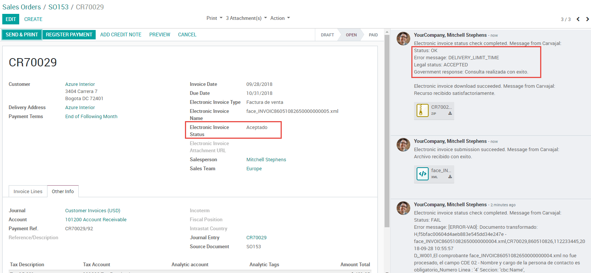

2. Additional use cases
-----------------------

The process for credit and debit notes is exactly the same as the
invoice, the functional workflow remains the same as well.
