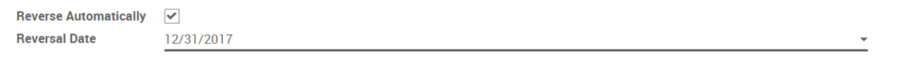

=========================================
Reverse an accounting entry automatically
=========================================

You may want to automatically reverse an accounting entry at a specific
date.

This is, for example, used when you make a provision (e.g. provision for
bad debt). When making the accounting entry for the provision, the
amount you entered is only an estimated amount. You will only be sure of
the amount at the end of the fiscal year. That's why, at that point, you
want the accounting entry to be reversed to be able to enter the real
loss that occurred.

For this, you just have to tick the box "Reverse Automatically" on the
journal entry and to define a reversal date. The accounting entry will
be reversed at that date.

