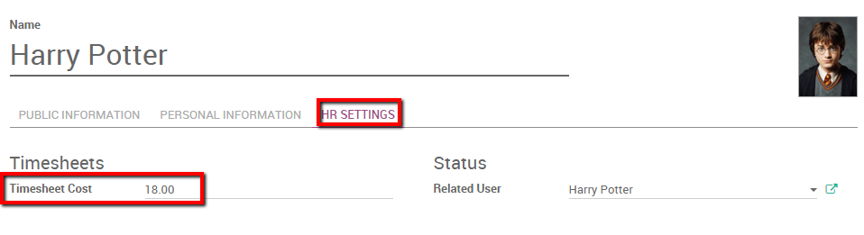
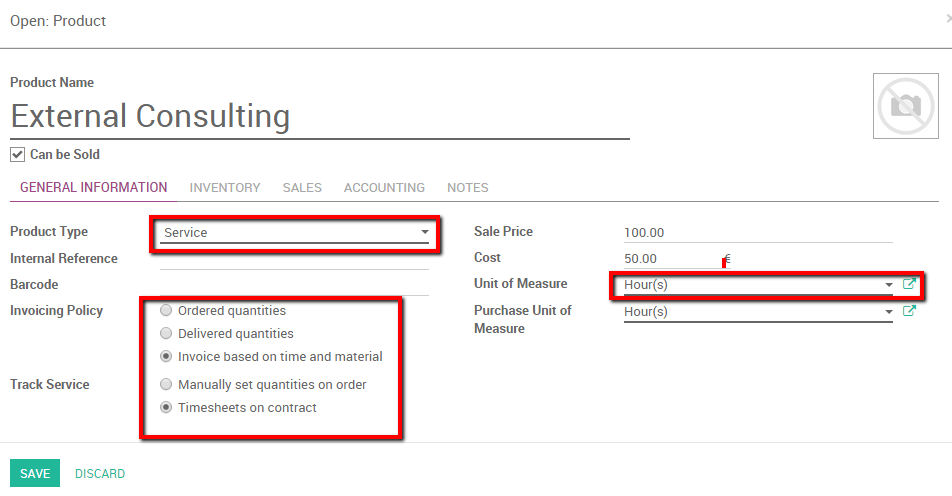

==============================================
Track costs of human resources with timesheets
==============================================

Human resource of course has a cost. It is interesting to see how much a
particular contract costs the company in term of human power in relation
to the invoiced amounts.

We will take the following example: Our two employees **Harry Potter** and
**Cedric Digory** both work on a **Consultancy pack** for our customer
**Smith&Co**. Harry is paid 18€ p.h. and Cedric's salary is 12€ p.h. We
would like to track their timesheet costs within the accounting app, and
compare them with the revenue of the consultancy service.

Configuration
=============

First, install the three applications necessary to use this
functionality, namely **Accounting**, **Sales** and **Timesheet**. Enter the apps
module name and install them.

.. image:: timesheets/timesheets05.png
   :align: center

.. image:: timesheets/timesheets11.png
   :align: center

Next you will need to enable analytical accounting. To do so enter the
**Accounting app**. Select :menuselection:`Configuration --> Settings` and tick the
**Analytic accounting** option (see picture below)

.. image:: timesheets/timesheets06.png
   :align: center

Apply your changes.

Create an employee
------------------

In order to check the revenue of an employee you need to have one. To
create an employee enter the **Employee** app. Select **Employees** and
create a new employee, fill in the name and the basic information.

On the employee sheet enter the **HR settings** tab. Here you are able to
specify the **Timesheet Cost** of your employee. In this case Harry has a
cost of 18 euros / hours. We will thus fill in 18 in this field.

.. note::
    If you want the employee to be able to enter timesheets he
    needs to be related to a User.

Repeat the operation to create the Cedric Digory employee. Don't forget
to specify its related user and **Timesheet Costs**.

Issue a Sales Order
--------------------

We created two employees called Harry Potter and Cedric Diggory in the
**Employee** app. Both of them will work on a consultancy contract for our
customer Smith&Co where they will point their hours on a timesheet.

We thus need to create a **sales order** with a **service** product invoiced
**based on time and material** and tracked by timesheets with **hours** as unit
of measures.

For more information on how to create a sales order based on time and
material please see :doc:`/applications/sales/sales/invoicing/time_materials`.

We save a Sales Order with the service product **External Consulting**. An
analytical account will automatically be generated once the **Sales Order**
is confirmed. Our employees will have to point to that account (in this
case **SO002-Smith&Co**) in order to be able to invoice their hours (see
picture below).

.. image:: timesheets/timesheets10.png
   :align: center

Fill in timesheet
-----------------

As an employee linked to a user, Harry can enter the **Timesheet** app and
specify his timesheets for the contract. Logged on Harry's account we enter the
**Timesheet** app and enter a detailed line pointing to the **Analytical
Account** discussed above.

Harry worked three hours on a SWOT analysis for Smith&Co.

.. image:: timesheets/timesheets01.png
   :align: center

In the meantime, Cedric discussed businesses needs with the customer for
1 hour and specified it as well in his personal timesheet, pointing as
well on the **Analytic Account**.

In the **Sales Order** we notice that the delivered amounts of hours is
automatically computed (see picture below).

.. image:: timesheets/timesheets02.png
   :align: center

Analytic accounting
-------------------

Thanks to analytic accounts we are able to have an overview of HR cost
and revenues. All the revenues and cost of this transactions have been
registered in the **SO002-Smith&Co** account.

We can use two methods to analyze this situation.

Without filters
~~~~~~~~~~~~~~~

If we pointed all our costs and revenues of the project on the correct
analytical account we can easily retrieve the cost and revenues related
to this analytical account. Enter the *Accounting* app, select
:menuselection:`Adviser --> Analytic Accounts --> Open Charts`.

Note : you can specify a period for **Analysis**. If you want to open the
current situation you should keep the fields empty. We can already note
the credit and debit balance of the account.

.. image:: timesheets/timesheets12.png
   :align: center

If we click on the account a special button is provided to have the
details of cost and revenues (see picture below).

.. image:: timesheets/timesheets13.png
   :align: center

Click the button **Cost/Revenue** to have an overview of cost and revenues with the
corresponding description.

With filters
~~~~~~~~~~~~

We can thus filter this information from the **Analytic Entries**.

Enter the **Accounting** app, and click on :menuselection:`Adviser --> Analytic Entries`.
In this menu we have several options to analyse the human resource cost.

1. We filter on the **Analytic account** so we can see the cost and revenues
   of the project. Add a custom **Filter** where the **Analytic Account**
   contains the **Sales Order** number.

   .. image:: timesheets/timesheets04.png
      :align: center

   In the results we see timesheets activities and invoiced lines with
   the corresponding costs and revenues.

   .. image:: timesheets/timesheets09.png
     :align: center

2. We can group the different analytical accounts together and check
   their respective revenues. Simply group by **Analytic account** and
   select the **Graph view** to have a clear overview.

   .. image:: timesheets/timesheets08.png
      :align: center
