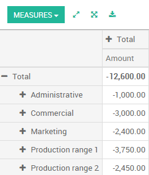

==========================
Analytic account use cases
==========================

The analytic accounting can be used for several purposes:

-  analyse costs of a company

-  reinvoice time to a customer

-  analyse performance of a service or a project

To manage analytic accounting, you have to activate it in
:menuselection:`Configuration --> Settings`:

.. image:: usage/usage01.png
   :align: center

To illustrate analytic accounts clearly, you will follow three use
cases, each in one of three different types of company:

1. Industrial company: Costs Analyse

2. Law Firm: reinvoice spent hours

3. IT/Services Company: performance analysis

Case 1: Industrial company: Costs Analyse
-----------------------------------------

In industry, you will often find analytic charts of accounts structured
into departments and products the company itself is built on.

The objective is to examine the costs, sales and margins by
department/resources and by product. The first level of the structure
comprises the different departments, and the lower levels represent the
product ranges the company makes and sells.

**Analytic Chart of Accounts for an Industrial Manufacturing Company**:

1. Marketing Department

2. Commercial Department

3. Administration Department

4. Production Range 1

5. Production Range 2

In daily use, it is useful to mark the analytic account on each purchase
invoice. When the invoice is approved, it will
automatically generate the entries for both the general and the
corresponding analytic accounts. For each entry on the general
accounts, there is at least one analytic entry that allocates costs to
the department which incurred them.

Here is a possible breakdown of some general accounting entries for the
example above, allocated to various analytic accounts:

+---------------------------------------+-----------+---------+----------+----+-------------------------+----------+
| **General accounts**                  |           |         |          |    | **Analytic accounts**   |          |
+=======================================+===========+=========+==========+====+=========================+==========+
| **Title**                             |**Account**|**Debit**|**Credit**|    | **Account**             |**Value** |
+---------------------------------------+-----------+---------+----------+----+-------------------------+----------+
| Purchase of Raw Material              | 2122      | 1500    |          |    | Production Range 1      | -1 500   |
+---------------------------------------+-----------+---------+----------+----+-------------------------+----------+
| Subcontractors                        | 2122      | 450     |          |    | Production Range 2      | -450     |
+---------------------------------------+-----------+---------+----------+----+-------------------------+----------+
| Credit Note for defective materials   | 2122      |         | 200      |    | Production Range 1      | 200      |
+---------------------------------------+-----------+---------+----------+----+-------------------------+----------+
| Transport charges                     | 2122      | 450     |          |    | Production Range 1      | -450     |
+---------------------------------------+-----------+---------+----------+----+-------------------------+----------+
| Staff costs                           | 2121      | 10000   |          |    | Marketing               | -2 000   |
+---------------------------------------+-----------+---------+----------+----+-------------------------+----------+
|                                       |           |         |          |    | Commercial              | -3 000   |
+---------------------------------------+-----------+---------+----------+----+-------------------------+----------+
|                                       |           |         |          |    | Administrative          | -1 000   |
+---------------------------------------+-----------+---------+----------+----+-------------------------+----------+
|                                       |           |         |          |    | Production Range 1      | -2 000   |
+---------------------------------------+-----------+---------+----------+----+-------------------------+----------+
|                                       |           |         |          |    | Production Range 2      | -2 000   |
+---------------------------------------+-----------+---------+----------+----+-------------------------+----------+
| PR                                    | 2122      | 450     |          |    | Marketing               | -400     |
+---------------------------------------+-----------+---------+----------+----+-------------------------+----------+

The analytic representation by department enables you to investigate the
costs allocated to each department in the company. The analytic chart of
accounts shows the distribution of the company's costs using the example above:

In this example of a hierarchical structure in Odoo, you can analyse not
only the costs of each product range, but also the costs of the whole
production. A report that relates both general accounts and analytic
accounts enables you to get a breakdown of costs within a given
department.

.. image:: usage/usage03.png
   :align: center

The examples above are based on a breakdown of the costs of the company.
Analytic allocations can be just as effective for sales. That gives you
the profitability (sales - costs) of different departments.

This analytic representation by department is generally used by trading
companies and industries.

A variantion of this, is not to break it down by sales and marketing
departments, but to assign each cost to its corresponding product range.
This will give you an analysis of the profitability of each product
range.

Choosing one over the other depends on how you look at your marketing
effort. Is it a global cost allocated in some general way, or is each
product range responsible for its own marketing costs?

Case 2: Law Firm: costs of human resources?
-------------------------------------------

Law firms generally adopt management by case, where each case represents
a current client file. All of the expenses and products are then
attached to a given file/analytic account.

A principal preoccupation of law firms is the invoicing of hours worked,
and the profitability by case and by employee.

Mechanisms used for encoding the hours worked will be covered in detail
in timesheet documentation. Like most system processes, hours worked are
integrated into the analytic accounting. In the employee form, specify
the cost of the employee. The hourly charge is a function of the
employee's cost.

So a law firm will opt for an analytic representation which reflects the
management of the time that employees work on the different customer
cases.

Billing for the different cases is a bit unusual. The cases do not match
any entry in the general account nor do they come from purchase or sales
invoices. They are represented by the various analytic operations and do
not have exact counterparts in the general accounts. They are calculated
on the basis of the hourly cost per employee.

At the end of the month when you pay salaries and benefits, you
integrate them into the general accounts but not in the analytic
accounts, because they have already been accounted for in billing each
account. A report that relates data from the analytic and general
accounts then lets you compare the totals, so you can readjust your
estimates of hourly cost per employee depending on the time actually
worked.

The following table shows an example of different analytic entries that
you can find for your analytic account:

+--------------------------------+------------------+--------------+----+----------------------------+-------------+--------------+
| **Title**                      | **Account**      | **Amount**   |    | **General Account**        | **Debit**   | **Credit**   |
+================================+==================+==============+====+============================+=============+==============+
| Study the file (1 h)           | Case 1.1         | -15          |    |                            |             |              |
+--------------------------------+------------------+--------------+----+----------------------------+-------------+--------------+
| Search for information (3 h)   | Case 1.1         | -45          |    |                            |             |              |
+--------------------------------+------------------+--------------+----+----------------------------+-------------+--------------+
| Consultation (4 h)             | Case 2.1         | -60          |    |                            |             |              |
+--------------------------------+------------------+--------------+----+----------------------------+-------------+--------------+
| Service charges                | Case 1.1         | 280          |    | 705 – Billing services     |             | 280          |
+--------------------------------+------------------+--------------+----+----------------------------+-------------+--------------+
| Stationery purchase            | Administrative   | -42          |    | 601 – Furniture purchase   | 42          |              |
+--------------------------------+------------------+--------------+----+----------------------------+-------------+--------------+
| Fuel Cost -Client trip         | Case 1.1         | -35          |    | 613 – Transports           | 35          |              |
+--------------------------------+------------------+--------------+----+----------------------------+-------------+--------------+
| Staff salaries                 |                  |              |    | 6201 – Salaries            |             | 3 000        |
+--------------------------------+------------------+--------------+----+----------------------------+-------------+--------------+

Such a structure allows you to make a detailed study of the
profitability of various transactions.

For more details about profitablity, please read the following document:
:doc:`timesheets`

But analytical accounting is not limited to a simple analysis of the
profitability of different customer. The same data can be used for
automatic recharging of the services to the customer at the end of the
month. To invoice customers, just link the analytic account to a sale
order and sell products that manage timesheet or expenses .

Case 3: IT Services Company: performance analysis
-------------------------------------------------

Most IT service companies face the following problems:

-  project planning,

-  invoicing, profitability and financial follow-up of projects,

-  managing support contracts.

To deal with these problems, you would use an analytic chart of accounts
structured by project and by sale order.

The management of services, expenditures and sales is similar to that
presented above for lawyers. Invoicing and the study of profitability
are also similar.

But now look at support contracts. These contracts are usually limited
to a prepaid number of hours. Each service posted in the analytic
accounts shows the remaining hours of support. To manage support
contracts, you would create a product configured to invoice on order and
link the sale order to an analytic account

In Odoo, each analytic line lists the number of units sold or used, as
well as what you would usually find there – the amount in currency units
(USD or GBP, or whatever other choice you make). So you can sum the
quantities sold and used on each sale order to determine whether any
hours of the support contract remain.

Conclusion
----------

Analytic accounting helps you to analyse costs and revenues whatever the
use case. You can sell or purchase services, track time or analyse the
production performance.

Analytic accounting is flexible and easy to use through all Odoo
applications (sales, purchase, timesheet, production, invoice, …).
