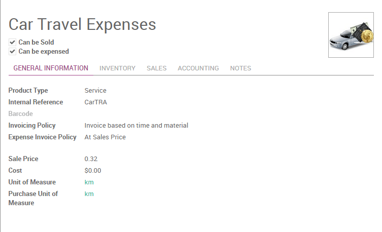

=======================================
How to keep track of employee expenses?
=======================================

Employee expenses are charges incurred on behalf of the company. The
company then reimburses these expenses to the employee. The receipts
encountered most frequently are:

- car travel, reimbursed per unit of distance (mile or kilometer),

- subsistence expenses, reimbursed based on the bill,

- other purchases, such as stationery and books, destined for the
  company but carried out by the employee.

Configuration
=============

To manage expenses, you need to install the **Expense Tracker**
application from the Apps module.

You will also need to install the **Sales Management** module in order to
re-invoice your expenses to your customers.

Once these applications are installed you can configure the different
products that represent the types of expenses. To create the firsts
products, go to the menu :menuselection:`Configuration --> Expenses Products` in the
**Expenses** application.

Some examples of products can be:

1. **Travel (car)**

   - Product Type: Service

   - Invoicing Policy: Invoice based on time and material

   - Expense Invoice Policy: At sales price

   - Sale Price: 0.32

   - Unit of Measure: Km or mile (you will need to enable the **Multiple
     Unit of Measures** option from :menuselection:`Sales module --> Configuration`)

1. **Hotel**

   -  Product Type: Service

   -  Invoicing Policy: Invoice based on time and material

   -  Expense Invoice Policy: At cost

   -  Unit of Measure: Unit

In these examples, the first product will be an expense we reimburse to
the employee based on the number of km he did with his own car (e.g. to
visit a customer): 0.32€ / km. The hotel is reimbursed based on the real
cost of the hotel.

Be sure that all these products have the checkbox **Can be expensed**
checked and the invoicing policy set to **Invoice Based on time and
material**. This invoicing policy means that, if the expense is related
to a customer project/sale order, Odoo will re-invoice this expense to
the customer.

Odoo support two types of expenses:

-  expenses paid by employee with their own money

-  expenses paid with a company credit card

The expenses workflow
=====================

Record a new expense
--------------------

Every employee of the company can register their expenses from 
:menuselection:`Expenses application --> My Expenses`. The workflow for personal
expenses work that way:

1. an employee record his expense, and submit it to the manager

2. the manager approve or refuse the expense

3. the accountant post journal entries

4. the company reimburse the employee expense (the employee is like a
   vendor, with a payable account)

5. if the expense is linked to an analytic account, the company can
   reinvoice the customer

For every expense, the employee should record at least:

-  a description: that should include the reference of the ticket / bill

-  a product: the expense type

-  a price (e.g. hotel) or a quantity (e.g. reimburse km if travel with
   his own car)

Depending of the policy of the company, he might have to attach a scan
or a photo of the expense. To do that, just a write a message in the
bottom of the expense with the scan of the bill/ticket in attachment.

.. image:: ./media/expense02.png
  :align: center

If the expense is linked to a customer project, you should not forget to
set an analytic account, related to the customer project or sale order
(you might have to activate analytic accounts in the accounting settings
to get this feature).

Once the expense is fully recorded, the employee has to click the button
**Submit to Manager**. In some companies, employees should submit their
expenses grouped at the end of the month, or at the end of a business
trip.

An employee can submit all his expenses in batch, using the Submit
Expenses action from the list view of expenses, or the small icons in
the list view.

Validation by the manager
-------------------------

Managers should receive an email for every expense to be approved (the
manager of an employee is defined on the employee form). They can use
the menu **To Approve** to check all expenses that are waiting for
validation.

The manager can:

- discuss on an expense to ask for more information (e.g., if a scan of
  the bill is missing);

- reject an expense;

- approve an expense.

Control by the accountant
-------------------------

Then, all expenses that have been validated by the manager should be
posted by the accountant. When an expense is posted, the related journal
entry is created and posted in your accounting.

If the accountant wants to create only one journal entry for a batch of
expenses, he can post expenses in batch from the list view of all
expenses.

Reinvoice expenses to customers
-------------------------------

If the expense was linked to an analytic account related to a sale
order, the sale order has a new line related to the expense. This line
is not invoiced to the customer yet and will be included in the next
invoice that will be send to the customer (charge travel and
accommodations on a customer project)

To invoice the customer, just click on the invoice button on his sale
order. (or it will be done automatically at the end of the week/month if
you invoice all your orders in batch)

.. todo::

	tip
	If you want to learn more; check the documentation page :doc: ../../../sale/invoicing/service/expense
	`*How to re-invoice expenses to your customers* <https://docs.google.com/document/d/1_6VclRWfESHfvNPZI32q5ANFi2C7cCTwkLXpbGTz6B8/edit?usp=sharing>`__

Reimburse the employee
----------------------

If the expense was paid with the employee's own money, the company
should reimburse the employee. In such a case, the employee will appear
in the aged payable balance until the company reimburse him his
expenses.

All you have to do is to create a payment to this employee for the
amount due.

Miscellaneous
=============

Expenses that are not reinvoiced to customers
---------------------------------------------

If some expenses should not be reinvoiced to customers, you have two
options:

1. if the decision to invoice or not is related to the product, change
   the invoicing policy on the product:

   - **based on time and material**: reinvoice the customer

   - **based on sale orders**: do not reinvoice the customer

2. if you have to make an exception for one invoice that should not be
   reinvoiced to the customer, do not set the related analytic
   account for this invoice.

.. seealso::

	* :doc:`forecast`
