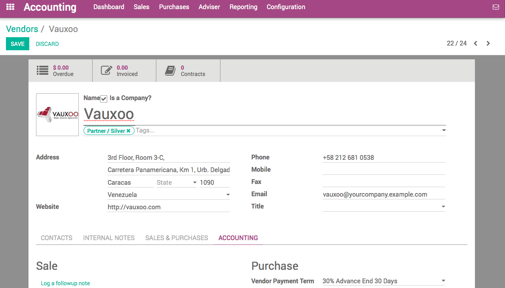
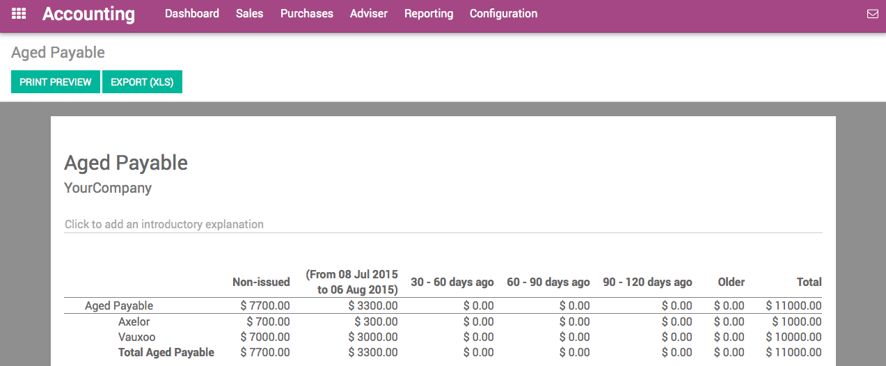

====================================
How to forecast future bills to pay?
====================================

When you get hundreds of vendor bills per month with each of them having
different payment terms, it could be complex to follow what you have to
pay and when. Paying your vendors too early can decrease your cash
availabilities and paying too late can lead to extra charges.

Fortunately, Odoo provides you the right tools to manage payment orders
to vendors efficiently.

Configuration: payment terms
============================

In order to track the vendor conditions, we use payment terms in Odoo.
Payment terms allow to keep track of the conditions to compute the due
date on an invoice. As an example, a payment term can be:

-  50% within 30 days

-  50% within 45 days

To create your most common payment terms, use the menu: :menuselection:`Configuration -->
Management --> Payment Terms` in the **Accounting** application. The following
example show a payment term of 30% directly and the balance after 30
days.

.. image:: ./media/forecast01.png
  :align: center

Once payment terms are defined, you can assign them to your vendor by
default. Set the Vendor Payment Term field on the Accounting tab of a
vendor form. That way, every time you will purchase to this vendor, Odoo
will propose you automatically the right payment term.

.. note::

    If you do not set a specific payment term on a vendor, you will still be
    able to set a specific payment term on the vendor bill.

Forecast bills to pay with the Aged Payables report
===================================================

In order to track amounts to be paid to the vendors, use the Aged
Payable report. You can get it from the Reports menu of the Accounting
application. This report gives you a summary per vendor of the amounts
to pay, compared to their due date (the due date being computed on each
bill using the payment term).

This reports tells you how much you will have to pay within the next
months.

Select bills to pay
===================

Using the menu :menuselection:`Purchases --> Vendor Bills`, you can get a list of vendor
bills. Using the advanced filters, you can list all the bills that you
should pay or the bills that are overdue (you are late on the payment).

.. image:: ./media/forecast04.png
  :align: center

From this screen, you can also switch to the pivot table or the graph
view to get statistics on the amount due over the next month, using the
group by "Due Date" feature.
