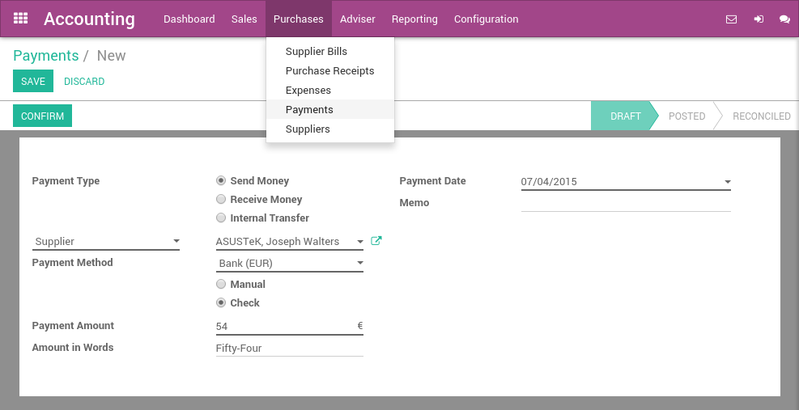

=============
Pay by checks
=============

Once you decide to pay a supplier bill, you can select to pay by check.
Then, at the end of the day, the manager can print all checks by batch.
Finally, the bank reconciliation process will match the checks you sent
to suppliers with actual bank statements.

Configuration
=============

Install the required module
---------------------------

To record supplier payments by checks, you must install the **Check
Writing** module. This module handle the process of recording checks in
Odoo. Others modules are necessary to print checks, according to the
country. As an example, the **U.S. Check Printing** module is required to
print U.S. checks.

.. note::
   According to your country and the chart of account you use, those
   modules may be installed by default. (example: United States users have
   nothing to install, it's configured by default).

Activate checks payment methods
-------------------------------

In order to allow payments by checks, you must activate the payment
method on related bank journals. From the accounting dashboard (the
screen you get when you enter the accounting application), click on your bank
account on :menuselection:`More --> Settings` option. On the
**Payment Method** field, set **Check**.

.. image:: check/check01.png
  :align: center

Compatible check stationery for printing checks
===============================================

United States
-------------

For the United States, Odoo supports by default the check formats of:

- **Quickbooks & Quicken**: check on top, stubs in the middle and bottom
- **Peachtree**: check in the middle, stubs on top and bottom
- **ADP**: check in the bottom, and stubs on the top.

It is also possible to customize your own check format through customizations.

Pay a supplier bill with a check
================================

Paying a supplier with a check is done in three steps:

1. registering a payment you'd like to do on the bill
2. printing checks in batch for all registered payments
3. reconcile bank statements

Register a payment by check
---------------------------

To register a payment on a bill, open any supplier bill from the menu
:menuselection:`Purchases --> Vendor Bills`. Once the supplier bill is
validated, you can register a payment. Set the **Payment Method** to **Check**
and validate the payment dialog.

.. image:: check/check02.png
  :align: center

Print checks
------------

From the accounting dashboard, on your bank account, you should see a
link "X checks to print". Click on this link and you will get the list
of all checks that are not printed yet. From this screen, you can print
all checks in batch or review them one by one.

If you want to review every payment one by one before printing the
check, open on the payment and click on **Print Check** if you accept it. A dialog
will ask you the number of the check. It automatically proposes you the
next number, but you can change it if it does not match your next check
number.

To print all checks in batch, select all payments from the list view and
Print Check from the top "print" menu.

.. image:: check/check03.png
  :align: center

Reconcile bank statements
-------------------------

Once you process your bank statement, when the check is credited from
your bank account, Odoo will propose you automatically to match it with
the payment. This will mark the payment as **Reconciled**.

.. tip::
   To review checks that have not been credited, open the list of
   payments and filter on the Sent state. Review those payments that have a
   date more than 2 weeks ago.

Pay anything with a check
=========================

You can register a payment that is not related to a supplier bill. To do
so, use the top menu :menuselection:`Purchases --> Payments`. Register your
payment and select a payment method by check.

If you pay a specific supplier bill, put the reference of the bill in
the **Memo** field.

Once your payment by check is registered, don't forget to **Confirm** it.
Once confirmed, you can use **Print Check** directly or follow the preceding
flow to print checks in batch:

-  `Print checks`_
-  `Reconcile bank statements`_
