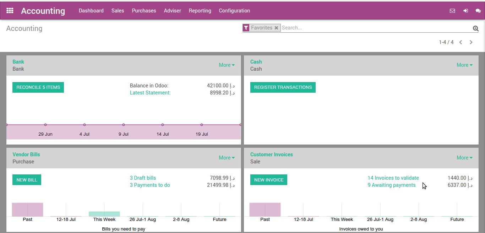
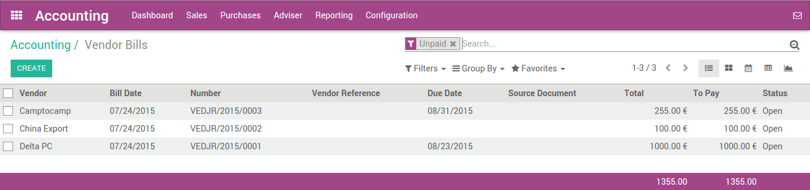
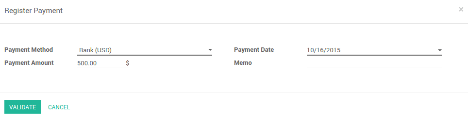
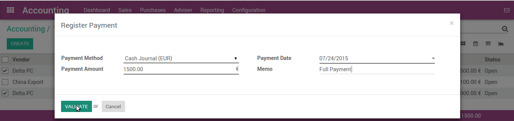

=========================
Pay several bills at once
=========================

Odoo provides a simple and effective way to handle several bills at
once, with various quick or complex options. With one single process,
anyone is able to handle bills and payment in just a few clicks.

Pay multiple bills with one payment
===================================

Record several payments
-----------------------

In the following example, we will generate some bills. You can control
the whole process from your accounting dashboard (first screen you get
when you open the accounting application).

To create a bill, open the Dashboard menu and click on **Vendor Bills**.
In the Vendor Bills window, click on **Create**.

.. image:: multiple/multiple02.png
  :align: center

Choose the vendor from which you wish to purchase the product, and click
on Add an item to add one (or more) product(s). Click on **Save** and then
**Validate**.

Pay supplier bills, one after the other
---------------------------------------

We will now record a payment for one bill only. Open the bill, then
click on **Register Payment**. Insert the Payment Method, Date and Amount,
and click on **Validate**.

Once you have validated the payment, the system will automatically
reconcile the payment with the bill, and set the bill as **Paid**. The
system will also generate a move from the payment account and reconcile
it with the expense transaction.

Pay several bills altogether
----------------------------

In order to illustrate the process thoroughly, create at least 2 more
bills following the above standing guide. **Make sure all bills come
from the same vendor.**

.. image:: multiple/multiple05.png
  :align: center

In the Vendors Bills, select the new bills you have just created by
checking the box next to each of them. In the Action menu located in the
middle of the page, click on **Register Payment**.

Insert the details of the payment. The system calculated the total
amount for both bills, but you can modify it freely. Click on **Validate**.

Record the payment, reconcile afterwards
----------------------------------------

You can also reconcile a payment with bills after the payment has been
recorded.

First, we need to create a payment

This will handle from :menuselection:`Dashboard --> Bank journal -->
More Option --> Send Money`

.. image:: multiple/multiple07.png
  :align: center

Creating payment order with check payment method. Selecting related
Vendor and amount which remain to pay. After filling all details, we
will confirm the payment order which will generate payment transaction
with the system.

.. image:: multiple/multiple08.png
  :align: center

As you can see, bill payment status show what is posted and what is
remaining to reconcile.

After receiving bank statement from the bank with payment detail, you
can reconcile the transaction from the Dashboard. It will automatically
map the transaction amount.

.. seealso::
   - :doc:`../../bank/reconciliation/use_cases`

Partial payments of several supplier bills
==========================================

How to pay several supplier bills having cash discounts at once?
----------------------------------------------------------------

You already learned how to pay bills in various way but what about
partial payment? We are taking another example where we will do partial
payment for various bills.

We are creating multiple bills and partially pay them through bank
statements.

We are adding payment terms which allow some cash discount where vendor
offer us early payment discount.

.. image:: multiple/multiple09.png
  :align: center

We are creating the following bills with the assignment of the above
payment term.

.. image:: multiple/multiple10.png
  :align: center

We have created the following bills:

.. image:: multiple/multiple11.png
  :align: center

We will pay the invoices by creating bank statement where we will adjust
the cash discount our vendor provided under payment terms.

.. image:: multiple/multiple12.png
  :align: center

Before reconciling this bank statement, we need to create one statement
model for cash discount.

.. image:: multiple/multiple13.png
  :align: center

Now we are going back to bank statement and opening reconcile view.

.. seealso::
   - :doc:`../../bank/reconciliation/reconciliation_models`