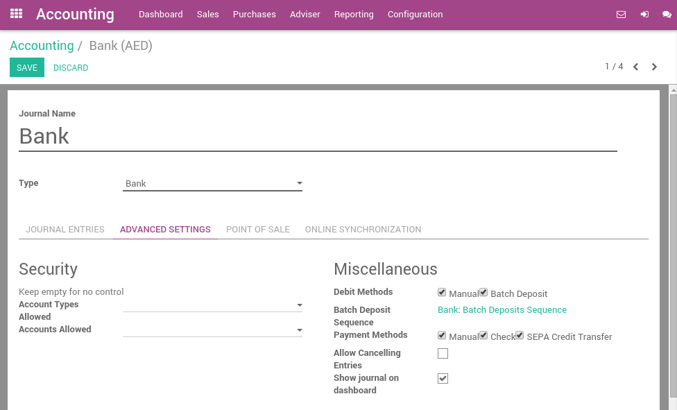
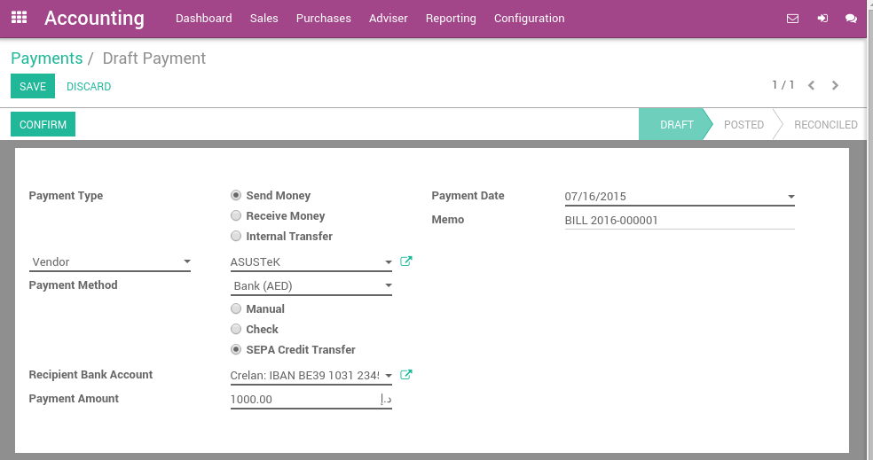
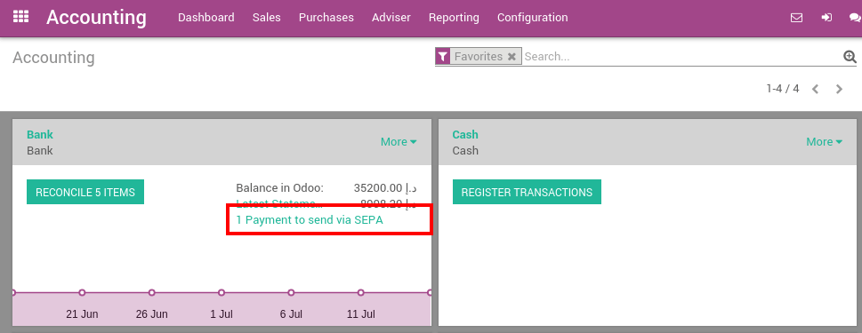

===============
Payez avec SEPA
===============

SEPA, the Single Euro Payments Area, est une initiative d'intégration des paiements
de l'Union européenne visant à simplifier les transferts bancaires libellés
en EURO. Le SEPA vous permet d'envoyer des ordres de paiement à votre banque pour automatiser
les virements bancaires.

Le SEPA est soutenu par les banques des 28 États membres de l'UE, ainsi que par les pays suivants
l'Islande, la Norvège, la Suisse, Andorre, Monaco et Saint-Marin.

Avec Odoo, une fois que vous décidez de payer un fournisseur, vous pouvez choisir de payer la facture avec SEPA. Ensuite, à la fin de la journée, le gestionnaire peut générer le fichier SEPA contenant tous les virements bancaires et l'envoyer à la banque. 

Par défaut, le fichier suit les spécifications du virement SEPA **'pain.001.001.03'**. Il s'agit d'une norme bien définie qui fait consensus parmi les banques. Cependant, en fonction du pays défini sur votre entreprise, un autre format peut être utilisé : **'pain.001.001.03.ch.02'** pour la Suisse et **'pain.001.003.03'** pour l'Allemagne.

Une fois que les paiements sont traités par votre banque, vous pouvez directement importer le relevé de compte dans Odoo. Le processus de rapprochement bancaire fera correspondre de manière transparente les ordres SEPA que vous avez envoyés à votre banque avec les relevés bancaires réels.

Configuration
=============

Install the required module
---------------------------

To pay suppliers with SEPA, you must install the **SEPA Credit Transfer**
module. This module handle the process of generating SEPA files based on
Odoo payments.

.. note::
   According to your country and the chart of account you use, this module may
   be installed by default.

Activate SEPA payment methods on banks
--------------------------------------

In order to allow payments by SEPA, you must activate the payment method
on related bank journals. From the accounting dashboard (the screen you
get when you enter the accounting application), click on "More" on your
bank account and select the "Settings" option.

To activate SEPA, click the **Advanced Settings** tab and, in the **Payment
Methods** part of the **Miscellaneous** section, check the box **Sepa Credit
Transfer**.

Make sure to specify the IBAN account number (domestic account number
won't work with SEPA) and the BIC (bank identifier code) on your bank
journal.

.. note::
   By default, the payments you send using SEPA will use your company name as
   initiating party name. This is what appears on the recipient's bank statement
   in the **payment from** field. You can customize it in your company settings,
   in the tab **Configuration**, under the **SEPA** section.

Pay with SEPA
=============

Register your payments
----------------------

You can register a payment that is not related to a supplier bill. To do
so, use the top menu :menuselection:`Purchases --> Payments`. Register your
payment and select a payment method by Sepa Credit Transfer.

If it's the first time you pay this vendor, you will have to fill in the
Recipient Bank Account field with, at least, the bank name, IBAN and BIC
(Bank Identifier Code). Odoo will automatically verify the IBAN format.

For future payments to this vendor, Odoo will propose you automatically
the bank accounts but you will be able to select another one or create a
new one.

If you pay a specific supplier bill, put the reference of the bill in
the **memo** field.

Once your payment is registered, don't forget to Confirm it. You can
also pay vendor bills from the bill directly using the Register Payment
button on top of a vendor bill. The form is the same, but the payment is
directly linked to the bill and will be automatically reconciled to it.

Generate SEPA files
-------------------

From your accounting dashboard, you should see if there are SEPA files
to generate for every bank account.

Click on the link to check all the payments that are ready to transfer
via SEPA. Then, select all the payments you want to send (or check the
top box to select all payment at once) and click on :menuselection:`More -->
Download SEPA Payments`.

.. image:: ./media/sepa04.png
  :align: center

Troubleshooting
===============

The bank refuses my SEPA file
-----------------------------

Ask your bank if they support the **SEPA Credit Transfer specification**
(the SEPA pain version depends on the country set on your company). If
they don't, or cannot provide relevant information, please forward the
error message to your Odoo partner.

There is no Bank Identifier Code recorded for bank account ...
--------------------------------------------------------------

In order to send a SEPA payment, the recipient must be identified by a
valid IBAN and BIC. If this message appear, you probably encoded an IBAN
account for the partner you are paying but forgot to fill in the BIC
field.

.. seealso::
   - :doc:`check`
   - :doc:`../../bank/setup/bank_accounts`
   - :doc:`../../bank/reconciliation/use_cases`
