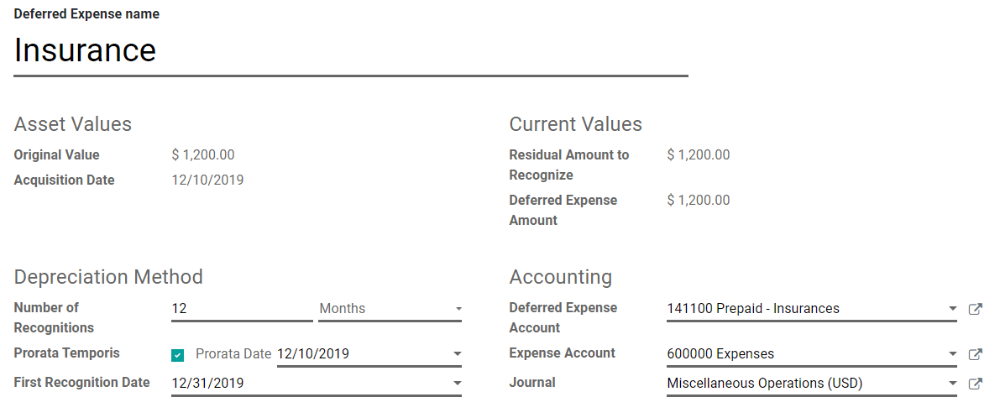

=================================
Deferred expenses and prepayments
=================================

**Deferred expenses** and **prepayments** (also known as **prepaid expense**), are both costs that
have already occurred for unconsumed products or services yet to receive.

Such costs are **assets** for the company that pays them since it already paid for products and
services still to receive or that are yet to be used. The company cannot report them on the current
**Profit and Loss statement**, or *Income Statement*, since the payments will be effectively
expensed in the future.

These future expenses must be deferred on the company's balance sheet until the moment in time they
can be **recognized**, at once or over a defined period, on the Profit and Loss statement.

For example, let's say we pay $ 1200 at once for one year of insurance. We already pay the cost now
but haven't used the service yet. Therefore, we post this new expense in a *prepayment account* and
decide to recognize it on a monthly basis. Each month, for the next 12 months, $ 100 will be
recognized as an expense.

Odoo Accounting handles deferred expenses and prepayments by spreading them in multiple entries that
are automatically created in *draft mode* and then posted periodically.

.. note::
   The server checks once a day if an entry must be posted. It might then take up to 24 hours before
   you see a change from *draft* to *posted*.

Prerequisites
=============

Such transactions must be posted on a **Deferred Expense Account** rather than on the default
expense account.

Configure a Deferred Expense Account
------------------------------------

To configure your account in the **Chart of Accounts**, go to :menuselection:`Accounting -->
Configuration --> Chart of Accounts`, click on *Create*, and fill out the form.

.. image:: deferred_expenses/deferred_expenses01.png
   :align: center
   :alt: Configuration of a Deferred Expense Account in Odoo Accounting

.. note::
   This account's type must be either *Current Assets* or *Prepayments*

Post an expense to the right account
------------------------------------

Select the account on a draft bill
~~~~~~~~~~~~~~~~~~~~~~~~~~~~~~~~~~~~~

On a draft bill, select the right account for all the products of which the expenses must be
deferred.

.. image:: deferred_expenses/deferred_expenses02.png
   :align: center
   :alt: Selection of a Deferred Expense Account on a draft bill in Odoo Accounting

Choose a different Expense Account for specific products
~~~~~~~~~~~~~~~~~~~~~~~~~~~~~~~~~~~~~~~~~~~~~~~~~~~~~~~~

Start editing the product, go to the *Accounting* tab, select the right **Expense Account**, and
save.

.. image:: deferred_expenses/deferred_expenses03.png
   :align: center
   :alt: Change of the Expense Account for a product in Odoo

.. tip::
   It is possible to automate the creation of expense entries for these products (see:
   `Automate the Deferred Expenses`_).

Change the account of a posted journal item
~~~~~~~~~~~~~~~~~~~~~~~~~~~~~~~~~~~~~~~~~~~~

To do so, open your Purchases Journal by going to :menuselection:`Accounting --> Accounting -->
Purchases`, select the journal item you want to modify, click on the account, and select the right
one.

.. image:: deferred_expenses/deferred_expenses04.png
   :align: center
   :alt: Modification of a posted journal item's account in Odoo Accounting

Deferred Expenses entries
=========================

Create a new entry
------------------

A **Deferred Expense entry** automatically generates all journal entries in *draft mode*. They are
then posted one by one at the right time until the full amount of the expense is recognized.

To create a new entry, go to :menuselection:`Accounting --> Accounting --> Deferred Expense`, click
on *Create*, and fill out the form.

Click on **select related purchases** to link an existing journal item to this new entry. Some
fields are then automatically filled out, and the journal item is now listed under the **Related
Expenses** tab.

Once done, you can click on *Compute Deferral* (next to the *Confirm* button) to generate all the
values of the **Expense Board**. This board shows you all the entries that Odoo will post to
recognize your expense, and at which date.

.. image:: deferred_expenses/deferred_expenses06.png
   :align: center
   :alt: Expense Board in Odoo Accounting

What does "Prorata Temporis" mean?
~~~~~~~~~~~~~~~~~~~~~~~~~~~~~~~~~~

The **Prorata Temporis** feature is useful to recognize your expense the most accurately possible.

With this feature, the first entry on the Expense Board is computed based on the time left between
the *Prorata Date* and the *First Recognition Date* rather than the default amount of time between
recognitions.

For example, the Expense Board above has its first expense with an amount of $ 70.97 rather than
$ 100.00. Consequently, the last entry is also lower and has an amount of $ 29.03.

Deferred Entry from the Purchases Journal
-----------------------------------------

You can create a deferred entry from a specific journal item in your **Purchases Journal**.

To do so, open your Purchases Journal by going to :menuselection:`Accounting --> Accounting -->
Purchases`, and select the journal item you want to defer. Make sure that it is posted in the right
account (see: `Change the account of a posted journal item`_).

Then, click on *Action*, select **Create Deferred Entry**, and fill out the form the same way you
would do to `create a new entry`_.

.. image:: deferred_expenses/deferred_expenses07.png
   :align: center
   :alt: Create Deferred Entry from a journal item in Odoo Accounting

Deferred Expense Models
=======================

You can create **Deferred Expense Models** to create your Deferred Expense entries faster.

To create a model, go to :menuselection:`Accounting --> Configuration --> Deferred Expense Models`,
click on *Create*, and fill out the form the same way you would do to create a new entry.

.. tip::
   You can also convert a *confirmed Deferred Expense entry* into a model by opening it from
   :menuselection:`Accounting --> Accounting --> Deferred Expenses` and then, by clicking on the
   button *Save Model*.

Apply a Deferred Expense Model to a new entry
---------------------------------------------

When you create a new Deferred Expense entry,  fill out the **Deferred Expense Account** with the
right recognition account.

New buttons with all the models linked to that account appear at the top of the form. Clicking on a
model button fills out the form according to that model.

.. image:: deferred_expenses/deferred_expenses08.png
   :align: center
   :alt: Deferred Expense model button in Odoo Accounting

.. _deferred-expenses-automation:

Automate the Deferred Expenses
==============================

When you create or edit an account of which the type is either *Current Assets* or *Prepayments*,
you can configure it to defer the expenses that are credited on it automatically.

You have three choices for the **Automate Deferred Expense** field:

#. **No:** this is the default value. Nothing happens.
#. **Create in draft:** whenever a transaction is posted on the account, a draft *Deferred Expenses
   entry* is created, but not validated. You must first fill out the form in
   :menuselection:`Accounting --> Accounting --> Deferred Expenses`.
#. **Create and validate:** you must also select a Deferred Expense Model (see: `Deferred Expense
   Models`_). Whenever a transaction is posted on the account, a *Deferred Expenses entry* is
   created and immediately validated.

.. image:: deferred_expenses/deferred_expenses09.png
   :align: center
   :alt: Automate Deferred Expense on an account in Odoo Accounting

.. tip::
   You can, for example, select this account as the default **Expense Account** of a product to
   fully automate its purchase. (see: `Choose a different Expense Account for specific
   products`_).

.. seealso::
   * :doc:`../../getting_started/initial_configuration/chart_of_accounts`