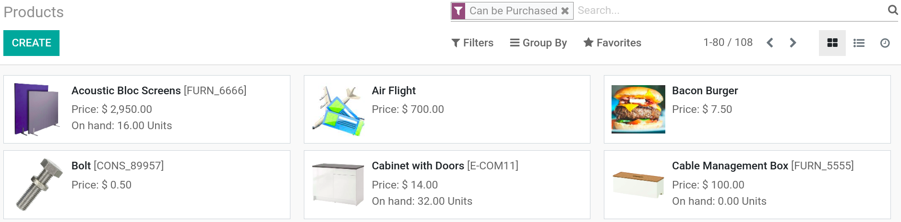
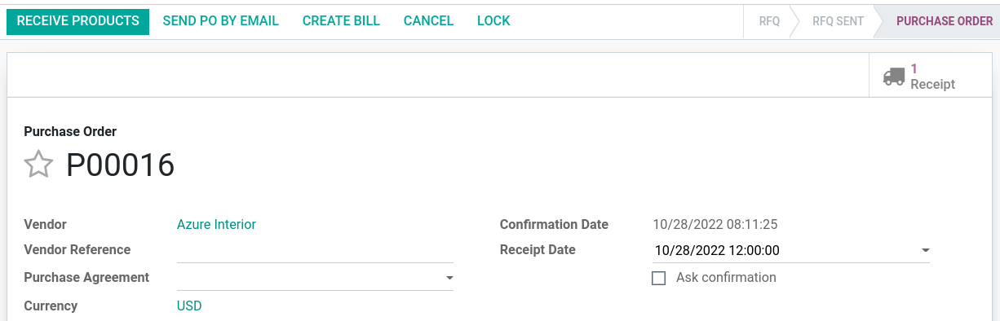

===================
Manage vendor bills
===================

Managing a vendor bill in Odoo can be summarized in four steps:

#. You begin with a **Request for Quotation (RFQ)** to send out to your vendor(s).

#. Once the vendor has accepted the RFQ, confirm the RFQ into a **Purchase Order (PO)**.

#. Confirming the PO generates an **Incoming Shipment** if you purchased any storable products.

#. Upon receiving the **vendor bill** from your vendor, validate the bill.

Configuration
=============

Installing the Purchase and Inventory applications
--------------------------------------------------

From the :guilabel:`Apps` application, search for the :guilabel:`Purchase` module and install it.
Due to certain dependencies, installing **Purchase** automatically installs the **Inventory** and
**Accounting** applications.

Creating products
-----------------

Creating products in Odoo allows for quick access to pre-configured products' information. To create
a product, navigate to :menuselection:`Purchase app --> Products --> Products --> Create`.

When creating a product, pay attention to the :guilabel:`Product Type` field, as:

- Products that are set as :guilabel:`Storable` or :guilabel:`Consumable` allow to keep track of
  their inventory levels. These options imply stock management and therefore make it possible to
  click on the :guilabel:`Receive Product` button.

- Conversely, products that are set as :guilabel:`Service` or :guilabel:`Digital Product` do not
  require stock management. You are therefore not able to receive products under either of these
  categories.

.. tip::
   It is recommended to create a **Miscellaneous** product category for all purchases occurring
   infrequently and that do not require inventory valuation or management. If you create such a
   product, it is recommended to set the product type as :guilabel:`Service`.

Managing your vendor bills
==========================

Purchasing products or services
-------------------------------

From the purchase application, you can create a **purchase order** with as many products as you
need. If the vendor sends you a quotation or confirmation for an order, you can record the **order
reference number** in the :guilabel:`Vendor Reference` field. This enables you to easily match the
PO with the vendor bill later on. Click on :guilabel:`Confirm Order` to confirm the purchase order.

Receiving products
------------------

Purchased storable products have to be indicated as *received* once the delivery is made. From the
**Purchase** app, select the purchase order corresponding to the delivery, click on the
:guilabel:`Receive Products` button, and then validate the transfer.

Alternatively, you can confirm the delivery of products through the **Inventory** app by going to
:menuselection:`Inventory dashboard --> Receipts` *or* :menuselection:`Inventory app --> Operations
--> Transfers`.

.. note::
   Purchasing **service** products does not trigger a delivery order.

Managing vendor bills
---------------------

.. todo::
   see with PO of purchase if it's still applicable

Your vendor may send you **several bills** for the same purchase order if:

#. Your vendor is in back-order and is sending you invoices as they ship the products;
#. Your vendor is sending you a partial bill or asking for a deposit.

Every time you record a new vendor bill, Odoo automatically populates the product quantities based
on what has been previously received from the vendor. If the value is showing `0`, it means no
deliveries for the product have been received yet.

you have not yet received this product and simply serves as a reminder that the
product is not in hand and you may need to inquire further into this. At
any point in time, before you validate the Vendor Bill, you may override
this zero quantity.

Vendor bill matching
====================

What to do if your vendor bill does not match what you received
---------------------------------------------------------------

If the bill you receive from the vendor has quantities that do not match
the quantities automatically populated by Odoo, this could be due to
several reasons:

- The vendor is incorrectly charging you for products and/or services
  that you have not ordered.

- The vendor is billing you for products that you might not have
  received yet, as the invoicing control may be based on ordered or
  received quantities.

- The vendor did not bill you for previously purchased products.

In these instances it is recommended that you verify that the bill, and
any associated purchase order to the vendor, are accurate and that you
understand what you have ordered and what you have already received.

If you are unable to find a purchase order related to a vendor bill,
this could be due to one of a few reasons:

- The vendor has already invoiced you for this purchase order;
  therefore it is not going to appear anywhere in the selection.

- Someone in the company forgot to record a purchase order for this
  vendor.

- The vendor is charging you for something you did not order.

How product quantities are managed
----------------------------------

By default, services are managed based on ordered quantities, while
stockables and consumables are managed based on received quantities.

If you need to manage products based on ordered quantities over received
quantities, you will need to belong to the group **Purchase Manager**.
Ask your system administrator to enable these access on :menuselection:`Settings
--> Users --> Users --> Access Rights`. Once you belong to the correct group,
select the product(s) you wish to modify, and you should see a new field appear,
labeled **Control Purchase Bills**.

.. image:: manage/manage08.png
   :align: center

You can then change the default management method for the selected
product to be based on either:

- Ordered quantities

- or Received quantities

Batch billing
-------------

When creating a vendor bill and selecting the appropriate purchase
order, you may continue to select additional purchase orders. Odoo
will add the additional line items from the purchase orders you select. If you
have not deleted the previous line items from the first purchase order,
the bill will be linked to all the appropriate purchase orders.
