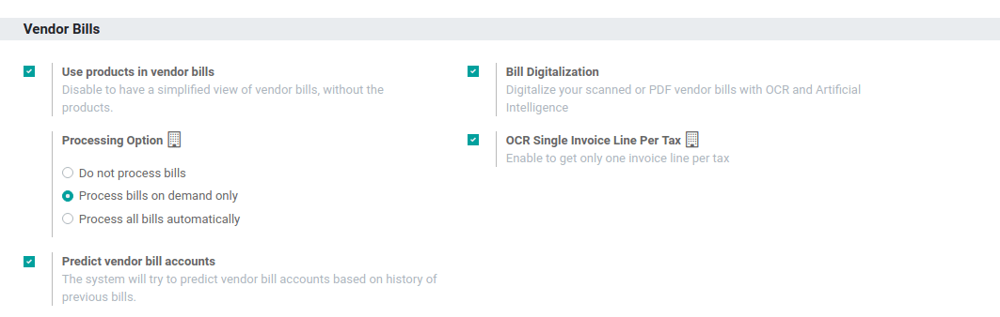
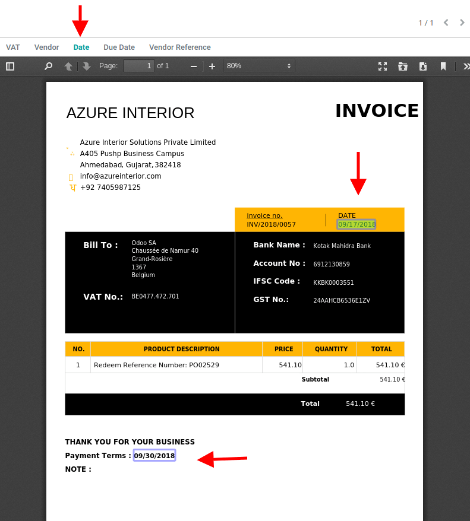

==============================================================
Digitize Vendor Bills with Optical Character Recognition (OCR)
==============================================================

Encoding bills manually can be a time-consuming task. Having a solution that allows you to digitize
them and automatically import the data to your database reduces errors and saves you time.

Set up the feature
==================

Go to :menuselection:`Accounting --> Settings --> Bill Digitalization`, and choose whether the bills
should be processed automatically or manually.

Start digitizing your bills
---------------------------

Scan your bills and then go to :menuselection:`Accounting --> Vendors --> Bills` and upload your
document. Based on your configuration, it either processes the documents automatically, or you
need to click on *Send for Digitalization* to do it manually.

.. tip::
   You can also create a vendor bill through the *Documents* app or by using an email alias on your
   journals.

Once the data is extracted from the PDF, you can correct it if necessary by clicking on the
respective tag (available in *Edit* mode), and selecting the right information instead.

.. note::
   The more bills you scan, the better the system gets at identifying the correct data.

Pricing
=======

| The *Bill Digitalization* is an *In-App Purchase (IAP)* service which requires prepaid credits to
  work. Digitalizing one document consumes one credit.
| To buy credits, go to :menuselection:`Accounting --> Configuration --> Settings --> Bill
  Digitalization` and click on *Buy credits*, or go to :menuselection:`Settings --> Odoo IAP` and
  click on *View My Services*.

.. important::
   - If you are on Odoo Online (SAAS) and have the Enterprise version, you benefit from free trial
     credits to test the feature.
   - Click `here <https://iap.odoo.com/privacy#header_4>`_ to know about our *Privacy Policy*.