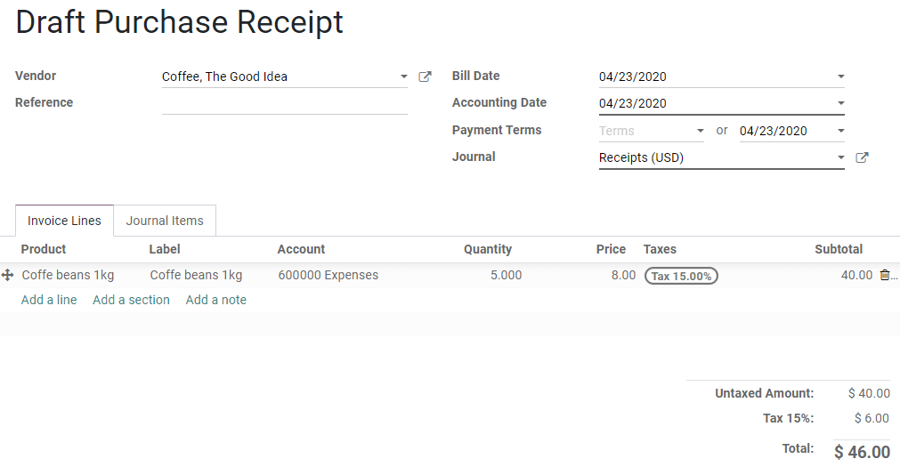
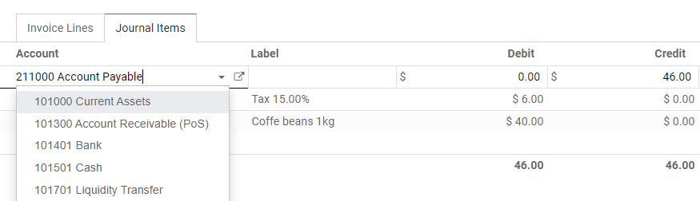

=================
Purchase receipts
=================

**Purchase Receipts** are not invoices but rather confirmations of received payments, such as a
ticket or a receipt.

This feature is meant to be used when you pay directly with your company's money for an expense.
**Vendor Bills**, on the other hand, are recorded when an invoice is issued to you and that the
amount is first credited on a debt account before a later payment reconciliation.

.. note::
   Expenses paid by employees can be managed with **Odoo Expenses**, an app dedicated to the
   approval of such expenses and the payments management. Click :doc:`here
   </applications/finance/expenses>` for more information on how to use Odoo Expenses.

Register a receipt
==================

To record a new receipt, go to :menuselection:`Accounting --> Vendors --> Receipts`, click on
*Create*, fill out the form, and click on *Post*.

You can register the payment by clicking on *Register Payment*, then filling out the payment's
details, and clicking on *Validate*.

Edit the Journal Entry before posting it
========================================

Once you have filled out the *Invoice Lines* tab, you can modify the **Journal Entry** before you
post it.

To do so, click on the **Journal Items** tab, change the accounts and values according to your
needs, and click on *Post*.

.. seealso::
   - :doc:`manage`
   - :doc:`/applications/finance/expenses`
