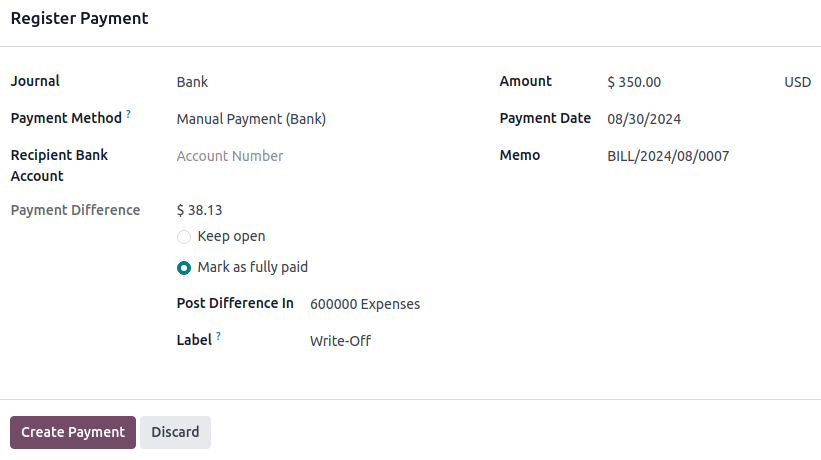

:show-content:

========
Payments
========

In Odoo, payments can either be automatically linked to an invoice or bill or be stand-alone records
for use at a later date:

- If a payment is **linked to an invoice or bill**, it reduces/settles the amount due on the
  invoice. Multiple payments on the same invoice are possible.

- If a payment is **not linked to an invoice or bill**, the customer has an outstanding credit with
  the company, or the company has an outstanding debit with a vendor. Those outstanding amounts
  reduce/settle unpaid invoices/bills.

.. seealso::
   - :doc:`Internal transfers <payments/internal_transfers>`
   - :doc:`bank/reconciliation`
   - `Odoo Tutorials: Bank Configuration
     <https://www.odoo.com/slides/slide/bank-configuration-6832>`_

.. _accounting/payments/from-invoice-bill:

Registering payment from an invoice or bill
===========================================

When clicking :guilabel:`Register payment` in a customer invoice or vendor bill, it generates a new
journal entry and changes the amount due according to the payment amount. The counterpart is
reflected in an :ref:`outstanding <bank/outstanding-accounts>` **receipts** or **payments** account.
At this point, the customer invoice or vendor bill is marked as :guilabel:`In payment`. Then, when
the outstanding account is reconciled with a bank transaction line, the invoice or vendor bill
changes to the :guilabel:`Paid` status.

The :icon:`fa-info-circle` information icon next to the payment line displays more
information about the payment. To access additional information, such as the related journal, click
:guilabel:`View`.

.. image:: payments/information-icon.png
   :alt: See detailed information of a payment.

.. note::
   - The customer invoice or vendor bill must be in the :guilabel:`Posted` status to register the
     payment.
   - If a payment is unreconciled, it still appears in the books but is no longer linked to the
     invoice.
   - If a payment is (un)reconciled in a different currency, a journal entry is automatically
     created to post the currency exchange gains/losses (reversal) amount.
   - If a payment is (un)reconciled and an invoice with cash-basis taxes, a journal entry is
     automatically created to post the cash-basis tax (reversal) amount.

.. tip::
   If the main bank account is set as an :ref:`outstanding account
   <bank/outstanding-accounts>`, and the payment is registered in Odoo (not through a related
   bank transaction), invoices and bills are directly registered as :guilabel:`Paid`.

.. _accounting/payments/not-tied:

Registering payments not tied to an invoice or bill
===================================================

When a new payment is registered via :menuselection:`Customers / Vendors --> Payments`, it is not
directly linked to an invoice or bill. Instead, the account receivable or the account payable is
matched with the **outstanding account** until it is manually matched with its related invoice or
bill.

.. _accounting/payments/matching-invoices-bills:

Matching invoices and bills with payments
-----------------------------------------

A blue banner appears when validating a new invoice/bill and an **outstanding payment** exists for
this specific customer or vendor. To match it with the invoice or bill, click :guilabel:`ADD`
under :guilabel:`Outstanding Credits` or :guilabel:`Outstanding Debits`.

.. image:: payments/add-option.png
   :alt: Shows the ADD option to reconcile an invoice or a bill with a payment.

The invoice or bill is now marked as :guilabel:`In payment` until it is reconciled with its
corresponding bank transaction.

.. _accounting/payments/group-payments:

Group payments
--------------

Group payments allow combining outgoing and incoming payments from the same contact into a single
payment to simplify the process and improve payment usability. To register a group payment:

#. Go to :menuselection:`Accounting --> Customers --> Invoices/Credit Notes` or
   :menuselection:`Accounting --> Vendors --> Bills/Refunds`.
#. Select the relevant invoices/credit notes or bills/refunds linked to a specific contact.
#. Click the :icon:`fa-cog` (:guilabel:`Action menu`) icon and select :guilabel:`Register Payment`.
#. In the :guilabel:`Register Payment` window, select the :guilabel:`Journal`, the
   :guilabel:`Payment Method`, and the :guilabel:`Payment Date`.
#. Enable the :guilabel:`Group Payments` option and click :guilabel:`Create payment`.

The invoices or bills are now marked as :guilabel:`In payment` until they are reconciled with the
corresponding bank transactions. The credit notes or refunds are marked as :guilabel:`Paid`.

.. _accounting/payments/batch-payments:

Batch payments
--------------

Batch payments allow grouping payments from multiple contacts to ease
:doc:`reconciliation <bank/reconciliation>`. They are also useful when depositing :doc:`checks
<payments/checks>` to the bank or for :doc:`SEPA payments <payments/pay_sepa>`. To do so, go to
:menuselection:`Accounting --> Customers --> Batch Payments` or :menuselection:`Accounting -->
Vendors --> Batch Payments`. In the list view of payments, to group several payments in a
batch, select them and click :menuselection:`Action --> Create Batch Payment`.

.. seealso::
  - :doc:`payments/batch`
  - :doc:`payments/batch_sdd`

.. _accounting/payments/matching:

Payments matching
-----------------

The :guilabel:`Payments matching` tool opens all unreconciled customer invoices or vendor bills and
allows them to be processed individually, matching all payments and invoices in one place. Go to the
:guilabel:`Accounting Dashboard`, click the :icon:`fa-ellipsis-v` (:guilabel:`dropdown menu`)
button from the :guilabel:`Customer Invoices` or :guilabel:`Vendor Bills` journals, and select
:guilabel:`Payments Matching`, or go to :menuselection:`Accounting --> Accounting -->
Reconciliation`.

.. image:: payments/payments-journal.png
   :alt: Payments matching menu in the drop-down menu.

.. note::
   During the :doc:`reconciliation <bank/reconciliation>`, if the sum of the debits and credits does
   not match, there is a remaining balance. This either needs to be reconciled at a later date or
   written off directly.

.. _accounting/payments/batch-payments-matching:

Batch payments matching
-----------------------

Use the batch reconciliation feature to reconcile several outstanding payments or invoices
simultaneously for a specific customer or vendor. Go to :menuselection:`Accounting --> Reporting -->
Aged Receivable / Aged Payable`. All transactions that have not yet been reconciled for that
contact are visible, and when a customer or vendor is selected, the :guilabel:`Reconcile` option is
displayed.

.. image:: payments/reconcile-option.png
   :alt: The batch payment reconcile option.

.. _accounting/payments/partial-payment:

Registering a partial payment
=============================

To register a partial payment, click on :guilabel:`Register Payment` from the related invoice or
bill. In the case of a partial payment (when the :guilabel:`Amount` paid is less than the total
remaining amount on the invoice or the bill), the :guilabel:`Payment Difference` field displays the
outstanding balance. There are two options:

- :guilabel:`Keep open`: Keep the invoice or the bill open and mark it with a :guilabel:`Partial`
  banner;
- :guilabel:`Mark as fully paid`: Select an account in the :guilabel:`Post Difference In` field and
  change the :guilabel:`Label` if needed. A journal entry will be created to balance the accounts
  payable or receivable with the selected account.

.. _accounting/payments/reconciling-payments:

Reconciling payments with bank transactions
===========================================

Once a payment has been registered, the status of the invoice or bill is :guilabel:`In payment`. The
next step is :doc:`reconciling <bank/reconciliation>` it with the related bank transaction line to
finalize the payment workflow and mark the invoice or bill as :guilabel:`Paid`.

.. toctree::
   :titlesonly:

   payments/online
   payments/checks
   payments/batch
   payments/batch_sdd
   payments/follow_up
   payments/internal_transfers
   payments/pay_sepa
   payments/pay_checks
   payments/forecast
   payments/trusted_accounts
