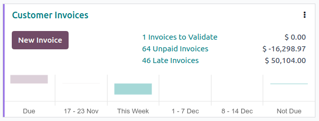

:show-content:

========
Payments
========

In Odoo, payments can either be automatically linked to an invoice or bill or be stand-alone records
for use at a later date:

- If a payment is **linked to an invoice or bill**, it reduces/settles the amount due on the
  invoice. Multiple payments on the same invoice are possible.

- If a payment is **not linked to an invoice or bill**, the customer has an outstanding credit with
  the company, or the company has an outstanding debit with a vendor. Those outstanding amounts
  reduce/settle unpaid invoices/bills.

.. seealso::
   - :doc:`Internal transfers <bank/internal_transfers>`
   - :doc:`bank/reconciliation`
   - `Odoo Tutorials: Bank Configuration
     <https://www.odoo.com/slides/slide/bank-configuration-6832>`_

.. _accounting/payments/payment-methods:

Payment methods
===============

Several payment methods are available in Odoo to allow different configurations for different types
of payments. Examples of payment methods include manual payments (such as cash), :doc:`checks
<payments/pay_checks>`, and batch payment files (such as :ref:`NACHA
<l10n_us/ach-electronic-transfers>` and :doc:`SEPA <payments/pay_sepa>`). Payment methods can be
configured in the :guilabel:`Incoming Payments` and :guilabel:`Outgoing Payments` tabs of a bank or
cash journal.

.. seealso::
   :doc:`../../sales/point_of_sale/payment_methods` for Point of Sale

.. _accounting/payments/preferred-payment-methods:

Preferred payment method
------------------------

A contact's preferred payment method can be set so that when a payment is created for that contact,
the payment method is automatically selected by default. Invoices and bills can be filtered by
:guilabel:`Payment Method` to simplify :ref:`group <accounting/payments/group-payments>` payments.

To set a preferred :guilabel:`Payment Method` for a customer or a vendor, go to
:menuselection:`Accounting --> Customers --> Customers` or :menuselection:`Accounting --> Vendors
--> Vendors` and select the customer or vendor. In the :guilabel:`Sales & Purchase` tab of the
contact form, select the preferred :guilabel:`Payment Method` in the :guilabel:`Sales` section for
invoice payments or for vendor bill payments in the :guilabel:`Purchase` section.

.. tip::
   Access a full list of all contacts from the :guilabel:`Customers` or :guilabel:`Vendors` list
   view by removing the :guilabel:`Customers` or :guilabel:`Vendors` filter. Alternatively, access
   the full contact list through the Contacts app.

.. _accounting/payments/from-invoice-bill:

Registering payment from an invoice or bill
===========================================

To register a payment for an invoice or a bill, follow these steps:

#. Click :guilabel:`Pay` on a customer invoice or vendor bill. In the :guilabel:`Pay` window, select
   the :guilabel:`Journal` and the :guilabel:`Payment Date`.
#. If previously set, the contact's preferred :guilabel:`Payment Method` is automatically selected
   by default but can be updated if necessary.
#. If using :doc:`payment terms <customer_invoices/payment_terms>`, the :guilabel:`Amount` is
   automatically set based on the installment amounts defined by the payment term. To pay the full
   amount instead, click :guilabel:`full amount`.
#. If necessary, edit the :guilabel:`Memo`.
#. Click :guilabel:`Create Payment`.

After the payment is registered, the customer invoice or vendor bill is marked as
:guilabel:`In payment`.

.. tabs::

   .. group-tab:: Without outstanding accounts

      If no :ref:`outstanding accounts <accounting/bank/outstanding-accounts>` are configured, no
      journal entry is created. To display more information about the payment, click the
      :guilabel:`Payments` smart button.

      When the invoice or vendor bill is :doc:`reconciled <bank/reconciliation>` with a bank
      transaction, its status is updated to :guilabel:`Paid`.

      .. note::
         - If a bank transaction is reconciled in a different currency, a journal entry is
           automatically created to post the currency exchange gains/loss amount.
         - When a bank transaction is reconciled with an invoice with cash-basis, a journal entry is
           automatically created to post the cash-basis tax amount.

   .. group-tab:: Using outstanding accounts

      By default, payments in Odoo do not create journal entries, but they can easily be configured
      to create journal entries using :ref:`outstanding accounts
      <accounting/bank/outstanding-accounts>`.

      Registering a payment on a customer invoice or vendor bill generates a new journal entry and
      reduces the :guilabel:`Amount Due` based on the payment amount. The counterpart is
      reflected in an :ref:`outstanding <accounting/bank/outstanding-accounts>` **receipts** or
      **payments** account. At this point, the customer invoice or vendor bill is marked as
      :guilabel:`In payment`. Then, when the payment is :doc:`reconciled <bank/reconciliation>` with
      a bank transaction, the invoice or vendor bill status changes to :guilabel:`Paid`.

      The :icon:`fa-info-circle` information icon next to the payment line displays more
      information about the payment. To access additional information, such as the related journal,
      click :guilabel:`View`.

      .. image:: payments/information-icon.png
         :alt: See detailed information of a payment.

      .. note::
         - Unreconciling a payment unlinks it from the invoice or bill but does not delete the
           payment.
         - If a payment is (un)reconciled in a different currency, a journal entry is automatically
           created to post the currency exchange gains/losses (reversal) amount.
         - If a payment is (un)reconciled on an invoice with cash-basis taxes, a journal entry is
           automatically created to post the cash-basis tax (reversal) amount.

      .. tip::
         If the main bank account is set as the outstanding account on the bank journal's payment
         method, registering the full payment on an invoice or bill moves the invoice/bill directly
         to the :guilabel:`Paid` status without requiring bank reconciliation.

.. _accounting/payments/not-tied:

Registering payments not tied to an invoice or bill
===================================================

When a new payment is registered via :menuselection:`Customers / Vendors --> Payments`, it is not
directly linked to an invoice or bill.

.. tabs::

   .. group-tab:: Without outstanding accounts

      Payments that are not linked to an invoice or bill should not be registered without using
      :ref:`outstanding accounts <accounting/bank/outstanding-accounts>`, as there is no way to
      associate the payment with the invoice or bill since no journal entry is created for the
      payment. The amount paid or received is not reflected in the accounting and the
      :guilabel:`Amount Due` is not updated based on the payment amount.

   .. group-tab:: Using outstanding accounts

      Instead, the payment's journal entry matches the :guilabel:`outstanding account` with the
      account receivable or the account payable until the payment is manually matched with its
      related invoice or bill. Then, :doc:`reconciling <bank/reconciliation>` the payment with the
      bank transaction completes the payment workflow.

.. _accounting/payments/payments-matching:

Payments matching
-----------------

.. note::
   During the :doc:`bank reconciliation <bank/reconciliation>` process, a remaining balance is
   identified if the total debits and credits do not match when records are compared with bank
   transactions. This balance must either be reconciled later or written off immediately.

.. _accounting/payments/matching-invoices-bills:

For a single invoice or bill
~~~~~~~~~~~~~~~~~~~~~~~~~~~~

.. tabs::

   .. group-tab:: Without outstanding accounts

      By default, payments in Odoo do not create journal entries. As a result, there is no payment
      to match.

   .. group-tab:: Using outstanding accounts

      A blue banner appears when validating a new invoice/bill and an **outstanding payment** exists
      for this specific customer or vendor. To match it with the invoice or bill, click
      :guilabel:`Add` under :guilabel:`Outstanding Credits` or :guilabel:`Outstanding Debits`.

      .. image:: payments/add-option.png
         :alt: Shows the Add option to reconcile an invoice or a bill with a payment.

      The invoice or bill is then marked as :guilabel:`In payment` until the payment is
      :doc:`reconciled <bank/reconciliation>` with its corresponding :doc:`bank transaction(s)
      <bank/transactions>`.

.. _accounting/payments/auto-reconcile-tool:

For multiple invoices or bills
~~~~~~~~~~~~~~~~~~~~~~~~~~~~~~

.. tabs::

   .. group-tab:: Without outstanding accounts

      By default, payments in Odoo do not create journal entries. As a result, there is no payment
      to match, but this feature can still be used to match miscellaneous journal items.

   .. group-tab:: Using outstanding accounts

      The :guilabel:`Payments matching` or :guilabel:`Auto-reconcile` tool allows reconciling
      journal items with each other (i.e., payments with customer invoices or vendor bills) either
      individually or in batches. Access the :guilabel:`Accounting Dashboard`, click the
      :icon:`fa-ellipsis-v` (:guilabel:`ellipsis`) button from the :guilabel:`Customer
      Invoices` or :guilabel:`Vendor Bills` journals, and select :guilabel:`Payments Matching`.
      Alternatively, go to :menuselection:`Accounting --> Accounting --> Reconcile`.

      To manually :guilabel:`Reconcile` journal items, select the individual items from the list
      view and click :guilabel:`Reconcile`.

.. _accounting/payments/auto-reconcile-feature:

Auto-Reconcile Feature
**********************

.. tabs::

   .. group-tab:: Without outstanding accounts

      To use the :guilabel:`Auto-Reconcile` feature, follow these steps:

      #. In the :guilabel:`Journal Items to reconcile` list view, click :guilabel:`Auto-Reconcile`
         next to the receivable or payable account (or a specific contact's group of journal items
         in that account).
      #. In the :guilabel:`Reconcile automatically` window, click :guilabel:`Reconcile`.

   .. group-tab:: Using outstanding accounts

      To use the :guilabel:`Auto-Reconcile` feature, follow these steps:

      #. In the :guilabel:`Journal Items to reconcile` list view, click :guilabel:`Auto-Reconcile`
         next to the receivable or payable account (or a specific contact's group of journal items
         in that account).
      #. In the :guilabel:`Reconcile Automatically` window, set the
         :guilabel:`Reconcile` field depending on how you want to match journal items:

         - :guilabel:`Perfect Match`: Each debit journal item will be matched with
           the corresponding credit journal item of the same value.
         - :guilabel:`Clear Accounts`: All reconciled journal items will have the same
           matching number, as they are selected from the same account.

      #. Click :guilabel:`Reconcile`.

      Invoices and bills are automatically matched to their corresponding payments and marked as
      :guilabel:`In payment` until they are :doc:`reconciled <bank/reconciliation>` with their
      corresponding :doc:`bank transactions <bank/transactions>`.

.. _accounting/payments/group-payments:

Registering payments on multiple invoices/credit notes or bills/refunds (group payments)
========================================================================================

To register payments on multiple invoices/credit notes or bills/refunds, follow these steps:

#. Go to :menuselection:`Accounting --> Customers --> Invoices/Credit Notes` or
   :menuselection:`Accounting --> Vendors --> Bills/Refunds`.
#. In the list view, click into the search bar, group by :guilabel:`Payment Method`, select the
   relevant invoices/credit notes or bills/refunds and click :guilabel:`Pay`.
#. In the :guilabel:`Pay` window, select the :guilabel:`Journal` and the :guilabel:`Payment Date`.
#. If previously set, the contact's preferred :guilabel:`Payment Method` is automatically selected
   by default but can be updated if necessary.
#. If using :doc:`payment terms <customer_invoices/payment_terms>`, the :guilabel:`Amount` is
   automatically set based on the installment amounts defined by the payment term. To pay the full
   amount instead, click :guilabel:`full amount`.
#. To combine all payments from the same contact into a single payment, enable the :guilabel:`Group
   Payments` option, or leave it unchecked to create separate payments.
#. Click :guilabel:`Create payment`.

.. tabs::

   .. group-tab:: Without outstanding accounts

      The invoices or bills are then marked as :guilabel:`In payment` until they are
      :doc:`reconciled <bank/reconciliation>` with the bank transactions.

   .. group-tab:: Using outstanding accounts

      The invoices or bills are then marked as :guilabel:`In payment` until the bank transactions
      are :doc:`reconciled <bank/reconciliation>` with the payments.

.. _accounting/payments/batch-payments:

Registering a single payment for multiple customers or vendors (batch payments)
===============================================================================

Batch payments allow grouping payments from multiple customers to ease :doc:`reconciliation
<bank/reconciliation>`. They are also useful when depositing :doc:`checks <payments/checks>` or
cash payments to the bank or for generating bank payment files such as :doc:`SEPA
<payments/pay_sepa>` or :ref:`NACHA <l10n_us/nacha>`.

.. seealso::
   :doc:`payments/batch`

.. _accounting/payments/matching:

Payments matching
-----------------

The :guilabel:`Payments matching` tool opens all unreconciled journal items and allows them to be
processed individually, matching all payments and journal items. Go to the
:guilabel:`Accounting Dashboard`, go to :menuselection:`Accounting --> Accounting --> Reconcile` or
click the :icon:`fa-ellipsis-v` (:guilabel:`ellipsis`) button from the :guilabel:`Customer
Invoices` or :guilabel:`Vendor Bills` journals, and select :guilabel:`Payments Matching`.

.. note::
   During the :doc:`reconciliation <bank/reconciliation>`, if the sum of the debits and credits does
   not match, there is a remaining balance. This either needs to be reconciled at a later date or
   written off directly.

.. _accounting/payments/partial-payment:

Registering a partial payment
=============================

To register a partial payment, click on :guilabel:`Pay` from the related invoice or bill.

.. tabs::

   .. group-tab:: Without outstanding accounts

      In the case of a partial payment (when the :guilabel:`Amount` paid is less than the total
      remaining amount on the invoice or the bill), fill in the :guilabel:`Amount` in the
      :guilabel:`Pay` window.

   .. group-tab:: Using outstanding accounts

      In the case of a partial payment (when the :guilabel:`Amount` paid is less than the total
      remaining amount on the invoice or the bill), the :guilabel:`Payment Difference` field
      displays the outstanding balance. There are two options:

      - :guilabel:`Keep open`: Keep the invoice or the bill open and mark it with a
        :guilabel:`Partial` banner;
      - :guilabel:`Mark as fully paid`: Select an account in the :guilabel:`Post Difference In`
        field and change the :guilabel:`Label` if needed. A journal entry will be created to balance
        the accounts payable or receivable with the selected account.

      .. image:: payments/partial-payment.png
         :alt: register a partial payment

.. _accounting/payments/reconciling-payments:

Reconciling payments with bank transactions
===========================================

.. tabs::

   .. group-tab:: Without outstanding accounts

      Once a payment has been registered, the status of the invoice or bill is :guilabel:`In
      payment`. The next step is :doc:`reconciling <bank/reconciliation>` the related :doc:`bank
      transaction <bank/transactions>` line with the invoice or bill to finalize the payment
      workflow and mark the invoice or bill as :guilabel:`Paid`.

   .. group-tab:: Using outstanding accounts

      Once a payment has been registered, the status of the invoice or bill is :guilabel:`In
      payment`. The next step is :doc:`reconciling <bank/reconciliation>` the payment with the
      related :doc:`bank transaction <bank/transactions>` line to finalize the payment workflow and
      mark the invoice or bill as :guilabel:`Paid`.

.. toctree::
   :titlesonly:

   payments/online
   payments/checks
   payments/batch
   payments/batch_sdd
   payments/follow_up
   payments/pay_sepa
   payments/pay_checks
   payments/forecast
   payments/trusted_accounts
