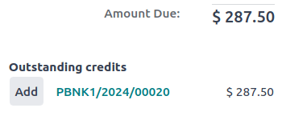

:show-content:

========
Payments
========

In Odoo, payments can either be automatically linked to an invoice or bill or be stand-alone records
for use at a later date:

- If a payment is **linked to an invoice or bill**, it reduces/settles the amount due of the
  invoice. You can have multiple payments related to the same invoice.

- If a payment is **not linked to an invoice or bill**, the customer has an outstanding credit with
  your company, or your company has an outstanding debit with a vendor. You can use those
  outstanding amounts to reduce/settle unpaid invoices/bills.

.. seealso::
   - :doc:`Internal transfers <payments/internal_transfers>`
   - :doc:`bank/reconciliation`
   - `Odoo Tutorials: Bank Configuration
     <https://www.odoo.com/slides/slide/bank-configuration-1880>`_

Registering payment from an invoice or bill
===========================================

When clicking :guilabel:`Register payment` in a customer invoice or vendor bill, it generates a new
journal entry and changes the amount due according to the payment amount. The counterpart is
reflected in an :ref:`outstanding <bank/outstanding-accounts>` **receipts** or **payments** account.
At this point, the customer invoice or vendor bill is marked as :guilabel:`In payment`. Then, when
the outstanding account is reconciled with a bank statement line, the invoice or vendor bill changes
to the :guilabel:`Paid` status.

The information icon near the payment line displays more information about the payment. You can
access additional information, such as the related journal, by clicking :guilabel:`View`.

.. image:: payments/information-icon.png
   :alt: See detailed information of a payment.

.. note::
   - The customer invoice or vendor bill must be in the :guilabel:`Posted` status to register the
     payment.
   - If you unreconcile a payment, it still appears in your books but is no longer linked to the
     invoice.
   - If you (un)reconcile a payment in a different currency, a journal entry is automatically
     created to post the currency exchange gains/losses (reversal) amount.
   - If you (un)reconcile a payment and an invoice having cash basis taxes, a journal entry is
     automatically created to post the cash basis tax (reversal) amount.

.. tip::
   - If your main bank account is set as an :ref:`outstanding account
     <bank/outstanding-accounts>`, and the payment is registered in Odoo (not through a related
     bank statement), invoices and bills are directly registered as :guilabel:`Paid`.

Registering payments not tied to an invoice or bill
===================================================

When a new payment is registered via :menuselection:`Customers / Vendors --> Payments` menu, it is
not directly linked to an invoice or bill. Instead, the account receivable or the account payable is
matched with the **outstanding account** until it is manually matched with its related invoice or
bill.

Matching invoices and bills with payments
-----------------------------------------

A blue banner appears when you validate a new invoice/bill and an **outstanding payment** exists for
this specific customer or vendor. It can easily be matched from the invoice or bill by clicking
:guilabel:`ADD` under :guilabel:`Outstanding Credits` or :guilabel:`Outstanding Debits`.

The invoice or bill is now marked as :guilabel:`In payment` until it is reconciled with its
corresponding bank statement.

.. _payments/batch-payments:

Batch payment
-------------

Batch payments allow you to group different payments to ease :doc:`reconciliation
<bank/reconciliation>`. They are also useful when you deposit :doc:`checks <payments/checks>` to the
bank or for :doc:`SEPA payments <payments/pay_sepa>`. To do so, go to :menuselection:`Accounting -->
Customers --> Batch Payments` or :menuselection:`Accounting --> Vendors --> Batch Payments`. In the
list view of payments, you can select and group several payments in a batch by clicking
:menuselection:`Action --> Create Batch Payment`.

.. seealso::
  - :doc:`payments/batch`
  - :doc:`payments/batch_sdd`

.. _payments/matching:

Payments matching
-----------------

The :guilabel:`Payments matching` tool opens all unreconciled customer invoices or vendor bills and
allows you to process them individually, matching all payments and invoices in one place. You can
reach this tool from the :menuselection:`Accounting Dashboard --> Customer Invoices / Vendor Bills`,
click the drop-down menu button (:guilabel:`⋮`), and select :guilabel:`Payments Matching`, or go to
:menuselection:`Accounting --> Accounting --> Reconciliation`.

.. image:: payments/payments-journal.png
   :alt: Payments matching menu in the drop-down menu.

.. note::
   During the :doc:`reconciliation <bank/reconciliation>`, if the sum of the debits and credits does
   not match, there is a remaining balance. This either needs to be reconciled at a later date or
   needs to be written off directly.

Batch payments matching
-----------------------

You can use the **batch reconciliation feature** to reconcile several outstanding payments or
invoices simultaneously for a specific customer or vendor. Go to your **Accounting Dashboard** and
open your **bank journal**. In the **bank reconciliation** view, select a **transaction**, and click
the :guilabel:`Batch Payments` tab. From here, you can reconcile your
:doc:`batch payments <payments/batch>` with your outstanding payments or invoices.

.. image:: payments/reconcile-option.png
   :alt: The batch payment reconcile option.

Registering a partial payment
=============================

To register a **partial payment**, click :guilabel:`Register payment` from the related invoice or
bill, and enter the amount received or paid. Upon entering the amount, a prompt appears to decide
whether to :guilabel:`Keep open` the invoice or bill, or :guilabel:`Mark as fully paid`. Select
:guilabel:`Keep open` and click :guilabel:`Create payment`. The invoice or bill is now marked as
:guilabel:`Partial`. Select :guilabel:`Mark as fully paid` if you wish to settle the invoice or bill
with a difference in the amount.

.. image:: payments/payment-difference.png
   :alt: Partial payment of an invoice or bill.

Reconciling payments with bank statements
=========================================

Once a payment has been registered, the status of the invoice or bill is :guilabel:`In payment`. The
next step is :doc:`reconciling <bank/reconciliation>` it with the related bank statement line to
have the transaction finalized and the invoice or bill marked as :guilabel:`Paid`.

.. toctree::
   :titlesonly:

   payments/online
   payments/checks
   payments/batch
   payments/batch_sdd
   payments/follow_up
   payments/internal_transfers
   payments/pay_sepa
   payments/pay_checks
   payments/forecast
   payments/trusted_accounts
