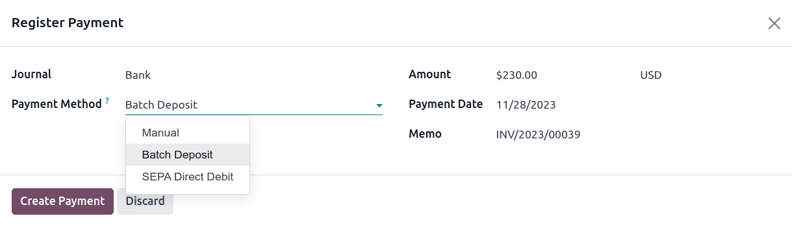
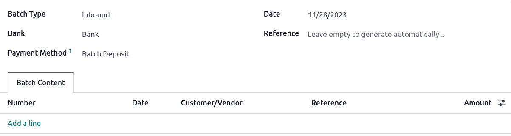
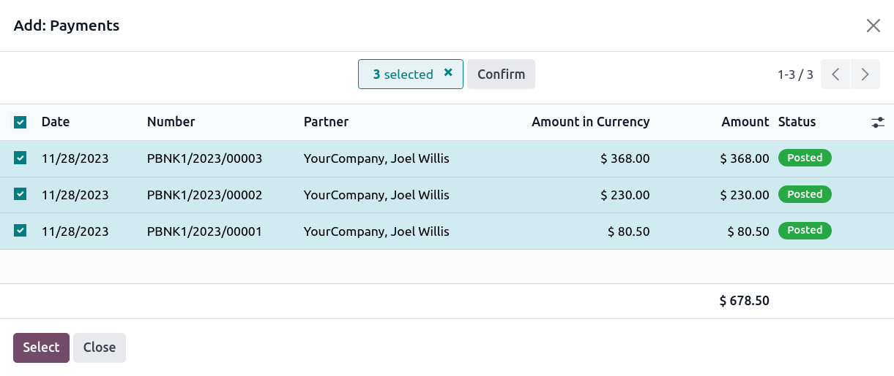
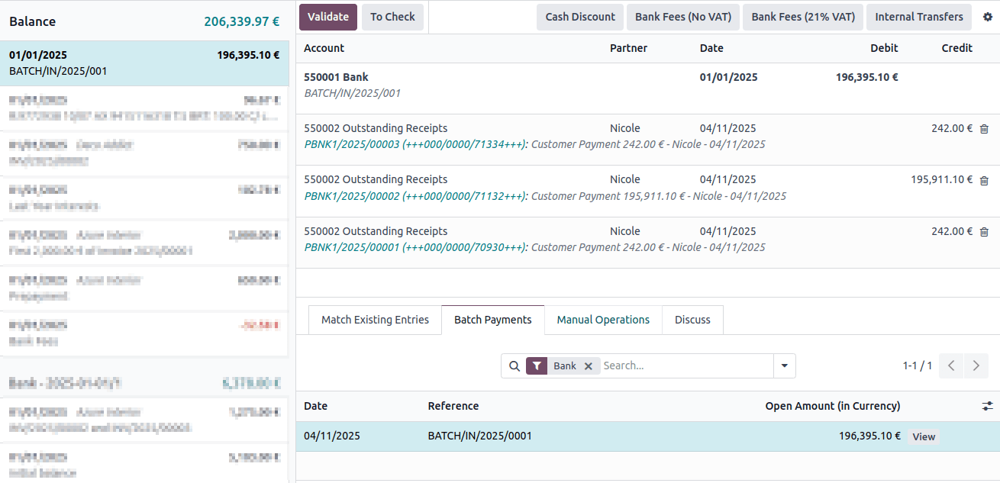

==============================
Batch payments by bank deposit
==============================

A **batch deposit** is a convenient way to group customer payments and deposit them into your bank
account. The feature lets you list multiple payments and generate a detailed deposit slip with a
batch reference. This reference can be used when reconciling to match bank statement lines with
transactions in the batch deposit.

Configuration
=============

Go to :menuselection:`Accounting --> Configuration --> Settings --> Customer Payments` and tick
:guilabel:`Batch Payments` to activate the feature.

Deposit multiple payments in batch
==================================

Register payments
-----------------

Before performing a batch deposit, it is necessary to register each transaction's payment. To do so,
open the corresponding customer invoice and click :guilabel:`Register Payment`. In the pop-up
window, select the :guilabel:`Journal` linked to your bank account and :guilabel:`Batch Deposit` as
the :guilabel:`Payment Method`, and click :guilabel:`Create Payment`.

Add payments to a batch deposit
-------------------------------

To add payments to a batch deposit, go to :menuselection:`Accounting --> Customers --> Batch
Payments`, and click :guilabel:`New`. Next, select the :guilabel:`Bank` and choose :guilabel:`Batch
Deposit` as the :guilabel:`Payment Method`.

Click :guilabel:`Add a line`. In the pop-up window, tick all payments to include in the batch
deposit, then click :guilabel:`Select`.

Once done, click :guilabel:`Validate` to finalize the batch deposit.

.. tip::
   Click :guilabel:`Print` to download a PDF file to include with the deposit slip.

Bank reconciliation
-------------------

Once the bank transactions are on your database, you can reconcile bank statement lines with the
batch payment. To do so, go to the :guilabel:`Accounting Dashboard` and click :guilabel:`Reconcile
Items` on the related bank account. Go to the :guilabel:`Batch Payments` tab to select a specific
batch and click :guilabel:`Validate` to finalize the process.

.. note::
   If a specific payment could not be processed by the bank or is missing, remove the related
   payment before reconciling.

.. seealso::
   - :doc:`../payments`
   - :doc:`batch_sdd`
