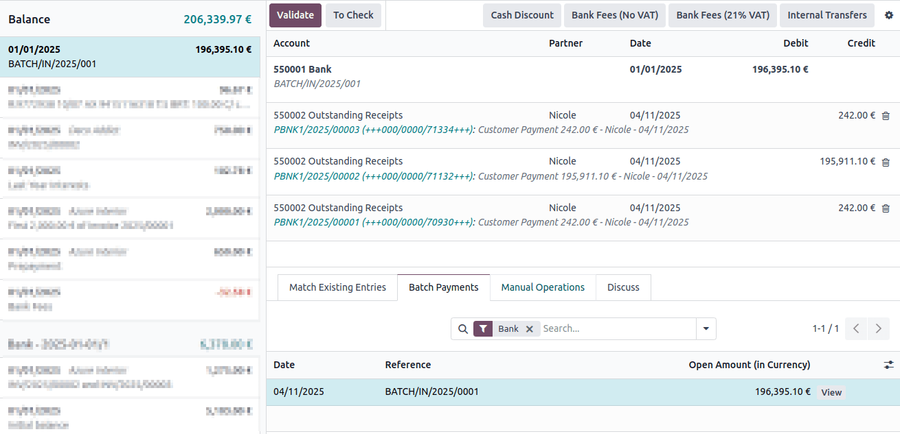

==============
Batch payments
==============

Batch payments act as an organizational tool that groups multiple individual customer or vendor
payments into a single file. Rather than managing transactions one by one, you can consolidate them
to generate a detailed deposit slip or a single electronic payment file. This significantly
simplifies :doc:`bank reconciliation <../bank/reconciliation>`: when a bulk sum appears on your bank
statement, Odoo uses the batch reference to automatically match and reconcile all underlying
payments in a single step.

For customer payments, the feature supports both physical payments, such as :doc:`checks <checks>`
and cash, and electronic transfers. Group incoming cash or check payments into batches to print bank
deposit slips to ensure your internal records mirror the lump-sum deposit on your bank statement. On
the vendor side, batch payments streamline bulk electronic transfers. Instead of processing supplier
invoices manually, select multiple bills and generate a single outgoing payment file to upload
directly to your banking portal. Because these file formats are region-specific (e.g., :doc:`SEPA
<sepa_payments>` in Europe, :ref:`NACHA <l10n_us/nacha>` in the U.S., or the global :ref:`ISO 20022
<accounting/sepa_payments/iso20022>` standard), consult your country's :doc:`fiscal localization
<../../fiscal_localizations>` documentation to verify supported formats.

.. seealso::
   :doc:`../payments`

.. _accounting/batch/configuration:

Configuration
=============

Make sure batch payments are enabled by opening the **Accounting** app, going to
:menuselection:`Configuration --> Settings`, scrolling down to the :guilabel:`Customer Payments`
section, and enabling :guilabel:`Batch Payments`.

.. note::
   This enables both customer *and* vendor batch payments.

.. tip::
   According to your needs, check that the following apps are installed in the **Apps** app:

   - :doc:`SEPA Credit Transfer <sepa_payments>`
   - :doc:`SEPA Direct Debit <sepa_payments>`
   - :doc:`SEPA Payments for Payroll <../../../hr/payroll>`
   - :doc:`Payment Provider: Sepa Direct Debit <../../payment_providers/sdd>`
   - :ref:`NACHA Payments <l10n_us/nacha>`

.. _accounting/batch/creation:

Batch creation
==============

To create customer or vendor batch payments and add existing payments to them, follow these steps:

#. Make sure all payments to be included in the batch have been :ref:`registered
   <accounting/payments/from-invoice-bill>`.
#. Open the **Accounting** app and go to :menuselection:`Customers --> Batch Payments` or
   :menuselection:`Vendors --> Batch payments` according to the nature of the payment and click
   :guilabel:`New`.
#. Next, configure the batch payment:

   - :guilabel:`Batch Type`: select whether the money is being transferred to your account
     (:guilabel:`Inbound`) or to someone else's account (:guilabel:`Outbound`).
   - :guilabel:`Bank`: the bank journal to use for this batch.
   - :guilabel:`Payment Method`: the payment method used for the invoices' payments. Only payments
     matching the payment method selected will appear.
   - :guilabel:`Date`: the batch's creation date.
   - :guilabel:`Reference`: the reference of the batch. Leave it empty to generate it automatically.
   - :guilabel:`Add a line`: click it to select the payments to include in the batch.

#. Once all desired payments are included, click :guilabel:`Validate` to finalize the batch.

Alternatively, you can select the relevant payments and create a batch payment directly from them:

#. Make sure all payments to be included in the batch have been :ref:`registered
   <accounting/payments/from-invoice-bill>`.
#. Open the **Accounting** app and go to :menuselection:`Customers --> Payments` or
   :menuselection:`Vendors --> Payments` and select all payments to include in the batch.
#. Click :guilabel:`Create Batch`, *or* :icon:`fa-cog` :guilabel:`(Actions)`, and select
   :guilabel:`Create batch payment`.
#. In the view form, review the selected payments. If any individual payments are missing, click
   :guilabel:`Add a line`, then select the missing payments to include in the batch.
#. Once all desired payments are included, click :guilabel:`Validate` to finalize the batch.

To view existing batch payments, go to :menuselection:`Customers --> Batch Payments` or
:menuselection:`Vendors --> Batch Payments`.

.. note::
   - All payments in a batch *must* use the same payment method.
   - Once validated, no additional payments can be added to a batch. You can delete the batch if
     necessary by clicking :icon:`fa-cog` :guilabel:`(Actions)` and then :icon:`fa-trash-o`
     :guilabel:`(Delete)`.

.. tip::
   - Click :icon:`fa-print` :guilabel:`Print` to download a list of the included payments.
   - To filter payments by payment method, click on the :guilabel:`Payment Method` column header
     during the batch payment creation step.

.. _accounting/batch/bank_reconciliation:

Bank reconciliation
===================

Once the :doc:`bank transactions <../bank/transactions>` have been created in your database, you can
:ref:`reconcile them with the batch payment <reconciliation/batch-payments>`.

.. note::
   If a specific payment could not be processed by the bank or is missing, remove the line
   corresponding to that payment by using the :icon:`fa-trash-o` (:guilabel:`Delete`) button before
   validating the reconciliation of the batch payment.

.. _accounting/batch/bank-accounts:

Bank accounts
=============

Odoo distinguishes between :guilabel:`Banks` (the financial institution issuing the account) and
:guilabel:`Bank Accounts` (the specific account number and routing details).

You can store banking details for both your own company and your :doc:`contacts
<../../../essentials/contacts>`. Odoo automatically uses this information when needed, such as when
generating batch payment files.

To protect your business against :ref:`phishing scams <accounting/batch/phishing>`, Odoo configures
all new bank accounts as "untrusted" by default, preventing outgoing wire transfers until you
:ref:`manually verify and trust <accounting/batch/link-account-contact>` the account.

.. seealso::
   :doc:`sepa_payments`
   :ref:`NACHA <l10n_us/nacha>`

.. _accounting/batch/bank-accounts-configuration:

Configuration
-------------

.. note::
   The **Contacts** app can be :ref:`installed <general/install>` from the **Apps** dashboard.

To configure your banking information, open the **Contacts** app and go to
:guilabel:`Configuration`. From here, you can manage :guilabel:`Banks` and :guilabel:`Bank
Accounts`.

.. _accounting/batch/create-bank:

Create a bank
~~~~~~~~~~~~~

Go to :menuselection:`Configuration --> Banks` and click :guilabel:`New`. Fill in the following
fields:

- :guilabel:`Name`: The name of the bank.
- :guilabel:`Bank Identifier Code`: The bank's SWIFT or BIC code.
- :guilabel:`Bank Address`: Enter the :guilabel:`Country`. The :guilabel:`Street`, :guilabel:`City`,
  :guilabel:`State`, and :guilabel:`Zip` fields are optional.
- :guilabel:`Phone` and :guilabel:`Email`: Optional contact details.

.. _accounting/batch/create-bank-account:

Create a bank account
~~~~~~~~~~~~~~~~~~~~~

.. note::
   **Prerequisite:** A bank account must be linked to a specific bank record. Ensure you have
   created the required bank using the steps above before setting up a bank account.

Go to :menuselection:`Configuration --> Bank Accounts` and click :guilabel:`New`. Enter the
following details:

- :guilabel:`Account Number`: The unique identification number for the bank account.
- :guilabel:`Bank`: Select the associated bank from the drop-down menu.
- :guilabel:`ABA/Routing`: The American Bankers Association routing number (if applicable).
- :guilabel:`Account Holder Name`: The full name of the account holder.
- :guilabel:`Account Holder`: Select the holder's :doc:`contact <../../../essentials/contacts>` from
  the drop-down menu. If the contact does not exist yet, you can link it later by following the next
  steps.
- Toggle :guilabel:`Send Money` to mark the account as :guilabel:`Trusted`. Marking the account as
  :guilabel:`Trusted` will enable you to send money to this account, so only do this when you are
  certain the information is correctly entered and was not provided by a :ref:`phishing attack
  <accounting/batch/phishing>`.

.. _accounting/batch/link-account-contact:

Link a bank account to a contact
~~~~~~~~~~~~~~~~~~~~~~~~~~~~~~~~

If you need to link an existing bank account to a contact:

1. Open an app with contact access (such as **Accounting** or **Contacts**).
2. Select a contact and open the :guilabel:`Accounting` tab.
3. In the :guilabel:`Bank Accounts` section, click :guilabel:`Add a line` and provide the:

   - :guilabel:`Account Number`,
   - :guilabel:`Bank`,
   - :guilabel:`Account Holder Name`,
   - :guilabel:`Account Holder`,
   - :guilabel:`Company` and :guilabel:`Currency` (if applicable).

4. Toggle :guilabel:`Send Money` to mark the account as :guilabel:`Trusted`.

.. _accounting/batch/phishing:

Phishing attacks
----------------

A **phishing attack** is an online scam designed to trick individuals or companies into giving away
sensitive information or money by sending out fraudulent communication. Fraudsters pretend to be
legitimate companies and may use partial information to give credibility to their requests.

There are several types of phishing attacks, including **invoice fraud**. In this case, the
fraudster pretends to be a genuine supplier following up on unpaid bills or sending a new invoice,
but with different payment information than usual and with fake contact details.

To protect yourself from these types of phishing attacks, remain vigilant when you receive
unexpected invoices or payment requests.

.. important::
   In case of doubt, **we recommend contacting the vendor by phone**. Make sure to call an official
   phone number by searching yourself, as the URLs, email addresses, and phone numbers written in
   the communication you received may be fake.
