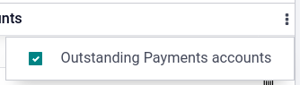
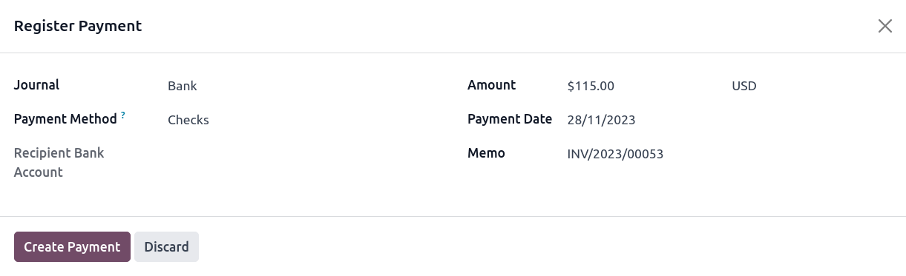

======
Checks
======

There are two ways to handle payments received by checks in Odoo, either by using :ref:`outstanding
accounts <checks/outstanding-account>` or by :ref:`bypassing the reconciliation process
<checks/reconciliation-bypass>`.

**Using outstanding accounts is recommended**, as your bank account balance stays accurate by taking
into account checks yet to be cashed.

.. note::
   Both methods produce the same data in your accounting at the end of the process. But if you
   have checks that have not been cashed in, the **Outstanding Account** method reports these
   checks in the **Outstanding Receipts** account. However, funds appear in your bank account
   whether or not they are reconciled, as the bank value is reflected at the moment of the bank
   statement.

.. seealso::
   * :ref:`Outstanding accounts <bank/outstanding-accounts>`
   * :ref:`Bank reconciliation <accounting/reconciliation>`

.. _checks/outstanding-account:

Method 1: Outstanding account
=============================

When you receive a check, you :doc:`record a payment <../bank/reconciliation>` by check on the
invoice. Then, when your bank account is credited with the check's amount, you reconcile the payment
and statement to move the amount from the **Outstanding Receipt** account to the **Bank** account.

.. tip::
   You can create a new payment method named *Checks* if you would like to identify such payments
   quickly. To do so, go to :menuselection:`Accounting --> Configuration --> Journals --> Bank`,
   click the :guilabel:`Incoming Payments` tab, and :guilabel:`Add a line`. As :guilabel:`Payment
   Method`, select :guilabel:`Manual`, and enter `Checks` as name.

.. _checks/reconciliation-bypass:

Method 2: Reconciliation bypass
===============================

When you receive a check, you :doc:`record a payment <../bank/reconciliation>` on the related
invoice. The amount is then moved from the **Account Receivable** to the **Bank** account, bypassing
the reconciliation and creating only **one journal entry**.

To do so, you *must* follow the following setup. Go to :menuselection:`Accounting --> Configuration
--> Journals --> Bank`. Click the :guilabel:`Incoming Payments` tab and then :guilabel:`Add a line`,
select :guilabel:`Manual` as :guilabel:`Payment Method`, and enter `Checks` as :guilabel:`Name`.
Click the toggle menu button, tick :guilabel:`Outstanding Receipts accounts`, and in the
:guilabel:`Outstanding Receipts accounts` column, and set the :guilabel:`Bank` account for the
**Checks** payment method.

Payment registration
====================

.. note::
   By default, there are two ways to register payments made by check:

   - **Manual**: for single checks;
   - **Batch**: for multiple checks at once.

   This documentation focuses on **single-check** payments. For **batch deposits**, see :doc:`the
   batch payments documentation <batch>`.

Once you receive a customer check, go to the related invoice (:menuselection:`Accounting -->
Customer --> Invoices)`, and click :guilabel:`Register Payment`. Fill in the payment information:

- :guilabel:`Journal: Bank`;
- :guilabel:`Payment method`: :guilabel:`Manual` (or **Checks** if you have created a specific
  payment method);
- :guilabel:`Memo`: enter the check number;
- Click :guilabel:`Create Payment`.

The generated journal entries are different depending on the payment registration method chosen.

Journal entries
===============

Outstanding account
-------------------

The invoice is marked as :guilabel:`In Payment` as soon as you record the payment. This operation
produces the following **journal entry**:

+----------------------+-------------------+----------+----------+
| Account              | Statement Match   | Debit    | Credit   |
+======================+===================+==========+==========+
| Account Receivable   |                   |          | 100.00   |
+----------------------+-------------------+----------+----------+
| Outstanding Receipts |                   | 100.00   |          |
+----------------------+-------------------+----------+----------+

Then, once you receive the bank statements, match this statement with the check of the **Outstanding
Receipts** account. This produces the following **journal entry**:

+---------------------+-------------------+----------+----------+
| Account             | Statement Match   | Debit    | Credit   |
+=====================+===================+==========+==========+
| Outstanding Receipts|        X          |          | 100.00   |
+---------------------+-------------------+----------+----------+
| Bank                |                   | 100.00   |          |
+---------------------+-------------------+----------+----------+

If you use this approach to manage received checks, you get the list of checks that have not been
cashed in the **Outstanding Receipt** account (accessible, for example, from the general ledger).

Reconciliation bypass
---------------------

The invoice is marked as :guilabel:`Paid` as soon as you record the check.

With this approach, you bypass the use of **outstanding accounts**, effectively getting only one
journal entry in your books and bypassing the reconciliation:

+----------------------+-------------------+----------+----------+
| Account              | Statement Match   | Debit    | Credit   |
+======================+===================+==========+==========+
| Account Receivable   | X                 |          | 100.00   |
+----------------------+-------------------+----------+----------+
| Bank                 |                   | 100.00   |          |
+----------------------+-------------------+----------+----------+
