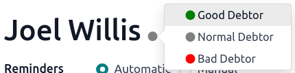

=====================
Follow-up on invoices
=====================

A follow-up message can be sent to customers when a payment is overdue. Odoo helps you identify late
payments and allows you to schedule and send the appropriate reminders using **follow-up actions**
that automatically trigger one or more actions according to the number of overdue days. You can send
your follow-ups via different means, such as email, post, or SMS.

.. seealso::
   - `Odoo Tutorials: Payment Follow-up <https://www.odoo.com/slides/slide/payment-follow-up-1682>`_

Configuration
=============

To configure a :guilabel:`Follow-Up Action`, go to :menuselection:`Accounting --> Configuration -->
Follow-up Levels`, and select or create (a) new follow-up level(s). Several follow-up actions are
available by default under the :guilabel:`Notification` tab, and the **name** as well as the
**number of days** can be changed. The follow-up :guilabel:`Actions` available are:

- :guilabel:`Send Email`;
- :ref:`Send a Letter <customer_invoices/snailmail>`;
- :ref:`Send an SMS message <pricing/pricing_and_faq>`.

You can use a pre-filled template for your messages by selecting a :guilabel:`Content Template`. To
change the template used, hover over the field and click the :guilabel:`-->`. If enabled, SMS
messages have a specific :guilabel:`Sms Template` field.

It is possible to automatically send a reminder by enabling the :guilabel:`Automatic` option, and
attaching the *open* invoice(s) by enabling :guilabel:`Attach Invoices`, within a specific follow-up
action.

By clicking on the :guilabel:`Activity` tab, scheduling activities (tasks) is possible. That way,
an activity is automatically scheduled when the follow-up is triggered. To do so, enable
:guilabel:`Schedule Activity`, and select a :guilabel:`Responsible` person for the task. Choose an
:guilabel:`Activity Type`, and enter a :guilabel:`Summary` on how to handle the activity, if
desired.

.. tip::
   Set a negative number of days to send a reminder before the actual due date.

Follow-up reports
=================

Overdue invoices you need to follow up on are available in :menuselection:`Accounting --> Customers
--> Follow-up Reports`. By default, Odoo filters by :guilabel:`Overdue Invoices`, but you can also
filter by :guilabel:`In need of action` in the :guilabel:`Filters` menu.

When selecting an invoice, you can see all of the customer's unpaid invoices (overdue or not), with
the due dates of late invoices appearing in red. You can exclude invoices from a reminder by
clicking :guilabel:`Exclude from Follow-ups`. You can set either :guilabel:`Automatic` or
:guilabel:`Manual` reminders as well as a :guilabel:`Responsible` person for that customer.

To send reminders, click on :guilabel:`Follow up`, and select the action(s) you want to perform
from:

- :guilabel:`Print`;
- :guilabel:`Email`;
- :guilabel:`Sms`;
- :guilabel:`By post`.

You can :guilabel:`Attach Invoices` and change the content templates from this view. When done,
click :guilabel:`Send` or :guilabel:`Send & Print`.

.. note::
   - The contact information on the invoice or the contact form is used to send the reminder.
   - When the reminder is sent, it is documented in the chatter of the invoice.
   - If it is not the right time for a reminder, you can specify the :guilabel:`Next Reminder` date.
     You will get the next report according to the next reminder date set.

.. tip::
   Reconcile all bank statements right before launching the follow-up process to avoid sending a
   reminder to a customer that has already paid.

Debtor's trust level
--------------------

To know whether a customer usually pays late or not, you can set a trust level by marking them as
:guilabel:`Good Debtor`, :guilabel:`Normal Debtor`, or :guilabel:`Bad Debtor` on their follow-up
report. To do so, click on the bullet next to the customer's name and select a trust level.

Send reminders in batches
-------------------------

You can send reminder emails in batches from the :guilabel:`Follow-up Reports` page. To do so,
select all the reports you would like to process, click on the :guilabel:`Action` gear icon, and
select :guilabel:`Process follow-ups`.

.. seealso::
   - :doc:`/applications/essentials/in_app_purchase`
   - :doc:`/applications/marketing/sms_marketing/pricing_and_faq`
   - :doc:`../customer_invoices/snailmail`
