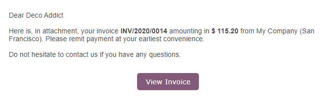

:show-content:

===============
Online payments
===============

.. toctree::

   online/install_portal_patch

To make it more convenient for your customers to pay the invoices you issue, you can activate the
**Invoice Online Payment** feature, which adds a *Pay Now* button on their **Customer Portal**. This
allows your customers to see their invoices online and pay directly with their favorite payment
method, making the payment process much easier.

.. image:: online/online-payment-providers.png
   :align: center
   :alt: Payment provider choice after having clicked on "Pay Now"

Configuration
=============

Make sure your :ref:`Payment Providers are correctly configured <payment_providers/configuration>`.

.. note::
   By default, ":doc:`Wire Transfer </applications/finance/payment_providers/wire_transfer>`" is the only
   Payment Provider activated, but you still have to fill out the payment details.

To activate the Invoice Online Payment, go to :menuselection:`Accounting --> Configuration -->
Settings --> Customer Payments`, enable **Invoice Online Payment**, and click on *Save*.

Customer Portal
===============

After issuing the invoice, click on *Send & Print* and send the invoice by email to the customer.
They will receive an email with a link that redirects them to the invoice on their **Customer
Portal**.

They can choose which Payment Provider to use by clicking on *Pay Now*.

.. image:: online/pay-now.png
   :alt: "Pay now" button on an invoice in the Customer Portal.

.. seealso::

   - :doc:`/applications/finance/payment_providers`
