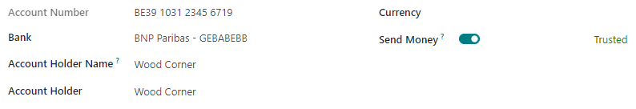

=============================
Trusted accounts (send money)
=============================

To protect users from sending money to scammers, vendor bank account numbers must be marked as
trusted before you can use them to make an outgoing payment.

To do so, open the vendor bank account and click on the :guilabel:`Send Money` toggle switch button.

.. note::
   All accounts are initially marked as untrusted.

Phishing attacks
================

A **phishing attack** is an online scam designed to trick individuals or companies into giving away
sensitive information or money by sending out fraudulent communication. Fraudsters pretend to be
legitimate companies and may use partial information to give credibility to their requests.

There are several types of phishing attacks, including **invoice fraud**. In this case, the
fraudster pretends to be a genuine supplier following up on unpaid bills or sending a new invoice,
but with different payment information than usual and with fake contact details.

To protect yourself from these types of phishing attacks, remain vigilant when you receive
unexpected invoices or payment requests.

.. important::
   In case of doubt, **we recommend contacting the vendor by phone**. Make sure to call an official
   phone number by searching yourself, as the URLs, email addresses, and phone numbers written in
   the communication you received may be fake.

Elements to check
-----------------

There are several elements you can check by yourself when you receive an outgoing payment request to
a new account:

Communication style
  Fraudulent emails and invoices often use a different communication style, such as **different
  wording**, and may include **spelling and grammatical mistakes**. Examine and **compare** them
  with previous ones that you know to be authentic (e.g., payment instructions, language, company
  logo, etc.).*

Urgency
  Invoice frauds often use **urgent or threatening language** and change the **payment deadline**.
  Check if you really received a late payment reminder previously.

Type of account
  A company is unlikely to replace a bank account with a **money transfer service**.

Email and links domain names
  Double-check the **email address domain** (`example@domain.com`). However, be wary that fraudsters
  can make their email addresses look genuine or even hack email addresses from your vendor's
  employees or even someone within your own organization.

  Hover over the links in your email and check that the URLs they redirect to are genuine. Your
  internet browser usually displays the link's target at the bottom left of the window.
