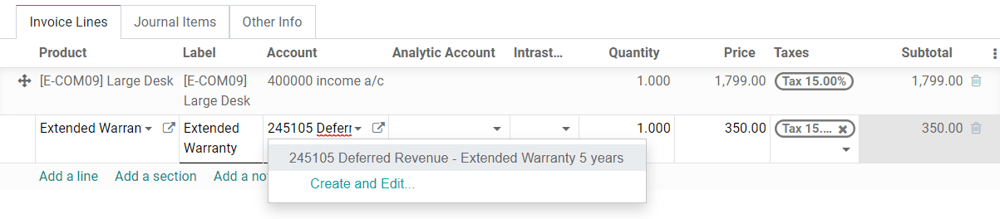
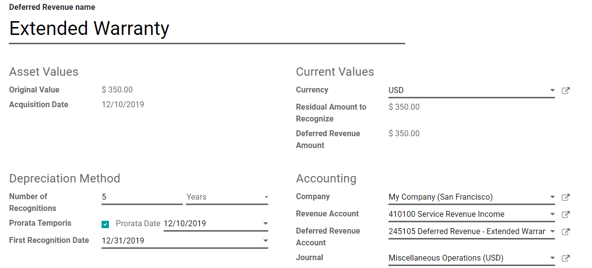
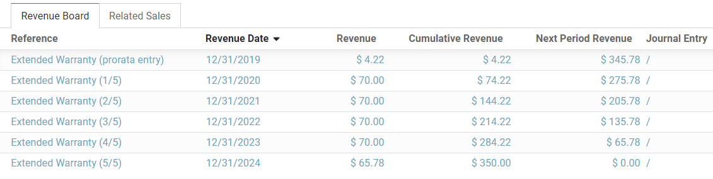
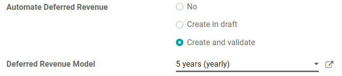

=================
Deferred revenues
=================

**Deferred revenues**, or **unearned revenue**, are payments made in advance by customers for
products yet to deliver or services yet to render.

Such payments are a **liability** for the company that receives them since it still owes its
customers these products or services. The company cannot report them on the current **Profit and
Loss statement**, or *Income Statement*, since the payments will be effectively earned in the future.

These future revenues must be deferred on the company's balance sheet until the moment in time they
can be **recognized**, at once or over a defined period, on the Profit and Loss statement.

For example, let's say we sell a five-year extended warranty for $ 350. We already receive the money
now but haven't earned it yet. Therefore, we post this new income in a deferred revenue account and
decide to recognize it on a yearly basis. Each year, for the next 5 years, $ 70 will be recognized
as revenue.

Odoo Accounting handles deferred revenues by spreading them in multiple entries that are
automatically created in *draft mode* and then posted periodically.

.. note::
   The server checks once a day if an entry must be posted. It might then take up to 24 hours before
   you see a change from *draft* to *posted*.

Prerequisites
=============

Such transactions must be posted on a **Deferred Revenue Account** rather than on the default income
account.

Configure a Deferred Revenue Account
------------------------------------

To configure your account in the **Chart of Accounts**, go to :menuselection:`Accounting -->
Configuration --> Chart of Accounts`, click on *Create*, and fill out the form.

.. image:: deferred_revenues/deferred_revenues01.png
   :align: center
   :alt: Configuration of a Deferred Revenue Account in Odoo Accounting

.. note::
   This account's type must be either *Current Liabilities* or *Non-current Liabilities*
   
Post an income to the right account
-----------------------------------

Select the account on a draft invoice
~~~~~~~~~~~~~~~~~~~~~~~~~~~~~~~~~~~~~

On a draft invoice, select the right account for all the products of which the incomes must be
deferred.

Choose a different Income Account for specific products
~~~~~~~~~~~~~~~~~~~~~~~~~~~~~~~~~~~~~~~~~~~~~~~~~~~~~~~

Start editing the product, go to the *Accounting* tab, select the right **Income Account**, and
save.

.. image:: deferred_revenues/deferred_revenues03.png
   :align: center
   :alt: Change of the Income Account for a product in Odoo 

.. tip::
   It is possible to automate the creation of revenue entries for these products (see:
   `Automate the Deferred Revenues`_).

Change the account of a posted journal item
~~~~~~~~~~~~~~~~~~~~~~~~~~~~~~~~~~~~~~~~~~~~

To do so, open your Sales Journal by going to
:menuselection:`Accounting --> Accounting --> Sales`, select the journal item you
want to modify, click on the account, and select the right one. 

.. image:: deferred_revenues/deferred_revenues04.png
   :align: center
   :alt: Modification of a posted journal item's account in Odoo Accounting 

Deferred Revenues entries
=========================

Create a new entry
------------------

A **Deferred Revenues entry** automatically generates all journal entries in *draft mode*. They are
then posted one by one at the right time until the full amount of the income is recognized.

To create a new entry, go to :menuselection:`Accounting --> Accounting --> Deferred Revenues`, click
on *Create*, and fill out the form.

Click on **select related purchases** to link an existing journal item to this new entry. Some
fields are then automatically filled out, and the journal item is now listed under the **Related
Sales** tab.

Once done, you can click on *Compute Revenue* (next to the *Confirm* button) to generate all the
values of the **Revenue Board**. This board shows you all the entries that Odoo will post to
recognize your revenue, and at which date.

   
What does "Prorata Temporis" mean?
~~~~~~~~~~~~~~~~~~~~~~~~~~~~~~~~~~

The **Prorata Temporis** feature is useful to recognize your revenue the most accurately possible.

With this feature, the first entry on the Revenue Board is computed based on the time left between
the *Prorata Date* and the *First Recognition Date* rather than the default amount of time between
recognitions.

For example, the Revenue Board above has its first revenue with an amount of $ 4.22 rather than
$ 70.00. Consequently, the last entry is also lower and has an amount of $ 65.78.

Deferred Entry from the Sales Journal
-------------------------------------

You can create a deferred entry from a specific journal item in your **Sales Journal**.

To do so, open your Sales Journal by going to 
:menuselection:`Accounting --> Accounting --> Sales`, and select the journal item you want to defer.
Make sure that it is posted in the right account (see:
`Change the account of a posted journal item`_).

Then, click on *Action*, select **Create Deferred Entry**, and fill out the form the same way you
would do to `create a new entry`_.

.. image:: deferred_revenues/deferred_revenues07.png
   :align: center
   :alt: Create Deferred Entry from a journal item in Odoo Accounting

Deferred Revenue Models
=======================

You can create **Deferred Revenue Models** to create your Deferred Revenue entries faster.

To create a model, go to :menuselection:`Accounting --> Configuration --> Deferred Revenue Models`,
click on *Create*, and fill out the form the same way you would do to create a new entry.

.. tip::
   You can also convert a *confirmed Deferred Revenue entry* into a model by
   opening it from :menuselection:`Accounting --> Accounting --> Deferred
   Revenues` and then, by clicking on the button *Save Model*.

Apply a Deferred Revenue Model to a new entry
---------------------------------------------

When you create a new Deferred Revenue entry,  fill out the **Deferred Revenue Account** with the
right recognition account.

New buttons with all the models linked to that account appear at the top of the form. Clicking on a
model button fills out the form according to that model.

.. image:: deferred_revenues/deferred_revenues08.png
   :align: center
   :alt: Deferred Revenue model button in Odoo Accounting

.. _deferred-revenues-automation:

Automate the Deferred Revenues
==============================

When you create or edit an account of which the type is either *Current Liabilities* or *Non-current
Liabilities*, you can configure it to defer the revenues that are credited on it automatically.

You have three choices for the **Automate Deferred Revenue** field:

#. **No:** this is the default value. Nothing happens.
#. **Create in draft:** whenever a transaction is posted on the account, a draft *Deferred Revenues
   entry* is created, but not validated. You must first fill out the form in
   :menuselection:`Accounting --> Accounting --> Deferred Revenues`.
#. **Create and validate:** you must also select a Deferred Revenue Model (see:
   `Deferred Revenue Models`_). Whenever a transaction is posted on the account, a *Deferred
   Revenues entry* is created and immediately validated.

.. tip::
   You can, for example, select this account as the default **Income Account** of a product to fully
   automate its sale. (see: `Choose a different Income Account for specific products`_).

.. seealso::
   * :doc:`../../getting_started/initial_configuration/chart_of_accounts`
   * `Odoo Academy: Deferred Revenues (Recognition) <https://www.odoo.com/r/EWO>`_