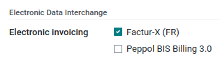

================================================================
Electronic invoicing (:abbr:`EDI (electronic data interchange)`)
================================================================

EDI, or electronic data interchange, is the inter-company communication of business documents, such
as purchase orders and invoices, in a standard format. Sending documents according to an EDI
standard ensures that the machine receiving the message can interpret the information correctly.
Various EDI file formats exist and are available depending on your company's country.

EDI feature enables automating the administration between companies and might also be required by
some governments for fiscal control or to facilitate the administration.

Electronic invoicing of your documents such as customer invoices, credit notes or vendor bills is
one of the application of EDI.

Odoo supports, among others, the following formats.

.. list-table::
   :header-rows: 1

   * - Format Name
     - Applicability
   * - Factur-X (PDF/A-3)
     - For French and German companies
   * - Peppol BIS Billing 3.0 (UBL)
     - For companies whose countries are part of the `EAS list
       <https://docs.peppol.eu/poacc/billing/3.0/codelist/eas/>`_
   * - E-FFF
     - For Belgian companies
   * - XRechnung (UBL)
     - For German companies
   * - Fattura PA (IT)
     - For Italian companies
   * - CFDI (4.0)
     - For Mexican companies
   * - Peru UBL 2.1
     - For Peruvian companies
   * - SII IVA Llevanza de libros registro (ES)
     - For Spanish companies
   * - UBL 2.1 (Columbia)
     - For Colombian companies
   * - Egyptian Tax Authority
     - For Egyptian companies
   * - E-Invoice (IN)
     - For Indian companies
   * - NLCIUS (Netherlands)
     - For Dutch companies
   * - EHF 3.0
     - For Norwegian companies

.. seealso::
   - :doc:`../../fiscal_localizations/overview/fiscal_localization_packages`

Configuration
=============

Go to :menuselection:`Accounting --> Configuration --> Journals --> Customer Invoices --> Advanced
Settings --> Electronic Invoicing` and enable the formats you need for this journal.

Once an electronic invoicing format is enabled, XML documents are generated when clicking on
:guilabel:`Confirm` in documents such as invoices, credit notes, etc. These documents are either
visible in the attachment section, or embedded in the PDF.

.. note::
   - For E-FFF, the xml file only appears after having generated the PDF (:guilabel:`Print` or
     :guilabel:`Send & Print` button), since the PDF needs to be embedded inside the xml.
   - Every PDF generated from Odoo contains a :guilabel:`Factur-X` XML file (for interoperability purpose).
     For German and French companies, the option :guilabel:`Factur-X (PDF/A-3)` in addition enables
     validation checks on the invoice and generates a PDF/A-3 compliant file, required by plaftorms like Chorus Pro.
   - The formats available depend on the country registered in your company's :guilabel:`General
     Information`.
   - Odoo supports the **Peppol BIS Billing 3.0** format that can be used via existing access
     points.

Add new formats to a database created before July 2022
------------------------------------------------------

If your database was created before July 2022 and you wish to use one of the formats available from
July 2022, you have to :ref:`install <general/install>` the module :guilabel:`Import/Export
electronic invoices with UBL/CII` (module’s technical name: `account_edi_ubl_cii`) and your
country-specific module.

.. example::
   If you want to use the Belgian format E-FFF in a database created prior to July 2022, you need to
   :ref:`install <general/install>`:

   .. list-table::
      :header-rows: 1

      * - Name
        - Technical name
      * - Belgium - E-Invoicing (UBL 2.0, e-fff)
        - `l10n_be_edi`
      * - Import/Export electronic invoices with UBL/CII
        - `account_edi_ubl_cii`

.. note::
   Once the new module is installed, UBL 2.0 and UBL 2.1 formats no longer appear in the journal
   since UBL BIS Billing 3.0 is available and more widely supported.
