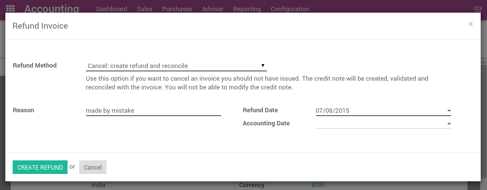
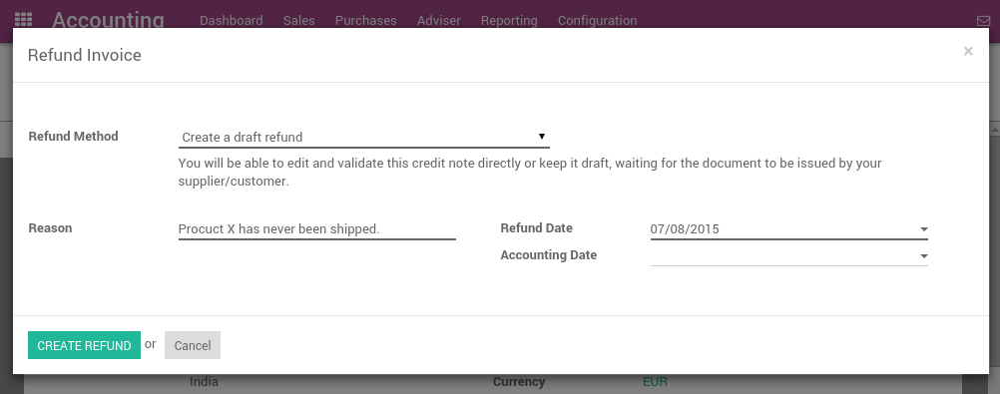

=================================
How to edit or refund an invoice?
=================================
In Odoo, it's not possible to modify an invoice that has been validated
and sent to the customer. If a mistake was made on a validated invoice,
the legal way to handle that is to refund the invoice, reconcile it with
the original invoice to close them and create a new invoice.

Modifying a validated invoice
=============================

If you need to modify an existing invoice, use the Refund Invoice button
on the invoice. In the refund method field, select "Modify: create a
refund, reconcile, and create a new draft invoice".

.. image:: ./media/image04.png
   :align: center

Odoo will automatically:

-  Create a refund for your invoice
-  Reconcile the refund invoice with the original invoice (marking both as Paid)
-  Create a new draft invoice you can modify

Then, you can modify the draft invoice and validate it once it's correct.

Cancelling an invoice
=====================

If you need to cancel an existing invoice, use the Refund Invoice button
on the invoice. In the refund method field, select "Cancel: create a
refund and reconcile".

Odoo will automatically:

-  Create a refund for your invoice
-  Reconcile the refund invoice with the original invoice (marking both as Paid)

Nothing else needs to be done. You can send the refund by regular mail or email
to your customer, if you already sent the original invoice.

Refunding part of an invoice
============================

If you need to refund an existing invoice partially, use the Refund
Invoice button on the invoice. In the refund method field, select
"Create a draft refund".

Odoo will automatically create a draft refund. You may modify the refund
(example: remove the lines you do not want to refund) and validate it.
Then, send the refund by regular mail or email to your customer.

.. tip::

	Refunding an invoice is different from refunding a payment. Usually, a
	refund invoice is sent before the customer has done a payment. If the
	customer has already paid, they should be reimbursed by doing a customer
	payment refund.
