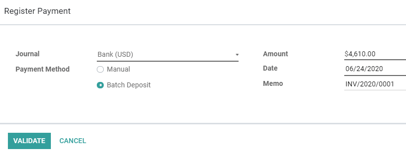

==================================================
Batch payments: Batch deposits (checks, cash etc.)
==================================================

A **Batch Deposit** groups multiple payments in a single batch. This allows you to deposit several
payments into your bank account with a single transaction. This is particularly useful to deposit
cash and checks.

This feature allows you to list several customer payments and print a **deposit slip**. This ticket
contains the details of the transactions and a reference to the batch deposit. You can then select
this reference during a bank reconciliation to match the single bank statement line with all the
transactions listed in the batch deposit.

Configuration
=============

To activate the feature, go to :menuselection:`Accounting --> Configuration --> Settings -->
Customer Payments`, activate **Batch Payments**, and click on *Save*.

Payment Method Types
--------------------

To record new payments as part of a Batch Deposit, you have to configure first the Journal on which
you record them.

To do so, go to :menuselection:`Accounting --> Configuration --> Journals`, open the Journal
you want to edit, click on *Edit*, and open the *Advanced Settings* tab. In the *Payment Method
Types* section, enable **Batch Deposit**, and click on *Save*.

.. image:: batch/batch-journal-settings.png
   :align: center
   :alt: Payment Method Types in a journal's advanced settings

.. note::
   Your main bank accounts are automatically configured to process batch payments when you activate
   the feature.

Deposit multiple payments in batch
==================================

Record payments to deposit in batch
-----------------------------------

:doc:`Register the payments <recording>` on the bank account on which you plan to deposit them by
opening the *Customer Invoice* for which you received a payment, and clicking on *Register Payment*.
There, select the appropriate Journal linked to your bank account and select *Batch Deposit* as
Payment Method.

Do this step for all checks or payments you want to process in batch.

.. note::
   Make sure to write the payment reference in the **Memo** field.

Add payments to a Batch Deposit
-------------------------------

To add the payments to a Batch Deposit, go to :menuselection:`Accounting --> Customers --> Batch
Payments`, and click on *Create*. Next, select the Bank and Payment Method, then click on *Add a
line*.

.. image:: batch/batch-new-inbound.png
   :align: center
   :alt: Filling out a new Inbound Batch Payment form on Odoo Accounting

Select all payments to include in the current Batch Deposit and click on *Select*. You can also
record a new payment and add it to the list by clicking on *Create*.

.. image:: batch/batch-payments-selection.png
   :align: center
   :alt: Selection of all payments to include in the Batch Deposit

Once done, click on *Validate* to finalize your Batch Deposit. You can then click on *Print* to
download a PDF file to include with the deposit slip that the bank usually requires to fill out.

Bank Reconciliation
-------------------

Once the bank statements are on your database, you can reconcile the bank statement line with the
*Batch Payment* reference. To do so, start your **Bank Reconciliation** by going to your Accounting
dashboard and clicking on *Reconcile Items* on the related bank account. At the bank statement line,
click on *Choose counterpart or Create Write-off* to display more options, open the *Batch Payments*
tab, and select your Batch Payment. All related payments are automatically added.

.. note::
   The *Batch Payments* tab won't appear if a Partner is selected for this bank statement line.

.. image:: batch/batch-bank-reconciliation.png
   :align: center
   :alt: Reconciliation of the Batch Payment with all its transactions

If a check, or a payment, couldn't be processed by the bank and is missing, remove the related
payment before validating the bank reconciliation.

.. seealso::
   - :doc:`recording`
   - :doc:`batch_sdd`