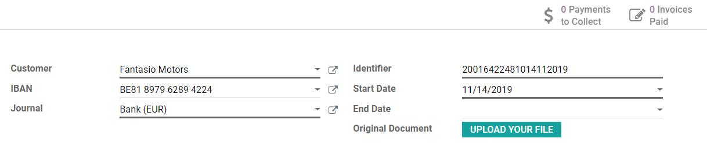
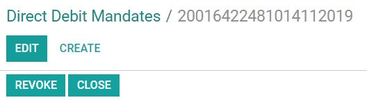
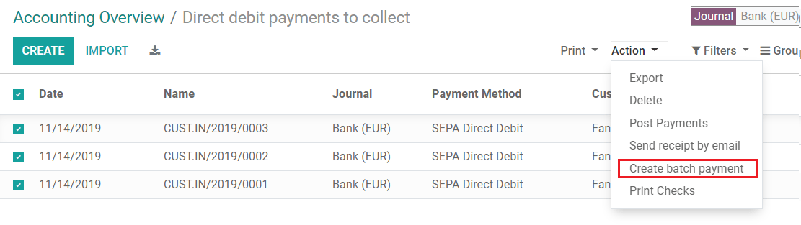

=======================================
Batch payments: SEPA Direct Debit (SDD)
=======================================

SEPA, the Single Euro Payments Area, is a payment-integration initiative of the European Union for
simplification of bank transfers denominated in EURO. With **SEPA Direct Debit**, your customers can
sign a **mandate** that authorizes you to collect future payments from their bank accounts. This is
particularly useful for recurring payments based on a subscription.

You can record customer mandates in Odoo, and generate XML files containing pending payments made
with an SDD mandate.

.. note::
   | SDD is supported by all SEPA countries, which includes the 27 member states of the European
     Union as well as additional countries.
   | `List of all SEPA countries
     <https://www.europeanpaymentscouncil.eu/document-library/other/epc-list-sepa-scheme-countries>`_.

Configuration
=============

Go to :menuselection:`Accounting --> Configuration --> Settings`, activate **SEPA Direct Debit
(SDD)** and click on *Save*. Enter your company's **Creditor Identifier**. This number is provided
by your bank institution, or the authority responsible for delivering them.

.. image:: batch_sdd/batch-sdd-creditor-identifier.png
   :align: center
   :alt: Add a SEPA Creditor Identifier to Odoo Accounting

SEPA Direct Debit Mandates
==========================

Create a mandate
----------------

The SEPA Direct Debit Mandate is the document that your customers sign to authorize you to collect
money directly from their bank accounts.

To create a new mandate, go to :menuselection:`Accounting --> Customers --> Direct Debit Mandates`,
click on *Create*, and fill out the form.

Export the PDF file by clicking on *Print*. It is then up to your customer to sign this document.
Once done, upload the signed file in the **Original Document** field, and click on *Validate* to
start running the mandate.

.. important::
   Make sure that the **IBAN bank accounts details** are correctly recorded on the debtor’s contact
   form, under the *Accounting* tab, and in your own :doc:`Bank Account
   <../../bank/setup/bank_accounts>` settings.

SEPA Direct Debit as a Payment Method
-------------------------------------

SEPA Direct Debit can be used as a payment method both on your **eCommerce** or on the **Customer
Portal** by activating SDD as a **Payment Provider**. With this method, your customers can create
and sign their mandates themselves.

To do so, go to :menuselection:`Accounting --> Configuration --> Payment Providers`, click on *SEPA
Direct Debit*, and set it up according to your needs.

.. important::
   Make sure to change the **State** field to *Enabled*, and to check **Online Signature**, as this
   is necessary to let your customers sign their mandates.

Customers using SDD as payment method get prompted to add their IBAN, email address, and to sign
their SEPA Direct Debit mandate.

.. todo::
   Add link to future **Payment Provider** documentation.

Close or revoke a mandate 
-------------------------

Direct Debit mandates are closed automatically after their *End Date*. If this field is left blank,
the mandate keeps being *Active* until it is *Closed* or *Revoked*.

Clicking on **Close** updates the mandate’s end day to the current day. This means that invoices
issued after the present day will not be processed with an SDD payment.

Clicking on **Revoke** disables the mandate immediately. No SDD payment can be registered anymore,
regardless of the invoice’s date. However, payments that have already been registered are still
included in the next SDD XML file.

.. warning::
   Once a mandate has been *closed* or *revoked*, it cannot be reactivated.

Get paid with SDD Batch Payments
================================

Customer Invoices 
-----------------

You can register SDD payments for invoices issued to customers who have an active SDD mandate.

To do so, open the invoice, click on *Register Payment*, and choose *SEPA Direct Debit* as payment
method.

Generate SEPA Direct Debit XML files to submit payments
-------------------------------------------------------

**XML files** with all SDD payment instructions can be uploaded to your online banking interface to
process all payments at once.

.. note::
   The files generated by Odoo follow the SEPA Direct Debit **PAIN.008.001.02** specifications, as
   required by the SEPA customer-to-bank Implementation Guidelines, which ensures compatibility with
   the banks.

To generate your XML file for the pending SDD payments, go to the related *bank journal* on your
*Accounting dashboard*, then click on *Direct Debit Payments to Collect*.

.. image:: batch_sdd/batch-sdd-collect.png
   :align: center
   :alt: Start the SDD payments collection in Odoo Accounting

Select all the payments you want to include in your SDD XML file, then click on *Action* and select
*Create Batch Payment*.

Odoo then takes you to your *Batch Payment*’s form. Click on *Validate* and download the SDD XML
file.

.. image:: batch_sdd/batch-sdd-xml.png
   :align: center
   :alt: Generate an XML file for your SDD payments in Odoo Accounting

Finally, upload this file to your online banking interface to process the payments.

.. tip::
   You can retrieve all the generated SDD XML files by going to
   :menuselection:`Accounting --> Configuration --> Customers --> Batch Payments`.

.. seealso::
   * :doc:`batch`
   * :doc:`../../bank/setup/bank_accounts`
   * `Odoo Academy: SEPA Direct Debit Mandates (SDD) <https://www.odoo.com/r/Zxs>`_
   * `List of all SEPA countries
     <https://www.europeanpaymentscouncil.eu/document-library/other/epc-list-sepa-scheme-countries>`_