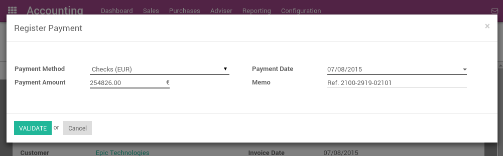

====================================
Register customer payments by checks
====================================

There are two ways to handle payments received by checks. Odoo support
both approaches so that you can use the one that better fits your
habits.

1. **Undeposited Funds:**
   once you receive the check, you record a payment
   by check on the invoice. (using a Check journal and posted on the
   Undeposited Fund account) Then, once the check arrives in your
   bank account, move money from Undeposited Funds to your bank
   account.

2. **One journal entry only:**
   once your receive the check, you record a
   payment on your bank, paid by check, without going through the
   **Undeposited Funds**. Once you process your bank statement, you do
   the matching with your bank feed and the check payment, without
   creating a dedicated journal entry.

We recommend the first approach as it is more accurate (your bank
account balance is accurate, taking into accounts checks that have not
been cashed yet). Both approaches require the same effort.

Even if the first method is cleaner, Odoo support the second approach
because some accountants are used to it (quickbooks and peachtree
users).

.. Note::
  You may have a look at the *Deposit Ticket feature* if you deposit
  several checks to your bank accounts in batch.

Option 1: Undeposited Funds
===========================

Configuration
-------------

-  Create a journal **Checks**

-  Set **Undeposited Checks** as a default credit/debit account

-  Set the bank account related to this journal as **Allow Reconciliation**

From check payments to bank statements
--------------------------------------

The first way to handle checks is to create a check journal. Thus,
checks become a payment method in itself and you will record two
transactions.

Once you receive a customer check, go to the related invoice and click
on **Register Payment**. Fill in the information about the payment:

-  Payment method: Check Journal (that you configured with the debit and
   credit default accounts as **Undeposited Funds**)

-  Memo: write the Check number

This operation will produce the following journal entry:

+----------------------+-------------------+----------+----------+
| Account              | Statement Match   | Debit    | Credit   |
+======================+===================+==========+==========+
| Account Receivable   |                   |          | 100.00   |
+----------------------+-------------------+----------+----------+
| Undeposited Funds    |                   | 100.00   |          |
+----------------------+-------------------+----------+----------+

The invoice is marked as paid as soon as you record the check.

Then, once you get the bank statements, you will match this statement
with the check that is in Undeposited Funds.

+---------------------+-------------------+----------+----------+
| Account             | Statement Match   | Debit    | Credit   |
+=====================+===================+==========+==========+
| Undeposited Funds   | X                 |          | 100.00   |
+---------------------+-------------------+----------+----------+
| Bank                |                   | 100.00   |          |
+---------------------+-------------------+----------+----------+

If you use this approach to manage received checks, you get the list of
checks that have not been cashed in the **Undeposit Funds** account
(accessible, for example, from the general ledger).

.. Note::
    Both methods will produce the same data in your accounting at the
    end of the process. But, if you have checks that have not been cashed,
    this one is cleaner because those checks have not been reported yet on
    your bank account.

Option 2: One journal entry only
================================

Configuration
-------------

These is nothing to configure if you plan to manage your checks using
this method.

From check payments to bank statements
--------------------------------------

Once you receive a customer check, go to the related invoice and click
on **Register Payment**. Fill in the information about the payment:

-  **Payment method:** the bank that will be used for the deposit

-  Memo: write the check number

.. image:: check/check03.png
  :align: center

The invoice is marked as paid as soon as you record the check.

Once you will receive the bank statements, you will do the matching with
the statement and this actual payment. (technically: point this payment
and relate it to the statement line)

With this approach, you will get the following journal entry in your
books:

+----------------------+-------------------+----------+----------+
| Account              | Statement Match   | Debit    | Credit   |
+======================+===================+==========+==========+
| Account Receivable   | X                 |          | 100.00   |
+----------------------+-------------------+----------+----------+
| Bank                 |                   | 100.00   |          |
+----------------------+-------------------+----------+----------+

.. tip::
    You may also record the payment directly without going on the
    customer invoice, using the menu :menuselection:`Sales --> Payments`. This method may
    be more convenient if you have a lot of checks to record in a batch but
    you will have to reconcile entries afterwards (matching payments with
    invoices)

If you use this approach to manage received checks, you can use the
report **Bank Reconciliation Report** to verify which checks have been
received or paid by the bank. (this report is available from the **More**
option from the Accounting dashboard on the related bank account).

.. image:: check/check01.png
  :align: center
