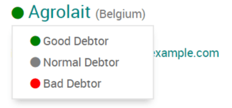
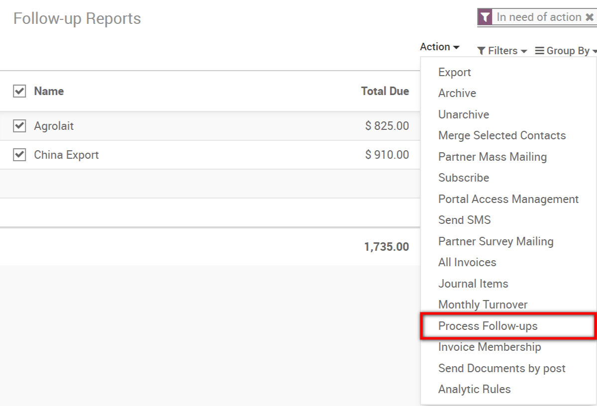
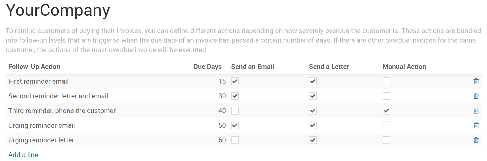

=========================================
Follow-up on invoices and get paid faster
=========================================

It is essential for your business to collect payments when they are
overdue. Odoo will help you identify payments that are late and will
allow you to send the appropriate reminders.

Manage your follow-ups
======================

.. tip::
    We recommend that you reconcile your bank statements before
    launching your follow-up process. It will avoid you the trouble of
    sending a statement to a customer that has already paid you.

The overdue invoices you need to follow-up on are available by default
in :menuselection:`Accounting --> Sales --> Follow-up Reports`. There,
you can easily send a reminder by email or print it as a letter. Then,
you can click on the *Done* button to view the next follow-up that
needs your attention.

Otherwise, if now is not the time for a reminder, click on *Remind me
later*. You will get the next report according to the *Next Reminder
Date* set on the statement.

.. tip::
    To avoid sending too many reminders in a short period of time,
    change the number of days calculated between each report by going to
    :menuselection:`Accounting --> Configuration --> Settings --> Payment
    Follow-up`.

You can also set a trust level for your customers by marking them as
bad, normal or good debtors on the follow-up reports.

Send reminders in batch
=======================

To get your follow-up process easier, you can send reminder emails in
batch from your follow-up reports page. Select all the reports you would
like to process, click on *Action* and then on *Process Follow-ups*.
A pdf document containing all of the follow-up letters for you to print
will also be automatically generated.

Plan a follow-up process
========================

To plan a follow-up process, go to :menuselection:`Accounting -->
Configuration --> Settings` and activate the *Follow-up Levels*
feature under the *Customer Payments* section. Then, click on the new
*Follow-up Levels* button that has appeared on your settings page.

A follow-up plan with several actions is available by default in Odoo,
but you can customize it any way you want. Depending on a specific
number of overdue days, plan to send an email, a letter or to undertake
a manual action. You can also edit the template used for the statement
according to the stage of the process.

.. tip::
    If you would like to get a reminder before the actual due date,
    set a negative number of due days.
