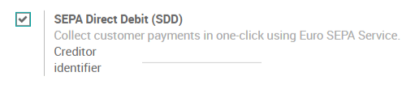
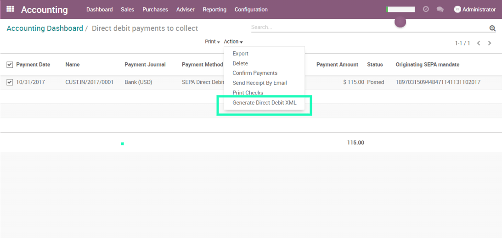

==================
Get paid with SEPA
==================

SEPA, the Single Euro Payments Area, is a payment-integration initiative
of the European Union for simplification of bank transfers denominated
in EURO. SEPA Direct Debit allows you to withdraw money from the bank
accounts of your customers with their approval.

SEPA is supported by the banks of the 28 EU member states as well as
Iceland, Norway, Switzerland, Andorra, Monaco and San Marino.

With Odoo, you can record customer mandates, generate an SDD XML file
containing customer payments and upload it in your bank interface. The
file follows the SEPA Direct Debit PAIN.008.001.02 specifications. This
is a well-defined standard that makes consensus among banks.

Configuration
-------------

Go in :menuselection:`Accounting --> Configuration --> Settings`
and activate the SEPA Direct Debit (SDD) Feature. Enter the Creditor
Identifier of your company. This number is provided by your bank.

Get paid with SEPA
------------------

Direct Debit Mandates
~~~~~~~~~~~~~~~~~~~~~

Before withdrawing money from a customer bank account, your customer has
to sign a mandate. Go in :menuselection:`Accounting --> Sales --> Direct Debit Mandates`
and create a new mandate.

.. tip:: SEPA Direct Debit only works between IBAN Bank Accounts.

Once you have entered all the information in the customer mandate, you
can print it and ask your customer to sign it. Once it is done, you can
upload the mandate signed by your customer on the mandate in Odoo.

.. image:: media/payment_sepa03.png
   :align: center

You can now validate the mandate.

Customer Invoices 
~~~~~~~~~~~~~~~~~

Let's create an invoice for that customer.

When you will validate this invoice, the payment will be automatically
generated and your invoice will be directly marked as paid.

.. tip::
   If you already had some invoices for that customer that could be
   paid using that mandate, it's still possible to do it. Go on the
   invoice, click on register payment and choose the Sepa Direct Debit as
   payment method.

Generate SDD Files
~~~~~~~~~~~~~~~~~~

You can generate the SDD File with all the customer payments to send to
your bank directly from the accounting dashboard :

You select the payments in the list that you want to include in your SDD
File, click on action and select "Generate Direct Debit XML".

You can now download the XML file generated by Odoo and upload it in
your bank interface.

.. tip::
   You can retrieve all the generated XML by activating the developer
   mode and going in :menuselection:`Accounting --> Configuration --> Payments --> SDD Payment File`.

Close or revoke a mandate 
~~~~~~~~~~~~~~~~~~~~~~~~~~

The Direct Debit mandate will be closed automatically once the end date
defined on it is reached. However, you can **close** a mandate earlier
than initially planned. To do that, simply go on the mandate and click
on the "Close" button.The end date of the mandate will be updated to
today's date. This means you will not be able to pay invoices with an
invoice date superior to this end date. Be careful, once a mandate is
closed, it cannot be reopened.

You can also **revoke** a mandate. In that case, you won't be able to
pay any invoice using that mandate anymore, no matter the invoice
date.To do that, simply go on the mandate and click on the "Revoke"
button.
