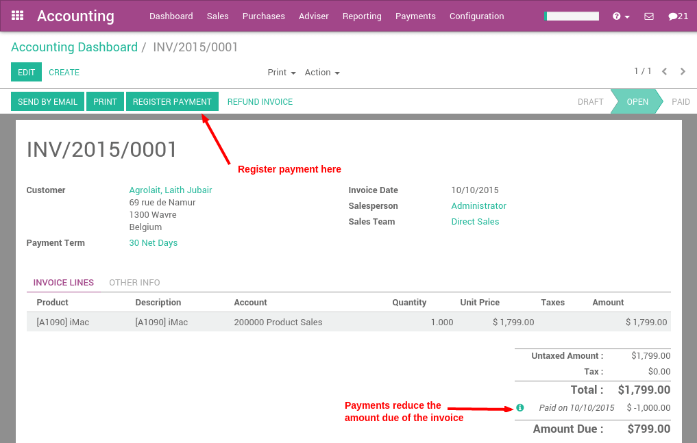
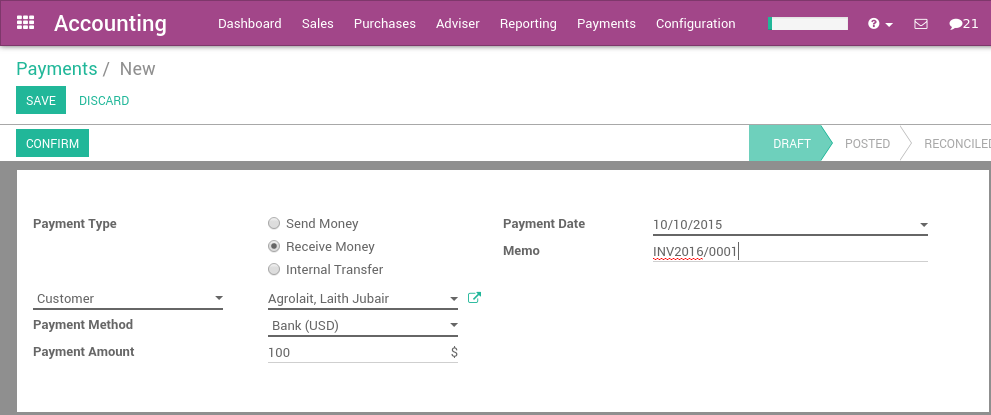
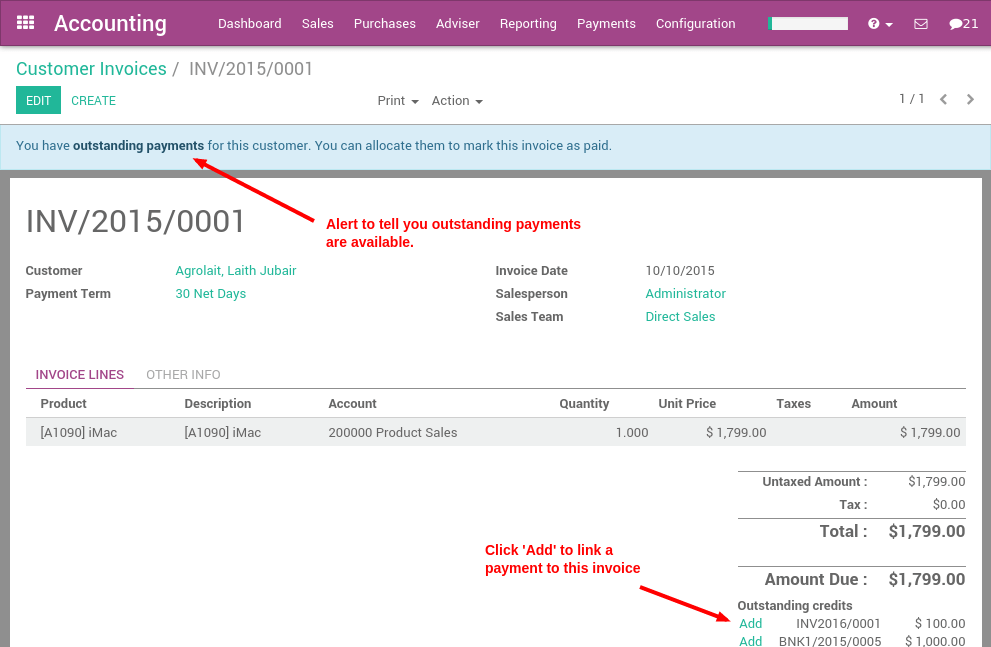

================================================
What are the different ways to record a payment?
================================================

In Odoo, a payment can either be linked directly to an invoice or be a
stand alone record for use on a later date:

- If a payment is linked to an invoice, it reduces the amount due of
  the invoice. You can have multiple payments linked to the same
  invoice.

- If a payment is not linked to an invoice, the customer has an
  outstanding credit with your company, or your company as an
  outstanding balance with a vendor. You can use this outstanding
  credit/debit to pay future invoices or bills.

Paying an invoice
=================

If you register a payment on a customer invoice or a vendor bill, the
payment is automatically reconciled with the invoice reducing the amount
due.

The green icon near the payment line will display more information about
the payment. From there you can choose to open the journal entry or
reconcile the payment.

.. note::

	If you unreconcile a payment, it is still registered in your books but not
	linked to the specific invoice any longer. If you unreconcile a payment in a
	different currency, Odoo will create a journal entry to reverse the Currency
	Exchange Loss/Gain posted at the time of reconciliation.

Payments not tied to an invoice
===============================

Registering a payment
---------------------

In the Accounting application, you can create a new payment from the
Sales menu (register a customer payment) or the Purchases menu (pay a
vendor). If you use these menus, the payment is not linked to an
invoice, but can easily be reconciled on an invoice later on.

When registering a new payment, you must select a customer or vendor,
the payment method, and the amount of the payment. The currency of the
transaction is defined by the payment method. If the payment refers to a
document (sale order, purchase order or invoice), set the reference of
this document in the memo field.

Once confirmed, a journal entry will be posted reflecting the
transaction just made in the accounting application.

Reconciling invoice payments
----------------------------

The easiest way of reconciling a payment with an invoice is to do so on
the invoice directly.

When validating a new invoice, Odoo will warn you that an outstanding
payment for this customer or vendor is available. In this case, you can
reconcile this payment to the invoice near the totals at the bottom,
under "Outstanding Payments".

Reconciling all your outstanding payments and invoices
------------------------------------------------------

If you want to reconcile all outstanding payments and invoices at once
(instead of doing so one by one), you can use the batch reconciliation
feature within Odoo.

The batch reconciliation feature is available from the dashboard on the
Customer Invoices card and the Vendor Bills card for reconciling
Accounts Receivable and Payable, respectively.

.. image:: ./media/recording04.png
  :align: center

The payments matching tool will open all unreconciled customers or
vendors and will give you the opportunity to process them all one by
one, doing the matching of all their payments and invoices at once.

.. image:: ./media/recording05.png
  :align: center

During the reconciliation, if the sum of the debits and credits do not
match, it means there is still a remaining balance that either needs to
be reconciled at a later date, or needs to be written off directly.

Transferring money from one bank account to another
===================================================

Just like making a customer or vendor payment, you transfer cash
internally between your bank accounts from the dashboard or from the
menus up top.

.. image:: ./media/recording06.png
  :align: center

This will take you to the same screen you have for receiving and making
payments.

.. image:: ./media/recording07.png
  :align: center

.. note::

	When making an internal transfer from one bank account to another, select
	the bank you want to apply the transfer from in the dashboard, and in the
	register payments screen, you select the transfer to account. Do not go
	through this process again in the other bank account or else you will end up
	with two journal entries for the same transaction.

.. seealso::

	* :doc:`credit_cards`
	* :doc:`../../bank/feeds/paypal`
	* :doc:`check`
	* :doc:`followup`
