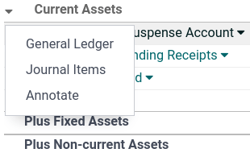
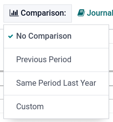

:show-content:

=========
Reporting
=========

Odoo includes **generic** and **dynamic** reports available for all countries, regardless of the
:doc:`localization package <../../finance/fiscal_localizations>` installed:

-  :ref:`accounting/reporting/balance-sheet`
-  :ref:`accounting/reporting/profit-and-loss`
-  :ref:`accounting/reporting/executive-summary`
-  :ref:`accounting/reporting/general-ledger`
-  :ref:`accounting/reporting/aged-receivable`
-  :ref:`accounting/reporting/aged-payable`
-  :ref:`accounting/reporting/cash-flow-statement`
-  :ref:`accounting/reporting/tax-report`

To expand the lines of a report and view its details, click the :icon:`fa-caret-right`
(:guilabel:`right arrow`) on the left. Then click the :icon:`fa-caret-down` (:guilabel:`down arrow`)
to the right of the account, journal entry, payment, invoice, etc. to :guilabel:`Annotate` and view
the details.

To export reports in PDF or XLSX format, click :guilabel:`PDF` at the top or click the
:icon:`fa-caret-down` (:guilabel:`down arrow`) icon next to the :guilabel:`PDF` button and
select :guilabel:`XLSX`.

To compare values across periods, click the :guilabel:`Comparison` menu and select the periods you
want to compare.

.. _accounting/reporting/balance-sheet:

Balance Sheet
=============

The :guilabel:`Balance Sheet` shows a snapshot of your organization's assets, liabilities, and
equity at a particular date.

.. _accounting/reporting/profit-and-loss:

Profit and Loss
===============

The :guilabel:`Profit and Loss` report (or **Income Statement**) shows your company's net income by
deducting expenses from revenue for the reporting period.

.. _accounting/reporting/executive-summary:

Executive Summary
=================

The :guilabel:`Executive Summary` provides an overview of all the important figures for overseeing
your company's performance.

It includes the following items:

- :guilabel:`Performance`:
    - :guilabel:`Gross profit margin`:
        The contribution of all sales your business makes **minus** any direct costs needed to
        make those sales (labor, materials, etc.).
    - :guilabel:`Net profit margin`:
        The contribution of all sales made by your business **minus** any direct costs needed to
        make those sales *and* fixed overheads your company has (electricity, rent, taxes
        to be paid as a result of those sales, etc.).
    - :guilabel:`Return on investment (per annum)`:
        The ratio of the net profit to the amount of assets the company used to make those profits.
- :guilabel:`Position`:
    - :guilabel:`Average debtors days`:
        The average number of days it takes your customers to (fully) pay you across all your
        customer invoices.
    - :guilabel:`Average creditors days`:
        The average number of days it takes you to (fully) pay your suppliers across all your bills.
    - :guilabel:`Short-term cash forecast`:
        How much cash is expected in or out of your business in the next month, i.e., the balance of
        your **Sales account** for the month **minus** the balance of your **Purchases account** for
        the month.
    - :guilabel:`Current assets to liabilities`:
        Also referred to as the **current ratio**, this is the ratio of current assets (:dfn:`assets
        that could be turned into cash within a year`) to the current liabilities (:dfn:`liabilities
        that will be due in the next year`). It is typically used to measure a company's ability to
        service its debt.

.. _accounting/reporting/general-ledger:

General Ledger
==============

The :guilabel:`General Ledger` report shows all transactions from all accounts for a selected date
range. The initial summary report shows the totals for each account. To expand an account and view
its details, click the :icon:`fa-caret-right` (:guilabel:`right arrow`) on the left.
This report is useful for reviewing each transaction that occurred during a specific period.

.. _accounting/reporting/aged-receivable:

Aged Receivable
===============

The :guilabel:`Aged Receivable` report shows the sales invoices awaiting payment during a selected
month and several months prior.

.. _accounting/reporting/aged-payable:

Aged Payable
============

The :guilabel:`Aged Payable` report displays information on individual bills, credit notes, and
overpayments you owe and how long these have gone unpaid.

.. _accounting/reporting/cash-flow-statement:

Cash Flow Statement
===================

The :guilabel:`Cash Flow Statement` shows how changes in balance sheet accounts and income affect
cash and cash equivalents and breaks the analysis down to operating, investing, and financing
activities.

.. _accounting/reporting/tax-report:

Tax Report
==========

The :guilabel:`Tax Report` shows the :guilabel:`NET` and :guilabel:`TAX` amounts for all the
taxes grouped by type (:guilabel:`Sales`/:guilabel:`Purchases`).

.. toctree::
   :titlesonly:

   reporting/tax_returns
   reporting/tax_carryover
   reporting/analytic_accounting
   reporting/budget
   reporting/intrastat
   reporting/data_inalterability
   reporting/silverfin
   reporting/customize
   reporting/year_end
